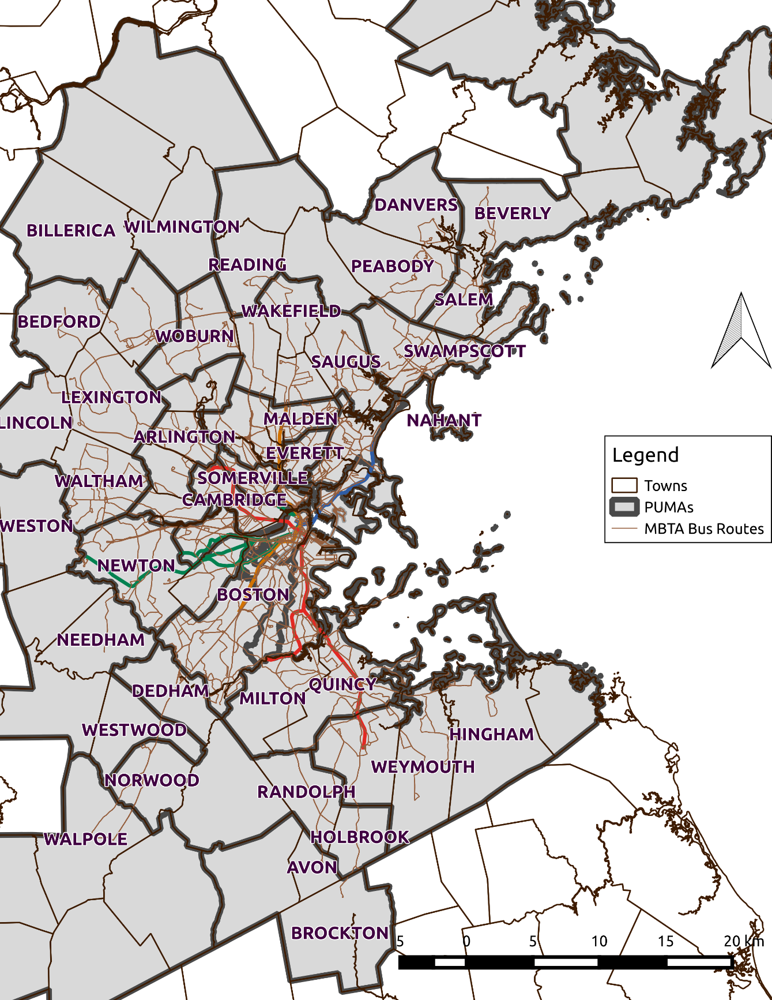

#Abstract  
By inferring individual passengers’ origins, destinations, and transfers using automatically collected transit data, transit providers can obtain and analyze larger volumes of information, with more accuracy, and at more frequent intervals than are available through traditional origin-destination (OD) surveys. Automatic OD inference can be an input into the analysis and reporting of agencies’ social goals, such as the provision of equitable service regardless of race, national origin, or ethnicity, which is federally required in the USA by Title VI of the Civil Rights Act of 1964. The methodology prescribed in the Title VI regulation, however, has not adapted to the opportunity to supplement supply metrics with passenger-centric demand metrics through the availability of OD data. The goal of this thesis is to demonstrate a preliminary methodology to link automatically inferred OD information from regular transit users to the demographic data of public transit commuters from the US Census’s American Community Survey, and to examine variation in passenger-centric metrics such as journey time and speed.

This study infers origins and destinations in the context of the Massachusetts Bay Transportation Authority (MBTA). From a sample month of these data, an example of a passenger-centric analysis is performed by comparing travel times and speeds of trips with origins in areas home to predominantly Black or African American transit commuters to travel times and speeds of trips with origins in areas home to predominantly White transit commuters. Commuters from predominantly Black or African American census tracts are found to have longer travel times and slower speeds relative to commuters from tracts where commuters are predominantly White. Differences are within agency specified margins, but are significant, in particular for journeys involving bus transfers. Short-term solutions such as through-routing of important bus routes and increasing reliability of bus departures at terminals and long-term solutions such as faster, more frequent Diesel Multiple Unit rail service are proposed and evaluated to mitigate these differences.

Thesis Supervisor: John P. Attanucci

Research Associate of Civil and Environmental Engineering

Thesis Supervisor: Frederick P. Salvucci

Senior Lecturer of Civil and Environmental Engineering

#Acknowledgments  
The research leading to this thesis was developed over a three-year period during which I had the advice and guidance of a number of people who will be thanked below. During this time, the research was partially funded by the Natural Sciences and Engineering Research Council of Canada (NSERC) and by the Massachusetts Bay Transportation Authority (MBTA).

Thanks to the following faculty and research advisors who have advised me, in chronological order, Haris Koutsopoulos, David Block-Schachter, John Attanucci, Fred Salvucci, and Jinhua Zhao. I’d like to thank them all for their guidance and advice. For their guidance in academic matters, intersecting two departments, and support in crises, thanks go to Chris Zegras and Jinhua Zhao.

From summers spent at the MBTA I’d like to thank Heather Hume, David Barker, Sam Hickey, Brian Kane, and other members of the stretching squad for welcoming me to their offices. I’d also like to thank fellow interns Brian Francis and Susan Balding for accompanying me on lunch and coffee breaks, as well as my fellow research assistants Katie Pincus, William Chow, Dave Maltzan, and Catherine Vanderwaart. I would additionally like to thank Anette Demchur of CTPS for answering numerous questions about their procedure for Title VI analyses.

For their invaluable input, advice, and support, Anson Stewart and Gabriel Sanchez Martinez.

Mr. Jason Gordon, whose work was a precursor to this thesis, for his mentorship, advice, last minute editing, and being the keeper of the data.

My comrades in the Transit Lab, scattering to the four corners, your camaraderie, good cheer, and support leading up to the end will be missed.

Finally my parents for their love and support from afar, and weekly check-in phone calls. Thank you very much.

Introduction
=========================================================================================================================================================

With the growing adoption of automatic data collection systems (ADCS), transit providers can now collect volumes of data on their operations and their customers’ behavior. The use of automated fare collection (AFC) systems, by collecting fares electronically and storing the data digitally, permits urban public transit providers to collect fine-resolution data on how their customers interact with the network. These data can show, for every transaction a customer performs, where and when that transaction occurred. If customers are uniquely identified, it is then possible to determine their behavior over one or many days, including the origins and destinations (OD) of their trips.

By using ADCS data to infer origins, destinations, and journeys, transit providers and researchers can avoid the need to gather information about usage using costly, time-consuming, and often inaccurate surveys
(Riegel, 2013). Due to their nature, these surveys are limited in both sample size and frequency, whereas (ADCS) data have the potential to provide information at a near daily frequency. In the USA an example of the potential use of such information is the federally required Title VI and environmental justice (EJ) reporting. Title VI of the Civil Rights Act of 1964 prevents agencies receiving federal funding from having a disparate impact with regards to race, ethnicity, or national origin. In complying with this law, large transit agencies must report regularly on how their service is provided to populations with different demographics. There is a growing critique of the inaccuracies inherent to the required methodology
(Bills, 2013; Karner & Golub, 2015; Karner & Niemeier, 2013), based on outdated data collection methods which have not kept pace with the availability of large, passenger-level data sets from ADCS.

A distinction must be made between early implementations of these technologies, which were designed with one task in mind such as AFC or automatic vehicle location (AVL) systems (hereafter legacy systems), and a second generation of ADCS designed with a holistic view of data collection and warehousing. Legacy systems require the synthesis of disparate data sources in order to produce useful information such as origins and destination whereas newer systems will have such synthesis built into data collection.

This thesis builds upon recent work in the synthesis of passenger-centric public transit information and primarily updates the work of Gordon
(2013), to infer origins, destinations, and full journeys in London, to a fully open[1] transit network: the Massachusetts Bay Transportation Authority’s (MBTA) rapid transit and bus network. Additional algorithms were developed to prepare bus and train vehicle location data for passenger origin and destination inference, as well as arrival time inference on a rail. The inference algorithm was performed on a month’s worth of data for April 2014. From this inferred origin–destination (OD) information users’ home locations are inferred, and their usage is aggregated to geographic units to demonstrate an alternative methodology for Title VI and EJ analysis which betters reflects passenger outcomes.

The remainder of this chapter provides the motivation for this case study, an overview of the state of the art of OD inference, the objectives and methodology for this study, and outlines the rest of this thesis.

1.  Motivation
    ----------

    1.  ### State of the Art: Using ADCS to Infer Travel Behaviour

Pelletier, Trépanier, & Morency
(2011) review the use of smart card AFC data including OD inference methods for tactical and strategic transit planning. Since their review, the state of the art has moved in a number of directions discussed in the sections below: from improved methodologies, to inferring activities from OD, or using alternative massive passively collected data sets to infer travel behaviour.

Robinson et al
(2014) review data collection errors for AFC and AVL systems. They discuss how to isolate faulty data collection units through peer comparison and present methods for error handling and correction with a particular focus on bus or light rail systems that require fare transactions upon both boarding and alighting.

#### Activity Inference

Moving beyond inferring the origin and destination of a trip, researchers have developed methodologies to elucidate trip purpose from the user and trip characteristics as well as land use characteristics. Lee and Hickman
(2014) infer home-based trip purposes (work, university, and other) for bus passengers in the Minneapolis/St. Paul Metropolitan Area in Minnesota using an OD inferred from AFC and GTFS[2] schedules
(Nassir, Khani, Lee, Noh, & Hickman, 2011). They assume users start their first journey of the day at home and used start time, activity duration and location as criteria in activity inference.

(Devillaine, Munizaga, & Trépanier, 2012) infer activity types (home, work, education, other) using simple heuristics based on the type of pass, the trip’s order (e.g., whether it was the last of the day), the duration of the activity, and the land use of the location of the activity.

#### Alternative Data Sources

Researchers have developed methodologies to use more ubiquitous data sources to infer travel behaviour.
Jiang et al.
(2013) offer a comprehensive review of the use of passively collected mobile phone data including challenges and opportunities for that data source.

Montero et al
(2015) use Bluetooth data to estimate real-time dynamic OD on a transit network. Their work extends a framework originally designed to predict traffic on roadways, to using a historical OD matrix for Vitoria in Spain updated with counts of passengers equipped with Bluetooth enabled devices. This methodology was validated with simulated rather than actual real-time data.

### ADCS Applications in Boston

The MBTA’s fare data have been used to analyze the effects of different fare policies. Pincus (2014) determined the impacts of the 2012 fare increase through analyzing months of AFC records. Kamfonik (2013) estimated the added revenue the MBTA's Corporate Pass program provides by analyzing the AFC usage records of Corporate Pass holders. Chow (2014) piloted the use of AFC in a survey of a panel of MBTA customers prompting them to recall their trips based on their transaction history.

Researchers have also used ADCS to improve transit operations. Tribone (2013) used automatically collected track circuit data to identify reasons for delays on the subway and then piloted and evaluated solutions to these. Maltzan (2015) designed real-time control strategies on high-frequency bus routes using real-time AVL data and evaluated the benefits of pilot interventions.

### Motivation: Using ADCS to Analyze and Improve Transit Outcomes

Beyond the obvious use of OD matrices for service and network planning, researchers have explored how ADCS can inform social policy. In developing countries where censuses are conducted sporadically, Smith et al. find that indicators calculated from mobile phone Call Detail Records (CDR) correlate well with regional poverty as defined by the Multidimensional Poverty Index
(Smith, Mashhadi, & Capra, 2013). In a developed country context, Smith et al. use heavy rail AFC data from the Oyster system in London to calculate proxy indicators that correlate with social indicators derived from census data collected on the order of every 5 years (Smith, Quercia, & Capra, 2013). In contexts with robust censuses, these applications are intended to supplement censuses by providing intermediate diagnostics in between censuses. This can allow for rapid feedback on policy changes without the need for intermediate surveys of target populations or to wait for census results.

In the USA, analysts at New York City Transit (NYCT) have published a number of Title VI and EJ analysis methodologies using ADCS. The agency was the first to determine disparate impacts using statistical methods rather than heuristic rules
(Reddy, Chennadu, & Lu, 2010). Fare-impact methodologies were developed to estimate the impacts of the March 2008 and December 2009 proposed fare change using two methods
(Hickey, Lu, & Reddy, 2010). Span adjustments and route modifications accompanied the fare increase, and *t*-tests were performed on load factor and travel time distributions to demonstrate no disparate impact
(Wang, Lu, & Reddy, 2013).

The federal reporting process has been generally criticized for missing large segments of target populations through analysis of averages aggregated by zones, rather than examining outcomes at the level of individual persons. Furthermore, the comparison of averages between populations rather than examining different distributions of individuals masks the existence of winners and losers across and within populations (Bills, 2013). This leaves planners without sufficient information for localized decision-making to identify interventions to correct disproportionate impacts.

The Massachusetts Bay Transportation Authority (MBTA), the transit provider for the Boston Metropolitan Area (Boston), must regularly perform Title VI and environmental justice reporting as a condition of Federal funding (most recently conducted by CTPS (2014)). A 2014 study by Williams, Pollack, & Billingham used American Community Survey (ACS) data from 2011 to examine commute times by race and income for the Boston Metropolitan Area. They found a significant commute time penalty for Black commuters versus White ones across all modes which was most pronounced on the bus (on average an extra 70 hours per year). In an Ordinary Least Squares (OLS) regression, when controlling for income, racial penalties persisted. While the data used for their analysis was from individual surveys, it had been geographically anonymized to such a degree to render a spatial analysis of impacts impossible. Additionally, information about the journey to work was missing important contributors to travel times such as journey distances, the number of transfers between vehicles or modes, and whether the journey required mandatory stops.

### Summary

As ADCS have become more prevalent, researchers have explored how these systems can guide social policies. The US federal regulation requiring transit agencies to provide equitable service benefits regardless of color, race, or national origin is an example of such a social goal that can be better informed with these systems. While agencies have begun incorporating these data into Title VI and EJ analyses, the current federal reporting requirements have not kept pace with the availability of data and the ability to perform finer resolution analysis. This thesis explores how inferred OD data can enable finer grained equity analysis.

Objectives
----------

This thesis demonstrates the feasibility of using a month of inferred origins and destinations from transit ADCS to perform periodic analysis of the spatial variation of transit service as part of ongoing service monitoring and in order to fulfill Federal Title VI reporting requirements. In order to accomplish this goal the following objectives must be met.

#### Infer boarding and alighting locations and times for bus journey stages in Boston

AVL data at a stop-level resolution are required for OD inference, however the bus AVL system was not designed to specifically record arrival times at stops. An appropriate source of AVL must be selected and processed to synthesize the stop-level input for inferring boarding and alighting locations.

#### Infer alighting locations and times for rail journey stages in Boston

In a rail system where users’ exit information is not collected, alighting locations and arrival times must be inferred. Rail AVL must be processed to derive stop-level arrival times, and these data must be used in an arrival time inference process to determine the time at which each user arrived at their rail destination.

#### Infer interchanges between journey stages of any AFC-enabled mode

From the inferred OD, link together stages into journeys as accurately as possible by adapting heuristic parameters for the specific MBTA transit context.

#### Prepare OD inference process to be run over months

This analysis requires multiple days of data to analyze travel behaviour and transit performance over time. The inference and preprocessing algorithms must be automated to be able to run over multiple days.

#### Develop methodologies for analyzing spatial variation of transit effectiveness

Assess current equity analysis methods and their critiques in the literature and from these propose new methodologies for analyzing spatial variation of transit effectiveness that better reflect passenger outcomes using ADCS.

#### Link users to demographic census data

In order to compare user behaviour and experienced service across different demographics and geographies, a link must be made between the fare payment ID and that user’s home location. By determining users’ home locations, the demographics of their home neighbourhood can be linked to their ID to demonstrate how transit use and experience differs by neighbourhood demographics.

#### Determine if differences exist in home based journey characteristics across demographics and space

Determine the distance, travel time, speed, and number of transfers for home-based trips for different users and compare the distributions by demographics. Map differences in behaviour and experience. Identify regions where differences are larger and explore causes of poor transit effectiveness.

#### Propose and evaluate a set of solutions to differences in transit 

Based on the analysis performed, determine a set of potential solutions; for example: bus route modification, increased bus frequencies, fast frequent commuter rail service. Evaluate the impacts of these solutions.

Thesis Organization
-------------------

The thesis is divided into two parts: the work required to process and infer ODs in the Boston context (Chapter 2) and the subsequent use of this OD to analyze spatial variation in transit effectiveness in Boston (Chapters 3-5). Chapter 3 presents an overview of efforts to quantify transportation equity and presents a history of analyses in Boston. Chapter 4 contains the methodology used to process the inferred OD from Chapter 2 into metrics used for the analysis of spatial variability in transit outcomes. The results of this analysis are discussed in Chapter 5 and select solutions to identified differences are proposed and evaluated. The final chapter reflects on the study’s findings and presents conclusions and recommendations for future research.

Origin, Destination, and Interchange Inference at the MBTA
========================================================================================================================================================

This chapter details the updating required to infer origins and destinations (OD) from automated fare collection (AFC) and other automatically collected data sources provided by the MBTA using the inference software package developed in
Gordon (2012). For a detailed explanation of the bus origin-, destination-, and interchange-inference algorithms the reader is invited to refer to that thesis. This chapter will present a high-level overview of the data and algorithms required to perform OD inference and an explanation of the differences between the data available in the MBTA system and in prior work.

This chapter explains the methodology required to generate a month of inferred OD for the MBTA. This includes the data pre-processing methodologies required to synthesize inputs to the OD inference algorithm from AFC, bus AVL, and heavy rail train-tracking data as well as the destination-inference algorithm required for passenger journey **stages** (equivalent to fare transactions) in the rail network. Additionally, an explanation of modifications made to the interchange-inference algorithm is provided. After a discussion of the validation conducted to test the new methodology, the chapter ends with an explanation of the method used to automate the full inference process so that a month of data could be processed.

Origin Destination Inference Explained
------------------------------------------------------------------------------------------------------------------------------------

The goals of OD inference is to process data from ADCS to synthesize for every stage, an origin (location and time) and destination (location and time). For networks where transfers can occur unobserved by the AFC system, multiple **segments**, each on a line, can make up a stage. Some applications have inferred only locations
(Zhao, Rahbee, & Wilson, 2007) while others use scheduled trip times to determine arrival times
(Nassir, Khani, Lee, Noh, & Hickman, 2011).

The use of boarding and alighting times, as well as the coordinates of origin and destination, are important to journey inference. By applying heuristics to the time a user spends between stages, as well as the spatial characteristics of these stages, one can link stages together into **journeys** if no trip-generating activity can be inferred to have occurred between stages. In essence, if the primary goal of one stage is to reach the origin of a subsequent stage, then that stage should be linked to the next to form a complete journey.

### Open, Closed, and Hybrid Automatic Fare Collection Customer Payment Systems

On the continuum (Figure 21) from open to closed AFC payment systems, an open system collects the least amount of information about user behavior: collecting a fee and recording a timestamp only when users enter the system. Examples of this type of system include transit systems in Boston, New York, and Montreal. At the other end of this continuum are closed payment systems, typically with distance-based and/or time-based fares. The calculation of each customer’s fare requires an exit transaction, thus recording the destination location and time such as in Singapore
(Robinson, Narayanan, Toh, & Pereira, 2014) or Seoul. Between these two are systems that include a combination of open and closed modes, typically an open bus system and a closed rail system such as in London, San Francisco, and Washington, D.C.

Figure 21 Open-Closed AFC Payment Continuum

### Generalized Data Flow & Issues

Figure 22 shows the generalized flow of the AFC, AVL, and schedule (stop and station coordinates, and stop arrival patterns) data necessary to complete the OD-inference process. The diagram includes only the fields useful to this application, while many others are usually included in each of the referenced tables. The data from some systems can be more processed by design. For example, instead of recording a GPS position and timestamp at given intervals, the London Buses AVL system detects stops along the route and records arrival and departure times. A more recent version of the London Buses AFC system combines AVL and AFC on board to provide an origin location for every transaction, thus bypassing the need for an origin-inference process.

In legacy data collection systems, it is therefore necessary to synthesize automatically collected data prior to origin inference. First one must determine the “pattern,” or the sequence of stops served in a given route and direction, that is being performed by the vehicle. This is done in order to filter the set of stops to which the AVL system GPS records may be matched in order to infer the boarding or alighting stops. By also assigning a pattern to customers, one limits the set of stop events at which the customer can board or alight. This assumes that customers would not stay on a vehicle to travel on its next trip after a terminus. If a set of vehicle-trip start and end times exists then records can be matched to trips temporally, though this requires a reliable time when a vehicle transitions to a subsequent trip.

Figure 22 Generalized Data Flow for OD Inference, Bolded Boxes Represent Processes, Others Represent Data Sources

In the MBTA context, stop arrival and departure times must be synthesized from raw AVL data and from the set of scheduled stops and their coordinates. Three different methods, depending on available data, are presented in section 2.3.2. With a pattern identified for both vehicle and transaction, and stop events generated, it is then possible to infer an origin by matching the vehicle location to the user based on the transaction time.

By examining a user's history of transactions and determining their next origin of the day (or the first, presumably home, origin in the case of the last stage of the day), OD-inference algorithms find the information necessary to infer destinations. The method assumes that users do not travel between transit trips via other modes, therefore the destination of the current transaction is assumed to be the nearest stop to the target (often the rider’s next origin, or her first origin of the day)
(Barry, Freimer, & Slavin, 2009; Gordon, 2012). Alternatively, for complex and circuitous networks, the destination can be inferred as the stop that minimizes the user's generalized travel cost
(Munizaga & Palma, 2012). The arrival time at that alighting location is determined from AVL and a reasonable set of feasibility checks can be performed to confirm the reliability of the destination.

For rail systems with gated entry, origin times and locations are already recorded in the AFC transaction. The “pattern” used in the rail destination inference is then the network of stations which can be accessed from behind the entry gate. The arrival time can then be inferred from observed stop times at the inferred destination or from scheduled travel times. The methodology for this step is described in section 2.5.3 below.

After origin and destination times and locations have been inferred, interchanges (i.e., transfers) can be inferred by a number of temporal and spatial filters resulting in single or multiple stage journeys being finally inferred.

The Massachusetts Bay Transportation Authority (MBTA)
---------------------------------------------------------------------------------------------------------------------------------------------------

The MBTA is the transit agency responsible for the operation of bus, light-rail, and heavy-rail transit in the Boston metropolitan area, and oversees the operation of contracted commuter rail and paratransit (see Figure 23). Service in the urban core consists of 191 bus routes including four bus rapid transit (BRT) routes, three subway lines, and a light rail line with four branches that operates as a subway in the downtown core. The network includes 7,691 bus stops and a network of 127 light-rail (LRT), heavy-rail, and BRT stations. The average April 2014 weekday has 53,000 stages beginning on LRT, 480,000 on heavy rail, and 341,000 on bus.

Pre-processing Methodologies
--------------------------------------------------------------------------------------------------------------------------

The inference of stop-level travel information necessitates greater data accuracy than is typically required for route- or station-level analysis. Transactions that report the bus route but not the vehicle trip, or that include timestamps with a few minutes of error, can be useful for reporting total boardings on a route or in a station during a particular hour. But the origin- and destination-inference algorithms discussed in the previous section require knowledge of the particular vehicle trip, and any temporal error of more than a few seconds can cause the process to choose a different origin stop than the one the passenger actually used. Additionally, and more problematically, a significant enough mismatch between transaction and trip-start times at terminals will infer passengers to be on the wrong vehicle trip, usually travelling in the opposite direction, resulting in the impossibility of correctly inferring origins or destinations for those passengers. This section describes the processing required of each data stream prior to its use within the OD-inference algorithm.

In order to generalize data processing, and reduce the variety of internal data sources to be used, data published in the General Transit Feed Specification (GTFS)[3] and provided online by the MBTA[4] (and many other transit agencies) were used wherever possible. This yielded the scheduled stop times for the modes to be processed, as well as spatial coordinates of these locations.

Figure 23 MBTA Subway and Key Bus Routes Schematic

### AFC

The MBTA’s AFC system collects fares on bus, LRT, and subway. Commuter rail fares are currently validated by conductors and are not recorded automatically, however passes exist that can be used on both commuter rail and the rapid transit network. The AFC system records detailed transaction information for cash, magnetic-stripe paper tickets (Charlie Tickets), and RFID-equipped smart cards (Charlie Cards). Since the AFC table does not contain all of the necessary fields for OD inference, some pre-processing was required. This includes a farebox clock correction algorithm which will be discussed further in the Vehicle Farebox Clock Correction section below. Figure 25 shows the entity relational diagram for this preprocessing with the output table on the right (see Figure 24 for an explanation of the Crow’s Foot notation relationships between fields in different table).

Figure 24 Entity Relationship Legend

Figure 25 AFC Preprocessing Relational Diagram

The goals of the preprocessing are to:

-   Create unique identifiers for fare payers

-   Assign origins for LRT and other stations

-   Assign a mode to every transaction

-   Assign a vehicle trip to bus transactions

#### Unique Identifiers

Because of the mixing of the three payment media (cash, ticket, card), the AFC serial number is not unique across all media and it is therefore necessary to create a compound identifier for users in order to for them to be uniquely identified within the OD inference algorithm. Additionally, transfers are allowed for tickets and cards that pay via stored value, which results in transactions with the same serial number as the original ticket or card, but a different ticket type. Thus, transfer transactions must be linked to the original stored-value ID.

The compound serial is created according to the rules in Table 21. Ticket Stock Type is a number which refers to the medium. Ticket User Type refers to the type of discount. Ticket Type refers to the type of pass. A cash serial number is started for every day and incremented with every transaction, so that each cash transaction has a unique ID.

Table 21 Unique ID Concatenation Rules

| **Medium**                        | **Fields concatenated**                           |
|-----------------------------------|---------------------------------------------------|
| Cash                              | TicketStockType-TicketUserType-Cash serial number |
| Ticket (Stored Value or Transfer) | TicketStockType-TicketUserType-Serial             |
| Ticket (Pass)                     | TicketStockType-TicketType-Serial                 |
| Card                              | TicketStockType-TicketUserType-Serial             |

Tickets with commuter rail or rapid transit passes are purpose created, so multiple tickets of different types could have the same serial, therefore the ticket type is used to create the unique composite key.

Because cards can have both stored value and passes stored simultaneously, the composite key includes the discount type (TicketUserType) rather than the TicketType.

#### Assigning Origins to Stations and LRT 

By using a look-up table for the deviceid column (the farebox ID) to match to station fare gates, the GTFS station codes are assigned to transactions made at stations. At the time of this writing, the surface portion of the Green Line LRT did not have accurate stop-level AVL data, so origins were inferred at the branch-level on the surface portion of the Green Line. This was done by matching the signcode to a signcode lookup table and using the LRT branch as the origin.

#### Assign a Mode to Every Transaction

There are three different modes a transaction can have for the purpose of origin inference. The transaction can

1.  be made at a station gate and require its destination to be inferred within the network of stations that can be accessed without making another transaction (all subway, and subterranean LRT & BRT);

2.  be made on a vehicle and require its origin to be inferred while requiring its destination to be inferred within the network of stations that can be accessed without making another transaction (surface LRT and select surface BRT);

3.  be made on a vehicle and require its origin to be inferred and require its destination to be inferred along a route (bus and surface BRT).

These modes are assigned in the AFC preprocessing using the following mutually exclusive conditional statements, respectively:

1.  If the transaction’s farebox ID is matched to a station.

2.  If the signcode is a surface LRT or the transaction is assigned to a trip on one of the BRT modes that enters the Silver Line Tunnel (Silver Line Shuttle, Silver Line 1 and Silver Line 2).

3.  If the transaction’s farebox ID is matched to a bus and that transaction occurred within a trip.

#### Assign a trip to bus transactions

In order to limit the set of stops to search for a potential origin or destination for a bus transaction, the transaction is assigned to a bus trip. This is done by matching the transaction to a trip performed by that bus based on the transaction time and the trip’s start and end time. If the transaction happens outside of a trip it is generally assigned to the subsequent trip if it occurred within a reasonable time before the start of that trip.

#### Vehicle Farebox Clock Correction

After running destination inference, it became apparent that vehicle farebox clocks could run slowly, with potentially inaccurate consequences for origin and destination inference. For example, Figure 26 compares inferred boardings and alightings to those observed by the automated passenger counter (APC) system on a bus route that ends at a rail station. The dotted vertical line indicates the temporal boundary between two vehicle trips, and shows that APC system recorded the greatest number of boardings near the beginning of the latter trip. The uncorrected AFC-inferred data show the largest number of boardings suspiciously occurring toward the end of the previous trip.

Further investigation found that clocks are recalibrated when vehicles are in the garage when the farebox communicates with a central server during refueling or cash extraction. In normal operations the clocks will drift, a thorough analysis of all fareboxes revealing that most have clocks drifting by roughly seven seconds per day
(Gordon, 2014). Such an error is insignificant for most purposes, but if uncorrected the clock error can lead to inaccuracies in origin and destination inference. This is especially true for transactions occurring at the beginning of a vehicle trip, since, due to clock drift, these will be assigned to the previous trip as in Figure 26.

Figure 26 Boarding and Alighting Comparison: Uncorrected AFC timestamps

To address the issue of clock drift, the timestamps of AFC records are corrected by interpolating the temporal error of each farebox between clock calibrations. Data from each farebox log, which records the times of clock calibrations and cash removals, are periodically matched to data from that bus’ garage server log, which uses a reliable clock and also records cash removals. Immediately before clock calibration, the connection between garage server and farebox is logged in both databases. Clock correction is performed using the following methodology:

1.  The temporal error between the two systems’ observation of this event is determined to be the farebox clock drift since the previous clock calibration.

2.  An automated linear regression analysis is performed for each farebox with clock drift as the dependent variable and the independent variable the amount of time since the previous calibration.

3.  For each regression, the slope of the regression line, the rate of drift per day, will be used to estimate each farebox’s drift for each transaction using that farebox’s rate of drift and the time since the previous calibration

4.  If the regression for a given farebox has too small a sample or too low a coefficient of determination (r2), the median rate of drift from valid regressions is used.

5.  Finally, the time of each fare transaction is corrected using Equation 21, by adding the product of the time since the device’s most recent calibration and the estimated drift per day.

Equation 21

\[Corrected\ Time\  = \ Uncorrected\ Time\  + (Time\ Since\ Last\ Probing\ *\ Drift\ Rate)\]

This process was automated to correct all transactions. Figure 27 shows the result of this correction for the example appearing Figure 26. The reader can see that the orange and yellow dotted lines, representing the total boardings estimated using APC and AFC respectively, are much more closely aligned

Figure 27 Boarding and Alighting Comparison: Corrected AFC timestamps

### Bus Stop Events

Unlike in London, the MBTA’s AVL system was not designed to record arrival or departure time at every scheduled stop. Instead the AVL system records timepoints: key stops along a route that are used for performance measurement. Timepoints exist for a median of one in 4.25 stops, with recorded timestamps for one in 4.5 stops.

#### Interpolation between Timepoints

Using the travel times between stops derived from the GTFS StopTimes schedule it is possible to interpolate arrival times for stops between timepoints. A table of distances between stops was provided, and distances were measured either by odometer or from maps. It would be possible, however, to use GIS to “snap” stops to GTFS shapes and to calculate distances between successive stops, as timepoints have a key which references stops in GTFS.

Interpolation was performed using a custom Java application, which excludes timepoints that are not stops (such as pull-out or pull-in locations or toll facilities), and which handles the 6 percent of timepoints that do not include temporal observations. The interpolator process loops over the timepoint array and searches for timepoint *i* in the stop array based on stop ID. It then searches for the timepoint *i* + 1 and sums the distance between the two timepoints. Travel time is calculated as the difference between the departure time of the current timepoint and the arrival time of the next. The time of a given stop event is then linearly interpolated using the average speed between its bounding timepoints and the distance travelled from the previous stop. No dwell time was assumed at stops since the origin inference algorithm was designed to handle only cases where there is only one time observed at a stop.

#### Announcements

Boston’s buses are equipped with a computer that logs a variety of events with a GPS position, an odometer reading, and a timestamp. In order to comply with the Americans with Disabilities Act (ADA), buses broadcast audio announcements to provide equal access to real- time information for those who are visually impaired. This data set is similar to the AVL in Chicago
(Zhao et al., 2007); however, GPS coordinates are included for every logged record.

Internal announcements alert users to upcoming stops and are generally made twice: announcing the next stop when the bus passes through a specified geographic boundary (geofence) around the stop from which it is departing, and again upon entering a geofence around the stop it is announcing. External announcements are triggered by the doors opening and announce the information available on the headsign: the route, direction, and destination.

##### Internal Announcements

Using internal tables it was possible to associate the text announced by the AVL system with its associated stop. By selecting the last announcement recorded for each stop one could derive a rough approximation of the time at which a bus approached a stop. However, due to the large number of small cities and towns coexisting in the metropolitan area, it is possible for bus routes to have more than one stop with the same name, as stops are not uniquely named for each city. Further, data reliability issues led to the disqualification of this data set as a unique source of information: geofences around stops, like those around timepoints, could be unreliable, and if a bus’s computer was set to the incorrect route (or was suffering other technical difficulties) false positives could be obtained.

##### External Announcements

There are fewer situations in which no data are recorded for external announcements, as timestamps and GPS positions are still recorded despite some computer errors. Events are triggered and logged by door openings even if the audio is silent because the bus is out of service. The processing algorithm was written and executed in an open-source relational database with a GIS extension, and is executed as follows (see Figure 28):

1.  The GTFS stop arrivals table includes the stop pattern for every trip. A subset of this table is loaded into a temporary table with the cumulative distance for each scheduled stop calculated based on the either internally measured bus stop distances or distances calculated using the GIS extension. This table is joined to a PostGIS table of the geographic point objects for every bus stop based on stop ID. The locations of bus garages, bus garages with special identifiers populating the route and trip fields are added to this table in order to identify when buses are closer to a garage than to a stop on their route. To improve performance, a spatial index is created and analyzed on the positions of the stops.

Figure 28 Bus Announcement Entity Relationship Diagram for Processing Stop Events

1.  Trip records are used to assign trips to external announcements based on their timestamps. The table is preprocessed to use observed arrival and departure values where possible, and also record the previous trip’s arrival and subsequent trip’s departure. This allows for temporal buffers of 15 minutes on trip start or end times while ensuring that these are not also joined to previous or subsequent trips.

2.  The announcement log is joined to the announcement lookup table in order to use only external announcements. Geographic point objects are created using each announcement record’s latitude and longitude values. To prevent errors caused by invalid position values (outside \[-90, 90\] latitude, and \[-180,180\] longitude), a generous zone around Boston is used as a filter to ensure that GPS records are within the MBTA’s service area. The timestamp of each announcement record is compared to the pre-processed trip records.

3.  For every external announcement, a k-nearest neighbors (k-NN) search is used to return the nearest stop either in the pattern for its assigned trip or the set of bus garages. If the bus was closer to a garage than to a stop along the pattern, that record is discarded. In order to remove erroneous GPS records or spurious events, those logged further than 250m (820ft) from the nearest stop were excluded.

4.  In cases where stops appear out of sequence, odometer values (truncated to 1/10 mile or 160m) are used to determine whether this is due to an incorrect GPS record. If the distance between the snapped stop and the previous stop is greater than 400m (1312ft) the distance travelled according to the odometer the record is excluded. Other records that are out of order—for example if the bus is short-turned but this is not reflected in the vehicle trips table—are conserved.

5.  The results from step 4 are joined to other tables to assign route, direction, stop name, stop sequence, and cumulative distance for each record.

The results for 21 weekdays yielded a median of 190,628 stop events served (standard deviation: 4,257), representing roughly 44 percent of scheduled service stops.

##### Low-Frequency, Regularly Recorded Positions

The buses also record and wirelessly transmit GPS position data to dispatchers and to published real-time feeds every 60 seconds[5]. Yang et al.
(2013) describe a procedure to infer stop arrival times from these records using random sampling. This data source is the most reliable in terms of coverage of trips since positions are still broadcast and recorded when computer issues result in no announcements or timepoints being recorded.

#### Selection of Preferred Bus Location Data Source

Announcement records are clearly preferred over interpolating between timepoints because of the better resolution of the data source and the increased temporal accuracy. However, announcements records do not necessarily exist for every trip, and due to filtering of inaccurate GPS positions, records are excluded. It is possible to supplement these with fixed-interval GPS records, which are present in more trips. However there is valuable information in the announcement records not absent from the more frequent (every 60sec) records: notably whether the bus opened its doors (and therefore whether any passenger could have boarded or alighted). Having arrival times for all scheduled stops introduces false positives inferred at locations where buses did not actually stop. Therefore it was preferred to have a smaller set of AVL data, and therefore lower OD inference rate, with higher confidence in observed behavior. Thus the external announcement data set is used in this research.

### Processing Behind-the-Gate Arrival Times

For modes in which customers have access to a network, rather than a single bus route, of stops and stations after paying their fares, a new arrival-time inference process was developed and is described in 2.5.2 below. The algorithm was designed to use GTFS stop times, in order to maximize portability of the code, to facilitate testing, and to be able to process lines (the Green Line LRT) which do not yet have stop-level vehicle tracking. The goal of this “behind-the-gate” data preprocessing algorithm was therefore to produce an equivalent set of stop times using observed data. This was done by combining data for the 3 different modes that can be accessed behind the gate as detailed in Table 22.

Table 22 Data Sources Used for Underground Arrival Times

| **Mode**       | **Data Stream Used**                                                                             |
|----------------|--------------------------------------------------------------------------------------------------|
| **LRT**        | GTFS scheduled stop arrival times                                                                |
| **BRT**        | Processed external announcements (see the External Announcements heading of section 2.3.2 above) |
| **Heavy Rail** | Track circuit records                                                                            |

Heavy rail data come in the form of track circuit records on the three heavy rail lines, for which the processing algorithm is describe in the following paragraphs. Figure 29 below shows the different tables used in this processing, as well as the output of the processing algorithm.

Figure 29 Track Processing Relational Diagram and Output Data

Each record contains a trip ID, a timestamp, and the location ID of that circuit. By matching location IDs to a lookup table, one can match records to their locations, and whether that circuit is at a station platform. There is one circuit per platform per direction.

Because of the use of multiple platforms at terminals, not all circuits are reliably triggered for station arrival and exit. A table was prepared of track circuits which are reliably triggered when trains enter or exit those terminal platforms. By filtering the circuit records for either being one of those terminal track circuits or presence at a station, the resulting set has platform arrival times for all stations and departure times at terminals. For arrival times in this set, the algorithm then finds an approximate departure time using the next triggered circuit. Since the goal of this processing was to provide data to determine the feasibility of an individual boarding a given train and then that train’s arrival time where the individual alighted, rather than determine accurate dwell times, this was deemed a satisfactory estimate of platform arrivals and departures.

On two branches, the trip IDs change to the subsequent ID prior to arriving at the terminal, between the penultimate station and the terminal. This is corrected for by using the previous trip ID as the trip ID if the previous station is different from the current record’s station. If the previous station is the same, then the train has reached a terminal and the trip ID will be different from the previous ID.

For the three heavy rail lines the output is an average of 17,581 stop events per Friday (SD=65) and 17,093 stop events per Monday-Thursday weekday (SD = 437) which is 94.4% of the scheduled Friday stops service and 96.1% of scheduled Monday-Thursday stops service.

Bus OD Inference 
---------------------------------------------------------------------------------------------------------------

This was performed using the same process as in London
(Gordon, 2012), with the Java code being updated to accept different input data. Because AFC transactions in Boston are precise to the second, origin inference was modified so that the origin of transactions are assigned to the stop immediately preceding the transaction time, except for a user-specified buffer before the next stop. In London, transactions were truncated to the minute, so transactions were assumed to occur on the 30th second, and due to this imprecision in time, origins were assigned to the closest stop in time.

The sensitivity of destination-inference rates to user-specified parameters was compared between the two cities. The distance from the candidate alighting location to the user’s target destination (the subsequent origin or the first origin of the day) is graphed in Figure 210. The parameter was originally 750m however a second maximum in the distribution was discovered between 750m and 1000m. Increasing the maximum destination inference parameter to 1000m would result in a potential increase in destination inference rate of 2.1 percentage points.

Underground Destination and Arrival Time Inference
------------------------------------------------------------------------------------------------------------------------------------------------

Unlike London’s closed rail system, which yields the times and locations of passenger origins and destinations, Boston’s underground rapid transit network, which allows behind-the-gate transfers, is an open fare payment system. Destination locations and times must therefore be inferred for Boston’s rapid transit lines (heavy rail, light rail, and bus rapid transit) which offer transfers underground. The methodology developed is described below.

Figure 210 Comparing Sensitivity to Destination Inference Distance for Bus

### Other examples of destination inference in rail networks 

Barry et al.
(2009), Munizaga and Palma
(2012), and Zhao, Rahbee and Wilson
(2007) all infer destination for open rail systems in New York City, Santiago de Chile, and Chicago respectively. All three methodologies use a nearest-stop assumption: that the user’s destination is closest to their subsequent transaction and that at the end of the day the user returns to their first origin.

To infer alighting times, Barry et al use a schedule-based shortest path algorithm to estimate an alighting time based on scheduled travel time. Munizaga and Palma use a shortest path algorithm based on AVL to infer alighting times at Metro station. Zhao et al do not infer arrival times.

### Methodology

Destinations are inferred using the aforementioned nearest-stop assumption with the set of feasible destinations being every surface and subway stop and station in the rapid transit network (see Figure)[6]. Arrival times are then inferred using the following methodology.

### Arrival Time Inference Procedure

The authors prepared a deterministic path matrix for all rail OD pairs which was stored in a database as arrays of segments (each segment representing travel between one boarding and alighting along a single line) where each row contained:

{Origin station, destination station, route, direction, alighting station, segment number}

The segment number increments from 1 for each segment required to go from origin to destination. The following assumptions were made:

-   Customers board the earliest train that stops at their segment alighting location.

-   Crowding does not prevent riders from boarding.

-   Arrival-time data are complete.

-   System wide access, egress, and transfer parameters are static.

The arrival-time inference algorithm is executed as follows (see Figure 211):

1.  Look up the path for an inferred passenger OD pair.

2.  For each segment:

    1.  Find the first trip to arrive after the customer’s transaction, for the specified origin station, line, and direction.

    2.  Find that vehicle’s arrival time at the alighting station.

    3.  If there is no arrival time, return to 2.a.

3.  If the segment sequence number is equivalent to the size of the path array then the alighting station is the destination and the arrival time is recorded. Otherwise use the alighting station as the next boarding station and the alighting station arrival time as the new transaction time and repeat from 2.a.

Arrival inference was initially tested using GTFS scheduled data, and then a hybrid of track data (where available) and schedule data was used. The number of successfully inferred rail destinations increased by 4,300 (0.9%) using track circuit data versus simply using schedule data because these customers were inferred to arrive in time to board their next bus. Many of these passenger trips were then inferred to have been linked to the customer’s previous or subsequent bus or rail trips.

Figure 211 Arrival Time Inference Flow Chart

Interchange Inference 
--------------------------------------------------------------------------------------------------------------------

The same process as performed in London was used
(Gordon, 2012) with the following parameters:

-   Minimum walk speed = 3000 m/hr

-   Maximum transfer distance = 1000 meters

-   Maximum bus wait time = 45 minutes

-   Minimum transfer time allowance = 5 minutes

-   Circuity factor = 1.7

-   Minimum linked journey distance = 400 meters

The sensitivity of each parameter was compared between Boston and London. No significant differences in user behavior were observed, so the parameters remained unchanged. See Appendix A for this sensitivity testing. Overall 12.6% of weekday stages are linked into multi-stage journeys. Due to the conservative setting of parameters, the inference rate is likely lower than the true rate of journey linking. Inferred transfer rates are below those estimated by the Central Transportation Planning Staff from surveys
(Vanderwaart, 2015) and testing of the inference procedure is ongoing.

Table 23 shows the proportion of stage-pairs that could be linked and that are linked by the combination of lines and mode used. The second column indicates the total number of sets of the stage-pair in the first column which occurred on weekdays in April 2014 and the table is sorted in descending order on the third column: the stage-pairs which were successfully linked into journeys. Stages were classified by their originating mode or line, in the case of rail. The following were excluded:

-   Stages where the subsequent stage was on the same route, or heavy rail after a heavy rail stage, since all heavy rail interchanges would happen behind the gate

-   Stages for customers who only had one stage on a given day, including stages where cash was used, since there are no subsequent stages to link the current stage to

-   Final stages of the day, since there are no subsequent stages to link the current stage to on that day

-   Stage-pairs that included an origin on the surface portion of the Green Line, since due to the lack of origin coordinates and stage travel times, it is impossible to link these

Examining the absolute numbers of linked journeys, one immediately notices an asymmetry between bus and any subway line: overall, fewer journeys are linked where a user transfers from bus to rail than the reverse. However, this asymmetry also appears in the number in the second column, fewer users travel from bus to rail subsequently than the converse, especially for the Orange and Red Lines. Anecdotal evidence suggests this may due to bus drivers waving on users with passes where the pass validity is printed on the ticket due to large volumes of users boarding from the subway to the bus. This would lead to fewer bus boardings being recorded by the AFC system at heavy rail stations, and consequently fewer observed “heavy rail&gt; bus” pairs of stages being recorded. The second to last column, which shows the ratio between the rail-to-bus linked stages versus bus-to-rail shows only a small discrepancy in the link rates for the Orange and Red Lines.

Table 23 Potentially Linked Transfer Pairs of Stages and Transfer Rates

| Stage-&gt;Next Stage | Potential Linked Stage-Pairs | Linked Stage-Pairs | Link Rate | Destination Inference Rate | Arrival Time Inference Rate | Rail-bus 
                                                                                                                                                             
                                                                                                                                                   Ratio     | Ratio of Arrival Time Inference |
|----------------------|------------------------------|--------------------|-----------|----------------------------|-----------------------------|----------|---------------------------------|
| bus-&gt;bus          | 2,323,510                    | 515,717            | 22.2%     | 73.0%                      | 73.0%                       |          |                                 |
| Bus-&gt;Orange Line  | 722,700                      | 473,103            | 65.5%     | 79.9%                      | 79.9%                       |          |                                 |
| bus-&gt;Red Line     | 670,395                      | 361,009            | 53.9%     | 74.4%                      | 74.4%                       |          |                                 |
| Red Line-&gt;bus     | 659,817                      | 341,483            | 51.8%     | 77.3%                      | 70.0%                       | 96.1%    | 94.1%                           |
| Orange Line-&gt;bus  | 634,678                      | 383,172            | 60.4%     | 80.0%                      | 76.1%                       | 92.2%    | 95.2%                           |
| bus-&gt;Green Line   | 138,472                      | 67,712             | 48.9%     | 75.7%                      | 75.7%                       |          |                                 |
| Green Line-&gt;bus   | 126,393                      | 51,736             | 40.9%     | 75.6%                      | 55.1%                       | 83.7%    | 72.8%                           |
| Bus-&gt;Blue Line    | 119,881                      | 72,608             | 60.6%     | 75.7%                      | 75.7%                       | 65.6%    | 69.2%                           |
| Blue Line-&gt;bus    | 101,992                      | 40,543             | 39.8%     | 76.9%                      | 52.4%                       |          |                                 |
| Bus-&gt;Silver Line  | 2,046                        | 50                 | 2.4%      | 40.9%                      | 40.9%                       |          |                                 |

This column shows a different story for the Green and Blue lines, the difference in linking rates is more significant. This appears to be due to an asymmetry in arrival time inference. While destinations tend to be inferred at a higher rate on heavy rail, arrival times are not being inferred at a rate similar to the Orange and Red Lines on these two rail lines. This is currently being investigated and will be improved upon in future versions of ODX.

Processing Months of Data
--------------------------------------------------------------------------------------------------------------------------------------------------------------------------------------------------------------------------------------------------------------------

The goal of the OD inference module is to run the algorithm one day at a time, once all the necessary inputs have been assembled. For retrospective analysis, however, it was necessary to infer OD for months of data at once. The AFC and AVL preprocessing scripts were programmed as PostgreSQL functions which could be queried to run over multiple days. A Bash script was developed which prepares the parameter file, calls the Java OD-inference algorithm, and then runs a COPY command to upload the results to a database. Performing OD inference for a month required approximately 30 minutes for the full MBTA system on a Linux server with a 6 core, 12 thread CPU at 3.2GHz and 64GB of 1333 MHz RAM.

Results and Validation
--------------------------------------------------------------------------------------------------------------------

Table 24 below shows the inference rates by mode for all weekdays in April 2014 and the top 5 sources of destination inference failure. Because of the lack of AVL on the LRT, origin and destination inference is at a branch level on surface LRT branches. The top 2 main contributors to destination inference failure are:

1.  Users who only make one transaction per day, and

2.  Users’ target destination being the same location as their current origin

In either case, there is insufficient information for that day from which a destination can be inferred. The latter case is partially due to the ability for users’ to gain entry for multiple people on a single card or ticket using Stored Value.

Destination inference is higher on the rail modes over the bus modes since rail users tend to use rail for the stage (either the subsequent stage, or the first of the day) that determines their target destination. For rail stages with the target destination at a rail station, the distance between a user’s inferred destination and the target is 0, since the destination will be inferred to be at the closest station to the target destination station which are one and the same. It is therefore likely that false positive inferences are introduced for these modes, since a user who uses a non-transit mode between rail stages can still have their destination inferred, since the destination distance and the travel direction tests do not apply to this case. This is less the case on bus, since each route is a distinct line, and therefore users using non-transit modes between stages are likely to travel more than the maximum destination inference distance of 1000m between bus routes, or travel in a manner to make the direction test fail.

Table 24 Inference Rates by Mode

|                                              | Bus   | Surface LRT | Heavy Rail |
|----------------------------------------------|-------|-------------|------------|
| Origin Inference                             | 97.1% | 100%        | 100%       |
| Destination Inference                        | 56.4% | 77.0%       | 74.8%      |
| Only One Stage In a Day                      | 8.72% | 16.7%       | 14.9%      |
| Distance Greater than 1000m                  | 8.80% | 2.10%       | 3.70%      |
| Target Destination same as Current Origin    | 7.23% | 0%          | 4.69%      |
| Cash                                         | 5.21% | 3.50%       | 0%         |
| User Travelling Away from Target Destination | 4.77% | 0.%         | 0%         |

Table 25 lists the top 10 routes by destination inference rate for April 2014 weekdays and Table 26 lists the bottom 10 routes by destination inference rate. For comparison the route with the highest ridership, the 66, had nearly 11,500 daily riders, and the 32 has the eighth-highest ridership. Routes with higher destination inference tend to have more ridership but don’t necessarily have higher origin inference. These routes are clustered around the Orange Line in the South West or serving the Orange and Red Lines from the North.

Of the routes with low destination inference, the routes with IDs like 4XX are geographically clustered around Lynn or Salem, to the North East of Boston. The 7XX routes are the surface portions of the Silver Line BRT, and their low inference is due to the algorithm not yet processing destinations within the rapid transit network from surface bus origins.

Table 25 Bus Routes with the Highest Destination Inference Rates

| Route | Origin Inference Rate | Destination Inference Rate | Average Daily Ridership |
|-------|-----------------------|----------------------------|-------------------------|
| 132   | 98.2%                 | 66.9%                      | 799                     |
| 50    | 97.9%                 | 66.7%                      | 1,108                   |
| 352   | 99.3%                 | 66.6%                      | 272                     |
| 428   | 100.0%                | 66.1%                      | 127                     |
| 87    | 98.6%                 | 65.9%                      | 3,262                   |
| 701   | 96.5%                 | 65.6%                      | 2,035                   |
| 97    | 99.6%                 | 65.6%                      | 856                     |
| 32    | 97.1%                 | 65.5%                      | 8,468                   |
| 106   | 98.1%                 | 65.1%                      | 2,457                   |
| 45    | 97.9%                 | 64.6%                      | 2,590                   |

Table 26 Bus Routes with the Lowest Destination Inference Rate

| Route | Origin Inference Rate | Destination Inference Rate | Average Daily Ridership |
|-------|-----------------------|----------------------------|-------------------------|
| 431   | 40.1%                 | 0.3%                       | 55                      |
| 741   | 87.4%                 | 11.7%                      | 324                     |
| 171   | 93.1%                 | 18.6%                      | 17                      |
| 746   | 92.8%                 | 21.8%                      | 225                     |
| 742   | 98.7%                 | 21.9%                      | 1,100                   |
| 465   | 96.7%                 | 24.8%                      | 310                     |
| 451   | 99.9%                 | 31.1%                      | 130                     |
| 429   | 99.4%                 | 33.7%                      | 1,283                   |
| 436   | 99.4%                 | 34.2%                      | 632                     |
| 52    | 96.3%                 | 34.9%                      | 523                     |
| 435   | 99.9%                 | 35.3%                      | 720                     |

The chart in Figure 212 shows the distribution of the number of stages for weekday journeys over the month. The mode is the mode of the first stage of the journey. 100% of LRT journeys are single stage since there is insufficient information (origin coordinates and time), for interchange inference to occur. Nearly 25% of bus journeys involve more than one stage whereas fewer than 10% of heavy rail journeys do (this does not include behind the gate transfers).

Figure 212 Stage Distribution by Mode

### Validation

The results of bus OD inference was previously validated in London comparing the stage distribution to the London Travel Demand Survey (LTDS)
(Gordon, 2012). No external data source which provided OD flows over the processed time period was available for large-scale validation of inference with the MBTA data. Load profiles were created for bus routes for visual inspection of results and the inference rate per route was analyzed to determine outlier routes. Additional validation is ongoing through the examination of bus loads and comparison with APC data. Subsequent to these validation exercises, the existing OD inference procedure may be improved in the future.

Summary
-----------------------------------------------------------------------------------------------------

The methods originally developed to infer bus origins and destinations and multimodal interchanges in the London network
(Gordon, 2012) have been updated to infer origins and destinations on the fully open multimodal system of the MBTA. Though the results of the OD inference algorithm have not been tested at large scale, there is evidence that estimates are reasonable. Scripts have been used to infer months of OD from archived data, and this output is further processed by a methodology described in Chapter 4 to generate performance metrics for the purpose of analyzing the spatial variation of transit travel described in Chapter 5.

The US Context for Transportation Equity Analyses
=============================================================================================================================================================================================================================================

Following an explanation of the methodology to automatically infer origins and destinations, this chapter positions this research within the context of transportation and transit equity analysis in the USA. First is presented a history of transportation equity regulations in the USA, followed by a review of critiques of the current state of equity analyses in transportation. Next comes a discussion of recent studies on equity in Boston including an examination of the most recent Federal Transit Administration (FTA)-required equity analysis of the MBTA and this procedure is critiqued in light of the state of the literature. Opportunities to integrate ADCS, in particular the OD inference developed for this research, into the three required forms of equity reporting are discussed. From this is developed a framework and methodology applied in subsequent chapters to the inferred OD data as a pilot alternative to the FTA-required analysis.

1.  History of Transportation Equity Analysis in the USA
    -------------------------------------------------------------------------------------------------------------------------------------------------------------------------------------------------

    1.  ### 1964 Title VI of the Civil Rights Act 

At the Federal level, equity is first considered to have entered transportation planning with the passing of the Civil Rights Act of 1964. Title VI of this act prohibits programs and agencies receiving federal funding from discriminating based on race, color, or national origin. Despite this, highways were frequently built through minority neighborhoods, giving the largely transit-dependent populations little benefit while burdening them with noise and pollution
(Bullard, 2004; Sanchez, Stolz, & Ma, 2004).

In 1970 the U.S. Department of Transportation (USDOT) issued 35 FR 10080, a federal regulation requiring its agencies to comply with Title VI. It prohibited using “criteria or methods of administration which have the *effect* of subjecting persons to discrimination because of their race, color, or national origin” (49 C.F.R. § 21.5, emphasis added). Thus, transportation outcomes can be found to have a discriminatory element, without intent having to be proven. Regarding reporting, the requirement stated that funding recipients “should have available \[...\] racial and ethnic data showing the extent to which members of minority groups are beneficiaries of programs receiving Federal financial assistance” (49 C.F.R. § 21.9). In 1972 the Urban Mass Transportation Administration (UMTA, now FTA) began requiring its funding recipients to provide assessments of compliance with Title VI. UMTA’s rule stated that non-compliance could be judged based on disparate outcomes, whether the act, or failure to act, was intentional or unintentional (Urban Mass Transportation Administration 1975, Circular 1160.1, as quoted by Pucher
(1982)). Pucher found that capital and operating subsidies had been distributed to modes such as commuter rail and subways which were disproportionately used by higher-income and non-minority riders.

In 1988 UMTA’s guidance was updated and included specific requirements on reporting. Census tracts or traffic analysis zones (TAZ) whose proportion of minority residents was greater than the agency’s service-area proportion had to perform comparisons with non-minority geographic units in that service area. The Level of Service Methodology required an assessment of routes based on service standards adopted by the agency (e.g. vehicle load, schedule adherence, transit amenities) and a comparison between the average performance of routes serving minority areas versus non-minority areas. The Quality of Service Methodology required determining travel patterns for a sample of minority and non-minority areas. For the top 3 destinations, metrics such as peak travel time and cost should be compared (UMTA C 4702.1).

### ISTEA and the Clinton Environmental Justice Executive Order 

The Intermodal Surface Transportation Efficiency Act (ISTEA), enacted by Congress in 1991 expanded the roles of metropolitan planning organizations (MPOs) to plan and allocate transportation funding by providing direct federal funding to them. This put MPOs under requirements to follow Title VI and therefore regional transportation plans could not discriminate against Title VI’s categories of protected populations
(Karner & Niemeier, 2013).

In the late 80s and early 90s, a number of studies found that Federal agencies—in particular the Environmental Protection Agency—were applying laws in a disparate manner depending on the income and the race of affected communities. For example, hazardous waste facilities were being disproportionately sited in minority communities, and the EPA was found to regulate Superfund sites more strictly in predominantly White areas. Following these accusations the Clinton Administration issued Executive Order 12898
(La Londe, 2004). The Order directs agencies to identify and address disproportionately high adverse impacts on protected populations, expanding protected groups beyond the Title VI definition to include low-income populations
(Clinton, 1994). This Order was operationalized by the US Department of Transportation (USDOT) with Proposed and Final Environmental Justice Orders in 1995 and 1997, respectively (USDOT, 1997). DOT guidance included social and economic effects as outcomes to identify along with human-health and environmental effects.

Despite this order to ensure equitable outcomes, Gobillon et al.
(2007) found in a review of studies published after 1998 that transportation planning and transit access to low-skilled jobs (due to lower auto ownership among low-income households
(Taylor & Ong, 1995)) still had a significant role in maintaining the spatial mismatch hypothesis
(Kain, 1968): that inner-city, primarily Black and low-skilled workers, were cut off from employment opportunities which had migrated to the suburbs.

The 2001 Supreme Court decision in Alexander v. Sandoval limits the means of redress of disparate impacts proscribed under Title VI to administrative action only. The Court held that the original framing of Title VI gave the right to legal recourse to cases with demonstrated discriminatory intent rather than discriminatory effects
(Laufer, 2002). In 2011 the Ninth Circuit Court of Appeals used this decision to require proof of discriminatory intent when an alliance of minority bus riders and advocates filed suit against the San Francisco Bay Area MPO (the Metropolitan Transportation Commission) for disparately subsidizing rail trips instead of bus trips. Unable to successfully prove such intent, the case failed
(Golub, Marcantonio, & Sanchez, 2013). Federal regulation still requires agencies to assess, report, and remedy disparate outcomes, however the right for advocates to pursue legal remedy for these outcomes has been removed.

### Current FTA Requirements

The most recent FTA reporting procedure was published in 2007
(Federal Transit Administration, 2007) and updated in 2012
(Federal Transit Administration, 2012a) for clarity. It requires agencies operating 50 or more fixed route vehicles serving populations over 200,000 to conduct the analyses outlined in Table 31.

Table 31 FTA required reporting

| **Analysis Required**                                          | **Frequency**                         |
|----------------------------------------------------------------|---------------------------------------|
| Disparate Impacts & Disproportionate Burden                    | Fare increase or major service change |
| Transit Service Monitoring                                     | Every three years                     |
| Demographic and service profile maps and charts                | Every three years                     |
| Survey data regarding customer demographic and travel patterns | A minimum of once every 5 years       |

Service monitoring and demographic analyses are included in agencies’ triennial “Title VI Program” which documents efforts to comply with Title VI and EJ regulations submitted to the FTA for approval
(Federal Transit Administration, 2012a, IV-1). The guidance on survey efforts is as follows
(Federal Transit Administration, 2012a, IV-8-9):

Fixed route providers of public transportation that meet the threshold in the Introduction section of this chapter shall collect information on the race, color, national origin, English proficiency, language spoken at home, household income and travel patterns of their riders using customer surveys. Transit providers shall use this information to develop a demographic profile comparing minority riders and non-minority riders, and trips taken by minority riders and non-minority riders. Demographic information shall also be collected on fare usage by fare type amongst minority users and low-income users, in order to assist with fare equity analyses. The demographic information shall be displayed in tabular format. \[…\]

The information required in this subparagraph may be integrated into passenger surveys employed by transit providers on a schedule determined by the transit provider but no less than every five years and may be collected at the time that such surveys are routinely performed, such as customer satisfaction surveys and origin and destination surveys used to update travel demand models. Transit providers should contact FTA for further guidance on survey sample sizes, data expansion procedures, and data collection methods suitable to the transit provider’s specific situation.

The monitoring requires comparison for each provided mode between minority and non-minority routes: defined as routes in “in which at least one-third of the revenue miles are located in a Census block, Census block group, or traffic analysis zone where the percentage minority population exceeds the percentage minority population in the service area. Transit providers may supplement this with ridership data and adjust route designations accordingly.”
(Federal Transit Administration, 2012a, IV-9) (See section 3.2) This adjustment may be made if “ridership does not reflect the characteristics of the census block, block group, or traffic analysis zone.”
(Federal Transit Administration, 2012a, I-4) After determining the status of routes, agencies must evaluate route performance based on service standards. The FTA prescribes the indicators but not the standards. Limiting this list to indicators which can be measured using ADCS these include but are not limited to:

-   Vehicle load

-   Scheduled headway

-   On-time performance (schedule adherence, or punctuality)

-   Service availability (density of coverage)

Disparate impacts are found if the service meets agency standards inequitably, using a test decided upon by the agency, and approved by the FTA. Typically this is the “4/5ths rule,” where disparate impact exists if a protected population experiences less than 80% of benefits
(TPCB, 2011) although a 95% rule (BART, 2013) and 95th percentile confidence *t* or *χ* statistical tests
(Reddy, Chennadu, & Lu, 2010) are also used. If disparate impacts are found, the agency is required to “take corrective action to remedy disparities to the greatest extent possible”
(Federal Transit Administration, 2012a, IV-10).

Critiques of the Equity Analysis State of the Practice
-------------------------------------------------------------------------------------------------------------------------------------------------------------------------------------------------------------------------------------------------------------------------------------------------

Equity analysis regulation has been influenced by the availability of data and modeling capacity, but the state of regulations have not kept pace with advances in modeling, computation, and data collection capabilities. They have also been influenced by the idea of “neighborhood effects,” that disparate impacts, such as pollution, affect a population uniformly. But the social and economic benefits of transportation are linked to the access provided by the broader network at any given entry point. Analyses delineating geography between protected and reference populations assumes a homogeneity of population within that unit of analysis when the heterogeneity of behavior can result in an uneven distribution of transportation benefits within
(Bills, 2013; Karner & Niemeier, 2013). For example, due to the mismatch in automobile ownership and employment, black and white residents in primarily minority tracts can have different commute times and distances
(Taylor & Ong, 1995). Ridership of two “Rapid” bus routes in Phoenix is disproportionately white compared to their catchment demographics. The Title VI analysis for the introduction of these routes was made using census data. Had the ridership data been used, a disparate benefit accruing to White customers would have been found
(Karner & Golub, 2015). There is also an assumption that effects on minorities are equivalent, when in many cities Black and African Americans have been disproportionately burdened relative to other minorities
(Gobillon et al., 2007; Williams, Pollack, & Billingham, 2014)

For service performance, the unit of analysis is a route. Routes are determined to be minority based on the proportion of revenue-miles through minority tracts, when route boardings are not likely to be uniform and boardings within a tract do not necessarily reflect the demographics of that tract. The labeling of a route as minority based on the actual ridership of that route is up to the discretion of the agency. Following the identification of route status, performance is aggregated by minority status for each mode, further erasing consideration of ridership. Ridership is not evenly distributed amongst routes, and the fraction of routes experiencing sub-standard performance can be different from the fraction of riders, minority or otherwise, who experience sub-standard performance.

Bills (2013) recommends using metrics estimated at an individual level and then examining the distribution of these metrics to identify individuals who are better or worse off. This would also make it easier to identify the causes of disparities in order to correct them.

Absent from the guidance is a requirement for sensitivity analysis: “How do different target populations, metrics, and definitions of equity affect the results of the analysis?”
(Karner & Niemeier, 2013)

A more comprehensive equity analysis would have individual outcomes as the unit of analysis and examine the distributions of these for different race and income categories. Where possible, the analysis unit of comparison should reflect actual ridership rather than approximations such as routes or route miles or stops or stations.

Examples of Transit Equity Analysis from other US Agencies
--------------------------------------------------------------------------------------------------------------------------------------------------------

A search of the 12 Metros in the USA with subways found publicly available Title VI Service Monitoring Reports for only the MBTA and Bay Area Rapid Transit (BART), which confirms that FTA triennial Title VI reports are not widely distributed by agencies
(Reddy et al., 2010).

The BART system runs on distance-based fares, resulting in origin, destination and travel time being collected for every customer trip. From these data the analysts derive a customer-based on-time performance metric, based on the difference between actual and scheduled travel time for each customer journey. However due to the difficulty in assigning performance to lines when many stations share multiple lines, these metrics are not aggregated to each line to be used in their Title VI reporting. The analysis also compares the demographics of catchment areas based on the census to the actual demographics of riders boarding at stations and revises the minority status of stations based on the ridership survey data, changing 3 stations from minority to non-minority, and one station from non-minority to minority status.

### Examples using Automatically Collected Data for Equity Analyses

Despite not making its triennial Title VI Reports to the FTA publicly available, NYC Transit (NYCT) has published a number of its methodologies in peer-reviewed literature. As a consequence of the 2008 recession, NYCT faced a significant budget shortfall for 2009 and thus had to propose fare hikes and service restructuring.

For both analyses they used thresholds to determine protected Census tracts based on averages for the entire city. According to the 2000 Census NYC was 65.02% minority. Only geographic units exceeding this threshold were considered to be minority—that is, a geographic unit that contained a population with a majority of minority residents might still not be considered a minority unit (for example, if the unit was 50 to 65.01 % minority). This threshold was chosen over a 50% threshold because with the latter gives rise to “most of the city being classified as minority and giving rise to analysis that would not be sensitive to actual disparities between heavily-minority areas versus somewhat-minority areas”
(Wang, Lu, & Reddy, 2013). Minority status was not disaggregated into different race or ethnic categories in order to determine if different minorities experience different outcomes. Tracts were considered low-income if 21.25% or more of residents were below the poverty line.

The magnitude of the 2009 hike was severe enough that NYCT decided to explore new ways to analyze equity in order to challenge assumptions made in previous analyses. They developed a method to estimate average fares experienced by individual farecard holders, and assigned minority/non-minority and low-income/high-income status to individual farecard holders based on the status of the stations or bus routes that they first swiped in at. For each mode, *t*-tests were conducted, and statistically significant disparities were found. Since the fare hike was designed to correct previous inequities in fare policy, the proposed hikes were proven to affect non-minorities, and higher-income individuals more severely
(Hickey, Lu, & Reddy, 2010).

In addition service reductions were proposed such as subway and bus route changes including service elimination, span changes, and route modifications
(Wang et al., 2013).

For span changes on bus routes: load factors were computed based on average AFC boardings relative to the number of seats on the vehicles used during the time periods to be cut. They determined the status of bus routes based on the 1/3 revenue mileage rule: if 1/3 of the revenue mileage of a route passed through tracts labelled as minority, then the route was classified as minority. Disparities were determined if the average load factor for routes with protected status was significantly different from routes without that status. This did not appear to take into account the ridership on the spans to be cut: whether more protected riders were affected by the service cut than high-income non-minority riders.

For subway and bus route changes travel time was the metric analyzed with each route considered individually. Two OD matrixes were developed from the 2000 Census Journey-to-Work data for minority tracts and non-minority tracts. For each route, the top 5 minority and top 5 non-minority origin tracts within ¼ mile of the route to be modified were selected, and then the top 3 destinations were selected for each. For these 15 OD pairs the shortest path using the route is the initial condition. Since the analysts were unable to change the network structure in the journey planner, the shortest path without the changed route was the changed condition. Travel time and cost are calculated for each and a t-test was conducted to determine if the differences in travel time between minority and non-minority OD pairs was equitable. Had an inferred OD matrix been available (with inferred home locations as per Section 4.3), the data used would have been more current than 9 year old Census data. Moreover, with a more robust way of computing shortest-path travel times, the full set of OD pairs using that route could have been used, rather than the top 30. With disaggregate OD data, the *t*-test would have based on distributions of individual travel times rather than a limited subset of OD pairs travel times.

Previous Analyses in Boston
-----------------------------------------------------------------------------------------------------------------------------------------------------------------------------------------------------------------------

Williams et al.
(2014) analyzed the transportation equity of the Boston-Cambridge-Newton, MA-NH metropolitan statistical area (MSA). They used data from the American Community Survey (ACS), which is an annual supplement to the census sampling approximately one percent of the American population. Data is provided in 1-year, 3-year, or 5-year packages scaled to represent the full population. The ACS questionnaire includes questions about a respondent’s race and the mode and duration of their journey to work. The researchers used the ACS data in the form of Public Use Micro-Samples (PUMS), which are individual responses, weighted to represent the full population. To protect the anonymity of responses, these are anonymized to geographies encompassing a minimum of 100,000 residents known as Public Use Microdata Areas (PUMAs). Their primary finding was that the starkest travel time differential between races after controlling for a number of confounding and related factors was between Black and White commuters. The difference is greatest between bus users, which is the mode most used by Black public transit users. However, due to the spatial resolution of the data used, and the lack of data on distance, it is difficult to identify causes and solutions for this disparity beyond calling on greater consideration of race in transportation planning.

### MBTA’s Title VI & EJ Reporting

The triennial equity analysis of the MBTA’s service is performed by the Central Transportation Planning Staff, which is directed by the Boston Region MPO. The most recent report was published May 2014
(Central Transportation Planning Staff, 2014) and is publicly available online[7]. The 2010 system-wide survey results show the greatest proportion of minority ridership on buses (47%) and a greater tendency for them to use cash on bus (3% to 2%) and to use 7-Day passes (Bus: 8% to 4%, Rapid Transit: 7% to 3%). Low-income riders are more likely to use cash on bus (3% to 2%) and to use 7-Day passes (Bus: 8% to 3%, Rapid Transit: 9% to 3%) and less likely to use Monthly passes (Bus: 49% to 66%, Rapid Transit: 53% to 69%). Minority riders are more likely to use transit four or more times a week (Bus: 82% to 73%, Rail 86% to 77%).

#### Minority Classification

Census tracts are designated as protected if they exceed the average proportion of minority residents of 26.2% for the entire MBTA service area, 175 municipalities served by bus, rapid transit, boat, or commuter rail within Massachusetts. Prior to the 2010 Census the analysis had been performed for 2 different zones: the urban fixed-route service area (65 municipalities) and the commuter rail service area (175 municipalities).

Improving upon the revenue-mile approximation, a bus or rapid transit route is designated as minority if 40% of its boardings occur in minority census tracts. Boardings are measured using APC on buses, AFC at rapid transit stations, and manual ride checks where the previous data is not available, such as the surface light rail,

*Metrics*

A disparate impact was found “if the performance of a service provided to minority areas passed the service standard at a rate less than 80 percent of the service provided to nonminority areas.” (CTPS, 2014, 6-5).

**Bus:**

**Vehicle Load:** Disparate impact is based on the percentage of routes that pass the standard, which is based on the peak passenger load relative to the number of seats. For all 3 types of service (Weekday, Saturday, and Sunday) though there is a slightly lower proportion of minority routes that meet the standard, this proportion is only below 80% of non-minority service, resulting in a finding of disparate impact, on Sundays.

**Schedule Adherence:** For bus, 75% of timepoints on route must pass the on-time criteria which is either schedule-based for service with a headway greater than 10 minutes or headway-based for high-frequency service. All high-frequency minority routes have better headway adherence than non-minority routes, although only 65.2% of minority routes pass on Weekdays. Low-frequency minority routes are disparately affected on the Weekday Schedule Adherence Standard: 22.3% of minority routes pass versus 32.7% non-minority routes.

**Rail:**

All heavy rail lines have over 40% of boardings occurring in minority tracts so no comparison is possible.

**Light-rail:**

**Vehicle load:** All lines pass the vehicle load standard during weekdays.

**Schedule adherence**: None of the lines pass the schedule adherence on Weekdays except for the Mattapan High-Speed Line. This results in no disparate impact since a greater proportion of minority light-rail lines passes the standard (1 of 4) than non-minority (0 of 1), even though the number of minority lines failing the standard is greater than the number of non-minority lines failing the standard.

#### Comparison of Boston Analyses

The point of this comparison is not to identify inaccuracies in either analysis, but to highlight how the use of different metrics and methodologies to estimate them can lead to differing conclusions. According to
Williams et al.
(2014), there are differences in travel time on subway, but the supply side equity analysis demonstrates no possibility for comparison because all lines are considered minority. This shows a failing of the FTA’s reporting requirements to reflect the passenger experience. That travel times are significantly different for different ethnicity categories highlights the problem of treating the minority population as a homogeneous group rather than investigating different groups individually.

For bus travel, that no disparate impact is found for high-frequency bus headway adherence when bus riders have such disparate travel times shows, in part, the consequence of not incorporating ridership into findings of disparate impacts. What proportion of minority riders bear the burden of routes that are not on time compared to non-minority bus riders? For both these cases behavior and the built environment are likely contributors to these disparate travel times. The report analyses a number of supply metrics representing accessibility to the network, including stop availability, and on-time performance, which affects out of vehicle waiting time. But it does not ask whether the network is configured to adequately supply the needs of all riders, when according to the disparate travel times found by
Williams et al.
(2014), the network is not fulfilling these.

Using ADCS to Improve Title VI & EJ Reporting
-------------------------------------------------------------------------------------------------------------------------------------------

This section examines how ADCS, and the inferred OD from this research, can improve the FTA required analyses:

1.  surveying demographics and ridership patterns

2.  analyzing fare changes and major service changes

3.  service monitoring

    1.  ### Surveying Demographics 

It is clear that under the current regulation, the following must be collected by a customer survey: “race, color, national origin, English proficiency, language spoken at home, household income and travel patterns” (FTA, 2012, IV-6). Since the ACS has questions on all those attributes except English proficiency, the combination of matching inferred OD and originating neighborhood demographics could satisfy the spirit of the requirements. This would need to be arranged between individual agencies and the FTA.

Maintaining the need to survey, it would be possible to survey ridership system-wide, asking for farecard numbers in order to match farecards with the required demographic information, thus satisfying the travel pattern reporting requirement. If there was an additional, or subsequent, prompted recall segment to the survey, as piloted in Boston by Chow
(2014), it would provide an opportunity to validate OD estimation and the subsequent home location inference. This survey technique would still have to account for uneven demographic distribution of fare media, such as the required targeted sampling of users who pay cash in order to collect their travel behavior. The ability to link travel behavior to survey results through fare data could reduce the need for mass distribution of surveys on a route-by-route basis, increasing the accuracy of information about users’ transit trips by eliminating the need for trips to be self-reported and increasing the volume of trips captured in the survey by permitting many days of activity to be linked to user demographics.

### Analyzing Fare Changes and Major Service Changes

#### Fare Changes

The NYCT method described in Section 3.3.1 on page 46 is exemplary of the potential for combining disaggregate fare data with census data. The use of inferred OD and home location inference on all modes would better capture variations in demographics by census tract.

#### Major Service Changes

For all service changes, travel time should be the metric used for analysis and disparate impact examining distributions of changes in travel times due to proposed modifications as per
Bills
(2013). This requires a network model capable of generating stop-level OD travel times based on modified networks. For span reductions, analysis should first examine the potential for customers to use alternative service. If alternate service is infeasible, then should be determined whether the proportion of affected riders is disproportionate with respect to the population.

### Service Monitoring

The use of inferred origins, or APC if inferred OD is not available, and ACS data should be used to determine the number of riders with protected status affected by vehicle loads and schedule adherence that fail performance standards in order to determine disparate impacts. Vehicle load is a good measure of passenger discomfort from failing service, while also providing some information about where, when, and whether passengers are left behind.

Ideally schedule adherence should be replaced with a passenger-centered metric such as excess journey time (i.e., the difference between a passenger’s actual and scheduled journey times) used by BART
(2013) to better measure poor service. Additionally the distribution of passenger journey times should be examined to determine whether the network can be better configured to serve customer needs.

### Limitations of Inferred OD

There are three categories of population for which OD information, by its nature, provides limited insight for equity analyses:

1.  Individuals who have the ability to switch to modes such as auto to avoid onerous transit trips

2.  Individuals who have no available transit

3.  Individuals who access transit by non-walking modes such as driving or biking.

The consideration of the first two categories of persons begs the question for which population must service be equitable: should service be equal to all persons, regardless of whether they choose to take transit? The FTA guidance is unclear in answering this question, since it allows the use of either ridership or census data to determine the demographics of interest for an equity analysis. Yet the use of census demographics has been shown to allow service that disproportionately benefits the non-minority residents of minority areas to be deemed equitable by the standards
(Karner & Golub, 2015). Agencies such as BART will revise classifications of minority status if ridership demographics at stations are different than those of the catchment area
(BART, 2013). The use of trips with inferred origins and destinations as the unit of measurement will weigh the analysis towards transit riders who, by choice or necessity, use it regularly. Access to an automobile, and the ability to forego an undesirable transit in favor of an auto is correlated with race and income and
Williams et al.
(2014) controlled for this in their regression of travel times, adding a zero-auto household dummy variable. This variable was significant and positive: the absence of an automobile correlates with an increased commute time of one minute. This which would support the auto selection bias, but did not eliminate the difference in travel time found by their regression

The MBTA’s service provision coverage guidelines are explicitly different between areas where population density is greater than 5,000 persons per square mile, and areas where it is not. In the former, it is assumed that users walk to service, and thus, in areas where there is bus, light rail, and/or heavy rail service, residents should be within at most ¼ mile walk of the network for weekday service. This does not apply to areas with densities lesser than 5,000 persons per square mile, or those served by commuter rail or commuter boat, since it is assumed that users in those areas drive
(MBTA, 2010).

The use of inferred OD assumes equivalent access time, or rather, implicitly excludes it. Due to housing availability in the inner city, or low stop density in the suburbs, this may not be true, as some users may have to travel greater distances to access transit.

Inferred OD will only measure trips that users actually make, and as mentioned above, there are limits to this information. It is beyond the scope of this thesis to make the judgment about how equity ought to be decided, but this does not preclude the use of the methodology proposed to inform transit agencies about the variation in usage by the demographics of users’ origins. This information could additionally be used by MPOs, which consider all modes, to evaluate the effectiveness of regional transportation plans.

Proposed Metrics and Methodology
-----------------------------------------------------------------------------------------------------------------------------------------------------------------------------

The remainder of this thesis will provide an example analysis of service monitoring using passenger travel time and speed as a performance metric. Travel time an important indicator of the temporal burden of using transit to access opportunities, and one for which disparities by race have already been identified in the Boston Metro Area
(Williams et al., 2014).

The procedure will demonstrate how inferred OD can be used to monitor service quality, while also improving upon previous identification of disparities to examine causes of travel time disparities, determining if the following factors apply:

-   the spatial mismatch of housing and jobs resulting in greater travel distance

-   lower vehicle travel speeds

-   or a network improperly configured for the needs of minority commuters.

After identifying causes, potential solutions can be proposed. This concluding section will first update the findings from the 2010 ACS to include distributions of travel time using the most recent ACS.

### Most Recent ACS

The analysis below uses the 5-year estimates for 2013, the most recent year for which data is available. ACS data is available in PUMS (see section 3.4 for a description). Any PUMA which intersects an MBTA bus or rapid transit route was used (Figure 31). Only responses for people who commuted by bus, streetcar, and heavy rail commuters were used.

Figure 31 PUMAs which intersect MBTA Rapid Transit or Bus

Table 32 shows the average commute time for users who travelled by public transit (bus, rail, or LRT) by different race or ethnicities. Only commuters who identify as White and Other have an average commute time below the average population, with the greatest difference being between those who identify as Black or African American, and those who identify as White. The proportion of bus riders who are White is 52%, which is comparable to the CTPS 2010 survey value of 53%, however there is a difference of 10% between the ACS 63% White Rapid Transit riders and the CTPS 73% White proportion.

Table 32 Average Public Transit Commute Time by Race

| **Race**                             | **Average Journey to Work Time (min)** | **Number of Public Transit Commuters** |
|--------------------------------------|----------------------------------------|----------------------------------------|
| **White alone **                     | 39.3                                   | 120,461                                |
| **Some Other Race alone **           | 40.8                                   | 10,217                                 |
| **Two or More Races**                | 41.2                                   | 10,475                                 |
| **Native American**                  | 42.7                                   | 547                                    |
| **Asian alone **                     | 43.1                                   | 22,828                                 |
| **Black or African American alone ** | 45.0                                   | 33,600                                 |
| **Average**                          | **40.9**                               | **198,128**                            |

The distribution of these travel times is important, and the distributions for Asian and Black or African American commuters are shown in Figure 32 and Figure 33, with the White Alone population as reference. The graphs are smoothed using a kernel density because respondents tend to report their travel times in 10 or 15 minute increments. Given the discrete nature of responses, and their clustering in 15 minute increments, smoothing was applied to the graphs. The Asian distribution is similar to the White Alone one except for a shift to the right, with increased proportions of trips taking 45, 60, and 90 minutes. The Black or African American distribution shows a slightly greater proportion of commuters with really short travel times, but mostly the distribution also shows a substantial proportion of lengthier commutes, in particular above 60 and 90 minutes.

Figure 32 Journey to Work Time Distribution for Asian (Source: ACS 5-year 2013)

Figure 33 Journey to Work Time Distribution for Black or African American (Source: ACS 5-year 2013)

Since the Black-White differential is the highest, it will be the focus of this analysis since causes for travel time differences might be more readily apparent, and potential solutions could have a greater impact on reducing gaps in travel time. In the absence of survey data directly linking ethnicity to farecard data, it is necessary to infer this by other means. Chapter 4 will present a methodology for inferring home locations from observed travel, and how these locations can be linked to census demographics by tract. It is important to note that this is only possible within regions where public transit usage is spatially heterogeneous across demographic variables of interest such as race. If the population were well mixed, it would be impossible to examine how demographics play a role in transit provision without directly linking users’ ethnicity with their fare data. **Error! Reference source not found.** compares residential location of public transit commuters who identify as White and those who identify as Black or African American according to the American Community Survey (2013). Data is aggregated to census tracts instead of the PUMAs used above however “public transit” in this dataset includes commuter rail and commuter boat users. The thick black line was drawn around tracts which have a high concentration of Black transit users. This area, roughly representing the neighborhoods of Roxbury, Dorchester, and Mattapan, is 22.1% White, 58.6% Black and contains 21,504 Black public transit commuters. Assuming none of these Black public transit users commute via commuter rail, this represents roughly 2/3 of the Black rapid transit commuters in the MBTA’s service area.

Summary
-----------------------------------------------------------------------------------------------------

This chapter has detailed a history of Federal requirements for equity analysis of transit and transportation in the USA. Examples of the state of the practice and criticisms of the state of the practice found in the academic literature were presented. The use of inferred origins and destinations to generate passenger-centric metrics addresses the critiques of overly aggregate supply-derived metrics. These data provide more information than survey data from the Journey to Work section of the Census Bureau administered American Community Survey, allowing the analyst to identify solutions to mitigate observed differences in travel time. Subsequent chapters will present an example of an analysis of the spatial variation of travel time using inferred OD data. Chapter 4 discusses the necessary processing to filter a comparable sample of regular commuters from AFC, and the inference required to link home locations with public transit demographics aggregated by census tract. Chapter 5 presents the results of an analysis of travel times of users from areas with predominantly Black or African American public transit commuters compared to areas with predominantly White public transit commuters.

Figure 34 Public Transit Commuters by Race: Black and White

OD Processing for Analysis of Spatial Variability of Transit Effectiveness
==========================================================================

Following the discussion of the selection of indicators in Chapter 3, this chapter describes the data used and the processing required to generate the information input to the spatial analysis described in Chapter 5. In order to compare transit outcomes by demographics, it is necessary to link farecards to demographic data. In the absence of information directly linking a farecard to its owner’s race or ethnicity, farecards will be aggregated by tract based on the demographics of that tract. The demographics used are the American Community Survey’s data on the racial/ethnic proportions of transit commuters. In order to perform this linkage, home locations, an area where a transit user likely resides, will be inferred from each user’s usage. Farecards must first be filtered in order to have a sample of regular commuters who live near where they first access transit in the day. First the results of 1 month of OD inference are described. Next will come the steps required to filter farecards in order to have a sample of regular commuters.

Journeys occurring on business days in April 2014 are used, inferred according to the methodology presented in Chapter 2. This chapter first describes general trends in the month of journey data before discussing the selection of a sample of regular transit users. For this sample, the process of inferring their home locations is described and its validation using the American Community Survey is discussed.

Data Description and Exploration 
---------------------------------

Weekday data for April 2014 represent a sample of 18.3 million stages, and 1.55 million distinct fare cards, to be further described below. The term fare card will be used to represent individual RFID cards or magnetic strip tickets. The breakdown by medium is shown in Table 41 below. The large triplex tickets are produced by fare vending machines which can be located in rapid transit stations or at a number of participating retailers throughout the metropolitan area. The “old tickets” are printed for the corporate pass program, and so are primarily monthly passes. Precut triplex are tickets produced by \*\*

The small triplex tickets are produced by fare boxes on vehicles and are equivalent to the remainder when a customer pays more than a fare. Smart cards are the plastic RFID equipped cards that users can use over multiple months and an individual card can simultaneously contain stored value as well as passes of different duration (1 and 7 days or a full-month).

The single use column tallies the number of users over the month who used that particular card only once in the month and that use occurred on a weekday. One can infer tickets are for the most part more disposable, less regular media with 30% of tickets being used once, whereas only approximately 8% of smart cards are only used once. The fare type for these single uses are overwhelmingly stored value transactions: a user using cash on a card or ticket in order to pay a reduced fare for a rare transit trip. Stored value is used for 28% of all transaction. 

Table 41 Weekday Usage for April 2014 by Fare Medium

| **Fare Medium**                    | **Cards**     | **Stages**     | **Stages/day** | **count**   |
|------------------------------------|---------------|----------------|----------------|-------------|
| **Large triplex roll mag. stripe** | 687,427       | 3,257,460      | 155,117        | 2,261       |
| **MBTA old tickets**               | 24,583        | 466,780        | 22,228         | 6,920       |
| **Precut triplex w. mag. stripe**  | 24,754        | 247,301        | 11,776         | 229,093     |
| **Small paper roll mag. stripe**   | 21,028        | 32,018         | 1,525          | 90,750      |
| **Smart card mifare** 1k           | 793,372       | 13,916,061     | 662,670        | 15,812      |
| **Cash**                           | -             | 411,545        | 19,597         | 411,545     |
| **Total**                          | **1,551,164** | **18,331,165** | **872,913**    | **756,381** |

For users with more than one stage in the month, Figure 41 shows the number of days and weekdays each card is used, broken down by a combination of medium and whether the fare was paid with stored value or a pass. Tickets with stored value tend to be very disposable, used one or two days, and are very common, representing 60% of tickets. Smart cards with stored value are used more broadly over the month. Passes on tickets tend to be valid for fewer days, 30% of tickets are 7-day passes while only 6% are monthly passes.

Figure 41 Distribution of active weekdays for April 2014

Figure 42 shows the distribution of stages per active weekday for the same combination of fare and medium as Figure 41 for users with more than 1 weekday stage. Since the ratio uses the number of weekdays the fare card was used on, the minimum usage rate is 1 and the bin of rate 1 exclusively captures users who only travel one-way for more than 1 weekday. Because they only have one stage per day, none of their destinations can be inferred, but these users tend to use stored value rather than passes.

Figure 42 Histogram of Stages/Weekday by Fare Type

Figure 43 below shows individual destination inference rates as a function of the number of active weekdays. The bottom and top lines bracket the 10th and 90th percentiles rates while the middle line represents the average. In general, the destination inference rate increases as users are active on more days. This implies that the behavior of more active users closely aligns with the assumptions of destination inference namely:

-   That users do not travel between transit stages using other modes

-   That users return to their first origin at the end day

    1.  Defining a Sample
        -----------------

Since the goal of the analysis is to compare the transit experience of commuters, a subset of users who are most likely to be commuters must be extracted from the data described above. The variables used to limit this set described in the section below are:

-   The number of days of activity

-   Excessive activity

-   Users whose pass type implies they are not commuters

-   Median start time for the first weekday trip

In order to link demographics to a user’s fare card, the users should reside within a specified buffer around their origins. Thus customers who take other modes such as commuter rail, or car to access rapid transit must be excluded. This will be discussed in depth in section 4.3 which describes the process of determining home location.

Figure 43 Destination Inference Rates by Active Weekday

### Number of Active Days

As mentioned above, the more days a user is active, the more their transit usage follows the assumptions of destination inference. When setting a threshold for the number of days there is a tradeoff between better information about and having a smaller sample size. The MBTA prices its 7-day passes to be similar to one quarter the price of a monthly pass in order not to burden disproportionately users who have insufficient cash flow to be able to purchase monthly passes outright. Of 7-day passholders who use a smart-card, 40% of them use their card over a period of greater than 7 days (Figure 44). However an overwhelming majority (94%) of these passes are purchased as tickets rather than loaded onto smart cards. This means that a threshold of active weekdays beyond 5 will exclude a large and distinct population of commuters. Thus a threshold of 4 days was selected, which excludes 24% of 7-day fare cards. There remain 643 thousand fare cards used for 4 or more weekdays.

### Excessive Activity

There is a small minority of cards that have so much activity over the month, in such a variety of stations, that the unique id cannot represent a unique user or fare card. These must be excluded from the final sample since destination inference is severely affected but also it is impossible to determine a home location since the card clearly represents many users. There are 4 users with more than 300 transactions in April.

Figure 44 Distribution of the active period of 7-day passholders by medium (the spread of days over which the farecard is used)

### Students

Students attending primary and secondary education are eligible for discounted fares. Since they represent a different population than adult commuters, these are excluded thanks to a flag in the fare type indicating the student discount. There are approximately 35 thousand farecards used for 4 or more weekdays that have a student discount.

### Start Time

Figure 45 below shows start time for bus, streetcar, and heavy rail commuters according to the American Community Survey 5-year estimates for 2013. Individual responses were used, which are expanded to represent a full population of approximately 200 thousand regular commuters. These responses are anonymized to geographies encompassing a minimum of 100,000 known as Public Use Microdata Areas (PUMAs). Any PUMA which intersects an MBTA bus or rapid transit route was used.

The discrepancy in start time in the morning peak, approximately 30 minutes, could be partially explained by the time required to access transit from a user’s home since the ACS asks when respondents left their houses. The difference between the number of fare cards and the estimated number of commuters may be explained by a number of factors: the use of multiple fare cards, the presence of regular transit users in the AFC sample who are not considered workers by the ACS (e.g. college students, retirees, the unemployed), and commuter rail users who transfer to rapid transit.

The 95th percentile of ACS commuters was used to exclude late start times, which corresponds to a journey to work start time of 15:10. This excludes the evening peak, and thus can prevent the inference of the home location at a user’s work place should they commute to work using commuter rail and return via rapid transit. Using this median start time excludes 15% of fare cards, leaving 494 thousand fare cards.

Figure 45 Distribution of users' start time for the journey to work (ACS) and first journey of the day (AFC) (NAFC = 581,934, NACS= 5,541 representing 198,128 commuters)

However, there is the problem of excluding nocturnal workers: users whose workday starts so late that it spans multiple service days. Assuming an 8-hour workday and a 30 minute commute a user would leave for work at the earliest at 18:30 to return the following service day. According to the ACS this would mean that as many as 4,000 users (2%) would be nocturnal workers. These users would appear in the AFC data as having very early first transactions since their first transaction of the service day would be the return journey from work, occurring close to 3:00AM. However the proportion of AFC users with very early median starts is smaller than that found in the ACS. There is little evidence that nocturnal workers are a large group of the regular transit users. Since home location inference uses the assumption that the first origin is within walking distance from a users’ home, nocturnal workers should be excluded from this inference. An alternative to infer their home locations should be developed.

Determining Home Locations 
------------------------------------------------------------------------------------------------------------------------------------------------------------------------

In order to link a customer’s observed activity to the demographics of their neighborhood it is necessary to infer their home location, a region where it is probable that that customer resides. In order to avoid the population fallacy the following disclaimer must be made: while location inference is made at the individual-level, it would be incorrect to assign characteristics of a population to an individual. Instead the goal of this location inference process is to aggregate the individual-level information about transit usage by zones for which demographic information is known.

One must first determine which activity can be used to infer the location of users’ home. With the assumption that users are at home when the service day begins at 3AM then the user’s first trip of the day is made from near their home. It is possible to infer home location from the first origins of a user’s day.

The current state of the practice for equity analysis by the CTPS is to draw buffers around every stop and assign the characteristics of the surrounding areas to stops. This aggregates a lot of variety in census tracts around stops. Figure 46 below shows the distribution of the number of census tracts within a 1 km buffer around stops, and rail stations. It may be possible to infer more precisely the area from which users originate through processing their use of transit over time.

Figure 46 Distribution of Number of Census Tracts Intersecting 1km Buffers around MBTA Stops and Stations

With the information available from many days of OD inference, it is also possible to examine user behavior in finer detail. Rather than linking together aggregate flows with the demographics surrounding stops, the goal of this process is to be able to examine travel patterns at finer spatial resolution to determine how the transit system could better serve users. By looking at each user’s history, it should be possible to infer the area wherein they probably reside with greater precision. The methodology for this is the subject of this section, with carefully selected example users to guide the reader through the process. To preserve anonymity the underlying geography has been removed.

From this filtered set of first origin stops, one could use the most frequented origin, however this would ignore information from other stops frequented by the user, and could use multiple stops equally. The weighted centroid could be used, but there needs to be a method to exclude outlier stops. Clustering is required to group together similar stops and exclude outlier stops, this can be performed by a spatial hierarchical clustering algorithm.

### Spatial Clustering of Stops

In order to group together stops at a similar location, which are within walking distance, hierarchical clustering is used. The algorithm groups together stops that are closest to each until a maximum cluster diameter is reached. Initially each stop in a user’s collection of first origins is its own cluster. For each user’s collection of first origins the algorithm then runs in the following loop:

1.  Find the two closest clusters to each other.

2.  If the distance between the furthest points in the two clusters is less than the specified maximum diameter, then group the two clusters together.

3.  If the distance between the furthest points in the two clusters is greater than the specified maximum diameter, then no further clusters can be formed and the algorithm ends

Assuming that users will not walk further from their homes than the maximum destination inference distance of 1000m, the maximum diameter of any cluster is specified as twice a radius of 1000m.

The hierarchical clustering algorithm was run on weekday ridership for April 2014. Of 494 thousand users, 414 thousand had first origins that could be clustered. The rest exclusively used Green Line or Mattapan as first origins. Figure 47 shows the distribution of the number of clusters per user.

Figure 47 Distribution of Number of Clusters per User

From the clustered groups of stops, the cluster where a user most frequently begins their day is most likely the one close to where they live. For users who start their weekdays in 2 or more clusters equally (see Figure 49), the smallest cluster is selected. Table 42 shows the distribution of these clustered users by ticket type.

For users with 2 or more clusters, Figure 48 shows the sensitivity of the clustering algorithm to the maximum cluster diameter parameter, giving the distance to the nearest stop outside of the primary cluster. No user has another first origin within 200m of their primary cluster, and 99% of users do not have a first origin within 1000m of their primary cluster, indicating that the 1000m cluster radius is adequate.

Table 42 Distribution of Users by Ticket Type

|                                        |                     |                                            |
|----------------------------------------|---------------------|--------------------------------------------|
| **Ticket Type**                        | **Number of Cards** | **Cumulative Percentage of Regular Users** |
| **Monthly RT Pass**                    | 136042              | 32.69%                                     |
| **SV Adult (SC)**                      | 117649              | 60.97%                                     |
| **7 Day Link Pass active FVM/TOM/RST** | 111559              | 87.78%                                     |
| **Commuter Rail**                      | 19793               | 92.54%                                     |
| **ID with SV Senior**                  | 10530               | 95.07%                                     |
| **TAP & Blind**                        | 8382                | 97.08%                                     |
| **SV Ticket**                          | 5960                | 98.51%                                     |
| **Monthly Link T.A.P.**                | 5219                | 99.77%                                     |
| **The RIDE ID**                        | 453                 | 99.88%                                     |
| **Commuter Boat Pass**                 | 204                 | 99.93%                                     |
| **ID w/o SV Retiree**                  | 197                 | 99.97%                                     |
| **Public Official Ids w/o SV w Pb**    | 62                  | 99.99%                                     |
| **Permit Senior/TAP 30 days validity** | 51                  | 100.00%                                    |
| **Local Bus Monthly Pass Adult**       | 1                   | 100.00%                                    |
| **ID without SV Blind 1 yr. Validity** | 1                   | 100.00%                                    |

Figure 48 Distribution of Distance to Nearest Cluster for Users with &gt;1 Cluster (N = 246,986)

Figure 49 shows the distribution of the importance of the each user’s primary cluster, the cluster from which the greatest number of weekdays began. The importance is quantified as the proportion of days started in the primary cluster versus the total number of active days. One can see that 97% of users start more than 50% of their weekdays within their primary cluster. For the 3% who start more than half their weekdays outside of the primary cluster, there may be multiple clusters from which the user started the same number of days.

Figure 49 Histogram of Importance of Primary Cluster

### Customers who do not Reside near Transit

Since this analysis requires that users live within walking distance of the stops from which they start their day, users for whom there is evidence that they do not live close to these stops should be excluded from the analysis. These users access transit stops and stations via modes other than walking, principally driving or commuter rail.

#### Users who Access Transit via Auto

Based on surveys of users, the CTPS has determined which stations are accessed primarily via auto or similar modes. Any user whose primary cluster exclusively contains these stations likely does not live near these stations and should therefore be excluded from the resulting sample.

#### Commuter Rail Users

Users who use both the urban transit network and commuter rail regularly can be identified by the ticket types that they use. If these users begin their days accessing urban transit at commuter rail stations then they have likely transferred to the transit network from commuter rail. The following are rapid transit stations which have commuter rail service:

-   

-   Back Bay

-   Braintree

-   Forest Hills

-   JFK/UMass

-   Kenmore

-   Malden Center

-   North Station

-   Porter Square

-   Quincy Center

-   Ruggles

-   South Station

Using GTFS data it is also possible to identify bus stops that are located within these stations by joining based on the parent\_station column. Of the 20,097 transit users who have a commuter rail pass, 14,634 start the majority of their days on transit at stops which are located at a commuter rail station. Table 43 shows the distribution of the commuter rail stations where these commuters most commonly access the public transit network. Fractions appear in the totals because 11 users use 2 stations equally over the month. There is anecdotal evidence that commuter rail users may board buses at commuter rail stations by presenting their passes for visual inspection at peak times rather than having their pass validated by the AFC system, explaining the low ridership at Ruggles, a major bus hub.

Table 43 Distribution of the Stations through which Commuter Rail Commuters Access the MBTA's Urban Transit Network

| **Station**           | **Number of Users** |
|-----------------------|---------------------|
| North Station         | 5511.5              |
| South Station         | 4835                |
| Back Bay Station      | 2187                |
| Porter Square Station | 1140                |
| Ruggles Station       | 275.5               |
| Malden Center Station | 198                 |
| Forest Hills Station  | 192                 |
| Braintree Station     | 107                 |
| JFK/UMass Station     | 66                  |
| Quincy Center Station | 64                  |
| Kenmore Station       | 58                  |

The goal of this filtering process is to retain only users who are likely to have walked to their first origin observed by the AFC system, therefore all commuter rail users have been excluded.

### The Information in stops that were not used

Voronoi polygons represent regions of space that are closer to a point than any other. Their boundaries represent a line that is equidistant between two points. When a set of Voronoi polygons are generated using a set of stops for a given route and direction then an individual Voronoi polygon represents the catchment area for a given stop. An individual taking the bus in a particular route and direction at a given stop likely started walking towards that stop within the stop’s Voronoi polygon, since the represents the region which is closer to that stop than any other for the desired service. Figure 410 provides an example of these polygons for the inbound direction of Route 01. To more accurately represent a catchment area, each polygon should be clipped by a buffer of a reasonable walking distance around its respective stop.

Voronoi polygons were generated for every bus pattern, a unique combination of route, direction and sequence of stops, and for every rapid transit line.

Figure 410 Voronoi Polygons Created for the Inbound Direction of Bus Route 01 (Basemap licensed under CC-By-SA from OpenStreetMap)

The home area is the area of the Voronoi polygons of the first origins used by an individual within their primary cluster. The centroid, the single point where the user would most likely reside given their transit usage, of each user’s stops is calculated, weighted by the number of times each stop is used. A Euclidean buffer is drawn around the centroid, the radius of which is 1km or the distance from the centroid to the furthest point in that cluster, whichever is greater. This buffer represents the walkshed of that user for those stops, around the centroid. The Voronoi polygons, the catchment areas for each stop, are then clipped by a buffer around the user’s weighted centroid. The union of these clipped catchment areas is the deemed the user’s home region location: the area within which the user likely resides.

### Joining to Census Tracts

The home areas are intersected geometrically with census tracts, the smallest geographic unit for which the demographic breakdown of transit riders is available from the ACS. Tracts where no transit riders live, such as parks, are subtracted from home areas. Weights are assigned for the probability of each user \(j\) residing in tract \(i\) according to Equation 41 below

Equation 41 Weighing a User's Probability of Residing in a Given Tract

\[p_{\text{ij}} = \frac{A_{j} \cap A_{i}}{A_{j}}\text{\ \ }\]

Where \({(A}_{j} \cap A_{i})\) is the area of the intersection of user *j*’s home area and census tract *i*

These weights will be used to aggregate statistics from user journeys in 4.4 and the spatial analysis of transit effectiveness in Chapter 5 below.

### Example

Taking a particular user as an example. This person started their weekdays at 6 distinct bus stops during April for a total of 21 active travel days. Figure 411 shows these stops mapped with the stop markers scaled by the number days the used started at each one.

Figure 411 Initial distribution of stops, scaled by number of days started at that stop

The map also features the bus routes used to make the first trips of the day: the 87 Inbound and the 88 Inbound. Both these routes serve the stops to the Northwest, which is near Davis Square in Somerville. The distance between the furthest stops of this collection of stops is approximately 4.1km.

The hierarchical clustering algorithm groups together stops which are close together and within 2km of each other. Figure 412 shows the results of hierarchical clustering for this example user: where the stops to the northwest are clustered separately from the stop to the southeast (now blue). Since the user started more weekdays in the month from stops in the beige cluster, these are assumed to be the stops closest to that user’s home, and within walking distance.

Figure 412 Distribution of stops post clustering, with 1km buffer around new centroid

The weighted centroid for this cluster is represented by the star. This point is the center of the stops near the user’s home, weighted by the frequency with which the user used each stop. A 1 km Euclidean buffer is drawn around these stops, representing the first guess at a region in which the user probably resides.

But it should also be possible to use information about what stops the user did not use to better infer where there home location may be. The Voronoi polygons for the stops of each route the user boarded at represent the catchment area for each. By selecting only the polygons for the stops which were used, one excludes the catchment areas for the stops not used from the user’s probable residence. Figure 413 shows the catchment areas for the stops from which the user began their day. Assuming the user is equally likely to reside in the area representing the union of these areas, then the percentages represent the probability the user lives in any given polygon. This example shows that this will weight termini more heavily, since terminal polygons, like the stop on the left, will be much larger than intermediate stops.

Figure 413 Clustered stops and home area in green

Taking the intersection of the Voronoi polygons with census tracts produces Figure 414, where now the percentages reveal the probability of the user residing in any given census tract outlined in red. Attributes from the user’s observed transit journeys can now be aggregated by census tract using those probabilities as weights.

Figure 414 Home area intersected with Census Tracts

### Final Sample

The final sample is of 328 thousand fare cards who have travelled a total 10.6 million weekday stages and 4.3 million first weekday journeys in April 2014.

Validating with American Community Survey
--------------------------------------------------------------------------------------------------------------------------------------------------------------------------------------

This method was validated using data from the U.S. Census bureay’s 2013 5-year estimates of the Means of Transportation to Work by Selected Characteristics (S0802), which were available at a Census Tract resolution. Census tracts which had no estimated transit commuters were excluded, since these enclosed large urban parks. The number of commuters residing within each tract was estimated using Equation 42.

Equation 42 Estimating number of commuters per tract

\[C_{i} = \sum_{j = 1}^{J}{C_{\text{ij}} = \sum_{j = 1}^{J}\frac{{(A}_{j} \cap A_{i})}{\sum_{i = 1}^{I}{{(A}_{j} \cap A_{i})}}}\]

Where:

\({(A}_{j} \cap A_{i})\) is the area of the intersection of user *j*’s home area and census tract *i*

\(\sum_{i = 1}^{I}{{(A}_{j} \cap A_{i})}\ \)is the total area of user *j*’s home area which is present within census tracts, and therefore

\(C_{\text{ij}}\ \)represents the probability that user *j* resides within tract *i*

The map in **Error! Reference source not found.** shows the result of this operation. There is a high density of users along the heavy rail lines, and very low density in the outer suburbs.

The map in **Error! Reference source not found.** shows the comparison between the estimated number of commuters from AFC data and the estimates from the ACS. The beige cells represent the AFC estimate being within the error range for the ACS estimates. In the suburbs the AFC method tends to undercount with respect to ACS, likely due to the ACS including commuter rail users in quantifying public transit commuters. The AFC estimates tend to over count the users in the tracts along the heavy rail corridors. The AFC estimates will in general tend to be high since there are 328 thousand farecards to the ACS’s estimated 240 thousand commuters (which includes commuter rail users).

Figure 415 Map of Commuter Density from AFC Estimate

Figure 416 Map of Ratio of AFC: ACS Estimated Commuters

1.  Future Research
    ---------------

    1.  ### Using Network Distances

Much of the work in this chapter was performed using an assumption of euclidean geometry: that pedestrians are walking about on a flat plane. This approximation of the street network is computationally efficient, but not necessarily accurate, in particular over smaller distances
(Okabe, Satoh, Furuta, Suzuki, & Okano, 2008). The pedestrian street network should be used to construct Voronoi polygons and buffers.

The home location inference process should be validated with survey data where researchers can link the transactions used in the process to a home address.

### Other Applications

The inference of locations of interest from inferred origins and destinations is not limited to residences. Other locations of activities, such as work, study, or recreation can be inferred using this procedure or its variants. See for example, Goulet-Langlois (2015) identifying user typologies based on transit travel and time spent at different activities at TfL.

Summary
-------

This chapter has presented the processing required to generate the inferred journey data to be used in the analysis performed in the following chapter. A sample of users who are regular commuters and who likely live near their first origins in the day is selected from weekday users during April 2014. From this sample home locations were inferred by analyzing the spatial distribution of these users’ first origins. Home locations were then intersected with Census Tracts, the geographic unit containing the demographic breakdown of transit commuters. From the intersection of tract and home location, weights were derived, representing the probability that a given user resides in a given tract, in order to aggregate the 4.3 million first weekday journeys in April 2014 made by 328 thousand fare cards who are regular commuters by tract. This aggregation by tract is necessary to the analysis of travel time differences between users from areas with predominantly Black or African American public transit commuters compared to areas with predominantly White public transit commuters discussed in Chapter 5.

Analysis of Spatial Variation in Transit Travel Times Using OD Data
=================================================================================================================================================================

This chapter discusses the results of an analysis of the spatial variation of public transit travel times and speeds between White and Black commuters using the MBTA in the Boston Metropolitan area. This example analysis demonstrates how the use of inferred origin-destination data can provide better information about spatial variability of transit effectiveness than the federally required equity reporting methodologies discussed in Chapter 3. The use of individual passenger observations enables the analysis to reflect the passenger experience better than supply-side metrics while also revealing the elements of the public transit system that may be responsible for inequities. The purpose of Title VI and EJ analysis is to identify disparate outcomes, not to prove discriminatory intent, and the goal of this chapter is to reveal how travel time differences may be addressed, not to assign blame for their existence.

A comparison between Black and White commuters was chosen for this analysis since an examination of the individual responses to the American Community Survey’s Journey to Work questionnaire reveals the greatest travel time difference between White and Black public transit commuters both in the data from 2010
(Williams, Pollack, & Billingham, 2014) and in the more recent 2013 data analyzed in Chapter 3. Regular commuters were selected from the AFC data using the procedure described in Chapter 4. In the absence of survey data linking the demographics of those selected users directly with their farecard, public transit demographic proportions from the American Community Survey at the census tract level were linked via the use of home locations inferred from travel behavior described in Chapter 4.

Following a discussion of these data sources, performance metrics for commuting trips made by all are presented. Because aggregate ridership demographics are used in this analysis, it is necessary to select thresholds for these demographic proportions to determine areas from which public transit commuters are predominantly White or predominantly Black. The selection of these thresholds is discussed, as well as the sensitivity of the results to the selected thresholds in section 5.3.1. Journey performance is analyzed for the selected thresholds, and some solutions are proposed. The limitations of the data used are discussed, as well as their likely impacts on the results.

1.  Data Sources
    ---------------------------------------------------------------------------------------------------------------------------------------------------------

    1.  ### American Community Survey

The U.S. Census Bureau’s 2013 five-year estimates of the Means of Transportation to Work by Selected Characteristics (S0802) gives the number of public transit commuters by race, income, citizenship status, occupation, and travel time by the 2010 census tracts. Unlike the PUMS data used in section 4.2.4, the public transit category includes categories for which there is no AFC inferred OD information such as commuter rail and boat. Figure 51 shows the proportion of public transit riders by different races identified by the ACS for census tracts for which at least one user’s home location was inferred.

Figure 51 Proportion of Public Transit Riders by Race (ACS 2013)

Figure 52 shows the spatial distribution of the proportion of public transit commuters who identify as White, and not-Hispanic/Latino. The proportion of White riders is higher near Heavy Rail lines, in select neighbourhoods and towns in the inner core such as South Boston, Charlestown, the Back Bay, and Cambridge, or out in the suburbs. Minority ridership tends to concentrate in the Urban Core in the space between Heavy Rail lines or in a few suburban towns such as Randolph and Lynn.

However the map below doesn’t reflect absolute numbers of commuters. The dot map in Figure 53 below represent 10 commuters by one dot randomly placed within the census tract boundary. Thus intensity can be shown by the concentration of the dot color, while avoiding the issue of larger tracts on the periphery being more noticeable due to their size rather than their intensity. The geographic separation of Black and White commuters is still noticeable, in particular south west of downtown Boston and the drop in the number of commuters outside of the core served by rapid transit is now noticeable.

Figure 52 Proportion of Public Transit Users who are White Alone, not Hispanic or Latino (ACS 2013

Figure 53 Dot Map of Public Transit Commuters Identifying as White or as Black and African American (ACS 2013)

### Inferred Weekday Home-based Journeys

As described in the previous chapter, AFC farecards are linked to census tracts by estimating the probability that the user of that farecard resides in a particular tract based on the intersection of a user’s home area with the tract geometry. Figure 54 shows the distribution of the density of farecards across the metropolitan area.

Of the 4.23 million first weekday journeys that regular commuters took in April 2014, 3.38 million (79.8%) started from that user’s inferred home and 1.96 million (46.3%, for a destination inference rate of 58.0%) of those have an inferred destination and arrival time. Figure 55 maps the distribution of destination inference rates by tract. Given that destination inference rates are higher for transactions on the subway rather than bus, there is a sampling bias in favor of heavy rail trips as well as tracts located near heavy rail stations.

Performance Metrics for All Journeys
---------------------------------------------------------------------------------------------------------------------------------------------------------------------------------

This analysis first examines the travel time of users’ home-based journeys to determine whether the travel time difference highlighted by Williams et al. (2014) can be found in the AFC data. Connected to travel times are the distances travelled. If certain users are travelling longer, but this is due to covering greater distances from their homes, then there may be policy implications, but it is not a failure of the public transit network.

This section will examine journey characteristics for the entire network to set a baseline before examining journeys by the demographics of their originating tracts in section 5.4. Figure 56 shows the distribution of journey straight line distances whereas Figure 57 shows this same distribution averaged by census tract. Due to the heterogeneity of behavior within each tract, when journey distances are averaged by tract the shortest average trip distance is 3km when approximately 20% of the individual trips are shorter.

Waiting times are not recorded in the ODX output when a bus stage is the first stage of a user’s journey since payment occurs after waiting at the stop. For rail journeys, fare payment occurs before waiting for a vehicle, and for multi-stage journeys, the transfer time between the arrival of one stage and the departure of the next includes waiting time at the stop. Waiting time is inferred for bus stages in section 5.4.1. Given the assumptions required in its inference, results will first be compared by disaggregating statistics by mode, such that journey times with recorded waiting times are not compared with journey times lacking waiting time.

Figure 54 Map of Farecard Density by Census Tract

Figure 55 Destination Inference Rate by Census Tract

Figure 56 Distribution of Straight-Line Distance by Journey

Figure 57 Average Straight-Line Journey Distance by Census Tract

Figure 58 shows the distribution of travel times by mode while Table 51 shows journey time, travel time, and the number of segments averaged by each mode. The “Rail” label applies to any journeys involving the rapid transit network, including the Silver Line Waterfront. Mixed refers to a combination of bus and rail. Segments take into account transfers behind the gate. Distances are measured as a straight-line from origin to destination, in order to capture their proximity, rather than detours taken by the transit network.

As one would expect, bus is used for shorter journeys than rail. Rail alone is used for the bulk of journeys and travel times are typically between bus and a combination of bus and rail (mixed). Mixed mode journeys are longer because they are journeys involving a bus stage to or from a rail stage in the inner core and on average, they cover more distance.

Figure 58 Distribution of Journey Time by Mode

Table 51 Journey Averages by Mode

| Journey Mode | Average Journey Time | Average Speed (km/hr) | Average Straight-Line Distance (m) | Average Number of Segments | Number of Journeys |
|-----------------------------------------------------------|----------------------|-----------------------|------------------------------------|----------------------------|--------------------|
| Mixed                                                     | 41.7                 | 12.4                  | 8647                               | 2.31                       | 315,618            |
| Bus                                                       | 18.2                 | 14.0                  | 3855                               | 1.14                       | 450,781            |
| Rail                                                      | 26.1                 | 14.0                  | 6316                               | 1.22                       | 1,058,094          |

The map in Figure 59 below shows the spatial distribution of average journey times by tract. Since travel time is only inferred for journeys that start at a gated station, there are artifacts along the surface portion of the Green Line because journeys on that segment are not used. Besides these, the pattern resembles what one might expect from a largely radial system: shorter travel times in the center, growing longer as the distance from the center increases. There exist a few outliers outside the center which are likely due to there being few trips originating from those tracts.

Figure 59 Map of Average Journey Time by Census Tract

Threshold Selection
-----------------------------------------------------------------------------------------------------------------

In the absence of being able to directly link a race/ethnicity to a farecard, geographic thresholds must be used: tracts are selected based on demographic thresholds and outcomes for the sampled populations are compared. Due to the geographic aggregation, this results in “noise” being introduced, since populations are not homogeneous within tracts
(Karner & Niemeier, 2013), even though, as Figure 53 showed, White Alone and Black/African American commuters are geographically separated.

As per FTA guidelines, the thresholds are selected based on the proportion of each demographic in the service area. Unlike CTPS analysis, which includes the entire commuter rail catchment area, the area used here are census tracts which intersect MBTA bus or rapid transit lines. For this service area, the proportion of Black and African American public transit commuters is 15.3% (37,444 commuters) and the proportion of White Alone is 56.1% (136,583 commuters), shown in the second column of Table 52. Two mutually exclusive samples are selected using these two proportions as thresholds, while excluding tracts which meet both thresholds, thus:

-   White tracts have a proportion of 56.1% or greater White Alone commuters and fewer than 15.3% Black or African American commuters

-   Black tracts have a proportion of 15.3% or greater Black or African American commuters and fewer than 56.1% White Alone commuters

Table 52 shows that over 75% of Black commuters reside in tracts meeting the Black threshold, and 73% of White commuters reside in tracts meeting the White threshold. Despite this, Black or African Americans make up only 46% of commuters in tracts meeting the Black threshold, resulting in the overrepresentation of the experiences of other transit demographics in that sample. On the other hand, a majority of commuters in the White tracts identify as White Alone (78%).

Table 52 Tract Demographics for Black or White Thresholds

|                                   | **All Tracts** | **Tracts Above Black Threshold** | **Tracts Above White Threshold** | **Tracts Above Both Thresholds** |
|-----------------------------------|----------------|----------------------------------|----------------------------------|----------------------------------|
| **Black Commuters**               | 37,444         | 28,504                           | 4,421                            | 1,765                            |
| **Proportion of Black Commuters** | 100%           | 76%                              | 12%                              | 5%                               |
| **Black Proportion of Commuters** | 15%            | 46%                              | 3%                               | 22%                              |
| **White Alone Commuters**         | 136,583        | 15,692                           | 99,461                           | 5,173                            |
| **Proportion of White Commuters** | 100%           | 11%                              | 73%                              | 4%                               |
| **White Proportion of Commuters** | 56%            | 25%                              | 78%                              | 64%                              |
| **All commuters**                 | 243,334        | 61,762                           | 127,575                          | 8,034                            |

### Selecting Appropriate Thresholds

Though the FTA has explicit guidance on how to select thresholds,
Karner & Niemeier
(2013) recommend that equity analyses should examine sensitivity of the results to the threshold used. Prior to selecting a threshold to use for an in-depth analysis of trip characteristics, this section examines how varying the threshold affects the demographics and the performance metrics of the resulting samples. The demographics and performance metrics of the sample are calculated for a sample formed by using each integer threshold between 0% and 100% for the White Alone and Black or African American demographics.

Figure 510 Census tracts above FTA Black or White commuter threshold

#### How Varying the Threshold Changes the Sample Demographics

In selecting a threshold one wants to ensure that the sample has a high concentration of that demographic (\(P_{\text{di}}\), see Equation 51) while ensuring a good representation of the target demographic in the threshold (\(R_{\text{di}}\), see Equation 52). When selecting census tracts, as one increases the threshold for that target demographic, the proportion within the sample increases but as the sample size decreases so does the number of individuals matching the target demographic.

Equation 51 Concentration of target demographic within a sample

\[C_{\text{di}} = \frac{\left( \text{Number\ of\ Commuters} \right)_{\text{di}}}{\left( \text{Number\ of\ Commuters} \right)_{i}}\]

\[\backslash n\]

\[R_{\text{di}} = \frac{\left( \text{Number\ of\ Commuters} \right)_{\text{di}}}{\left( \text{Total\ Number\ of\ commuters} \right)_{d}}\]

Where:

\[{d:\ target\ demographic,\ ex:White\ Alone\ or\ Black\ or\ African\ American\ \backslash n}{i:sample\ of\ commuters\ meeting\ the\ given\ threshold}\]

The FTA guidance requires thresholds to be based on area averages, however these can be overly restrictive or overly permissive depending on the circumstance. Figure 511 and Figure 512 show how the representation of Black or African American commuters, and White Alone commuters varies by varying the threshold of Black or White commuters respectively. In order to be mutually exclusive, each sample excludes tracts exceeding the area proportion for the other demographic. For:

-   White Alone tracts: Any tract exceeding 15.3% Black or African American commuters is excluded

-   Black or African American tracts: Any tract exceeding 56.1% White Alone commuters is excluded

For example, the tracts in Figure 511 exclude tracts exceeding the area average proportion of White Alone commuters. Selecting the most permissive threshold of 0% still results in 12% of Black or African American commuters being excluded from the sample (the green line). At the FTA threshold of 15.3% Black (the black vertical dashed line), 76% of Black commuters are included in the sample, but they are not a majority of commuters in the sample (the magenta line). By selecting a threshold between approximately 20% and 50%, the sample would ensure that Black or African Americans are the majority in the sample, while the majority of Black or African Americans are included in the sample. The reference population of White Alone commuters would be between 25% and below 10% (the blue line).

Figure 511 Sample Demographics as Black Threshold Varies

Figure 512 shows that White Alone commuters make up a majority of commuters in tracts that have a below average proportion of Black or African American commuters. Above the FTA threshold (the black dotted line), the sample has a majority White Alone population (78%) while including 73% of White Alone commuters. The sample would exclude a majority of White Alone commuters when using a threshold above 75%. Thus the FTA threshold would be inappropriate for selecting a sample of tracts housing Black or African American commuters, but would be reasonable for sampling the White Alone population.

Figure 512 Sample Demographics as White Threshold Varies

For the 80 tracts which fall below both the White Alone threshold and the Black or African American threshold (see Figure 510 for their locations), Figure 513 shows their demographic breakdown. A majority of the 45,683 public transit commuters in these tracts are White, either non-Hispanic or White Hispanic.

Figure 513 Demographic Proportion of Tracts below the FTA Thresholds for White Alone and Black or African American Commuters

#### How Varying the Threshold Affects Performance Metrics

After identifying a range of possible thresholds to select which balance the need to adequately represent a group within a sample with the need to have a sample with a high concentration of members of that particular demographic, the sensitivity of the results to the selected threshold should be examined. This section examines how the performance metrics of interest—speed and travel time—vary according to the threshold selected. For each threshold from 0% to 100% the average characteristics of the journeys from home for the sample are calculated by aggregating metrics by Census Tract, with the statistics being weighted by the probability of a farecard holder residing within that particular tract (see Chapter 4). By showing how the metrics change by changing the threshold the analyst can observe the presence of trends in the metrics as the proportion of a demographic increases. It also highlights whether a selected threshold is stable: does changing the threshold by a few percentage points have a dramatic impact on the results?

Figure 514 shows how the straight-line speed for each mode varies with the selected Black or African American threshold on the left plot, and the White Alone threshold on the right plot. The dotted lines show the average values for commuting trips for all races/ethnicities. Average rail and bus speeds are the same. Above the FTA threshold (the black vertical line), commuters in Black tracts have below average speed across all modes whereas commuters in White Alone have above average speed on bus and the combination of bus and rail. Though below average, rail trips for commuters from White Alone tracts are still faster than speeds from Black tracts.

Above the 70% threshold for Black or African American tracts and the 80% threshold for White Alone ones, the speed varies considerably as the sample shrinks to below 25% and 35% of the respective demographics.

Figure 514 Average Straight-line Speed by Mode and by Varying Thresholds

Also notable is that journey speeds slow as the concentration of Black or African Americans in the sample increases. A similar phenomenon can be observed with White Alone rail speeds, though bus and mixed speeds indicate no clear trends.

Figure 515 shows that travel times tend to increase as the concentration of Black and African Americans increases. For all modes commuters in these tracts have above-average travel times. As with Figure 514 above, with thresholds above 70% for Black or African American tracts and 80% for White Alone ones, the averages become unstable as sample sizes shrink.

This increasing in journey times for commuters in Black or African American tracts is not due to these commuters living farther away as the concentration increases, Figure 516 shows that average journey distances do not increase as the threshold increases. Moreover, as one might expect due to their location, average journey distances are slightly shorter than for commuters from White Alone tracts. This also disproves the spatial mismatch theory that destinations are located further for Black or African American residents than for White ones.

Figure 515 Average Journey Time by Mode for Varying Thresholds

Figure 516 Average Straight-line Distance for Varying Thresholds

Despite no increase in journey distance as the concentration of Black or African American commuters increases, the number of transfers required to complete these journeys increases. The proportion of trips requiring at least one transfer increases from over 35% to 55% at a Black proportion of 70% (Figure 517). Over the same range the proportion of trips requiring at least two transfers increases by over 5%. Meanwhile the proportion of trips requiring more than 1 transfer for commuters from White Alone tracts barely goes above 35%. This indicates that the network is not currently configured to serve trips from Black or African American tracts very well, since shorter distances should not require more transfers.

Figure 517 Number of Segments Required per Trip for Varying Thresholds

There is therefore evidence for a difference in journey speed (Figure 514) and journey times (Figure 515) between commuters in Black or African American tracts versus commuters in White Alone tracts. It is telling that a population with lower average distances travelled (Figure 516) who, given its location, should have better access, instead has longer travel times and lower speeds. This is partially due to these trips requiring more transfers (Figure 517), an indication that the network is not configured to serve these trips as efficiently as trips made from other zones. The increase in transfers causes an increase not only in actual travel time, but also in perceived travel time, as commuters tend to perceive waiting time as more onerous than in-vehicle travel time. It also decreases journey reliability, as the possibility of missing a connection increases potential journey time.

In the next section, distinct samples are selected to examine the reasons for these observed differences in greater detail. In order to have greater concentrations of either demographic in the samples, a Black or African American threshold of 40% and White Alone threshold of 70% are selected. The average travel times and speeds at these thresholds do not vary greatly with minor variations in the threshold and the thresholds provide a reasonable balance between having a high concentration of the demographics while still retaining a majority of either demographic in the sample.

Comparing Performance Metrics by Demographic Samples 
--------------------------------------------------------------------------------------------------------------------------------------------------------------------------------------------------

Table 53 shows the demographics for the two samples used in this section with the White sample being tracts above 70% White Alone public transit commuters and the Black sample being tracts above 40% Black or African American public transit commuters. The target demographics make up a majority of commuters in their respective samples, while the samples still contain over 50% of the commuters of the respective demographics (55% of Black Commuters, and 57% of White Commuters).

Table 53 Tract Demographics for Black or White Thresholds

| Case | Tracts Above Black Threshold | Tracts Above White Threshold | Tracts Below Both Thresholds |
|----------------------------------------------------|------------------------------|------------------------------|------------------------------|
| Black Commuters                                    | 20,641                       | 2,651                        | 14,132                       |
| Proportion of Black Commuters                      | 55%                          | 7%                           | 38%                          |
| Black Concentration                                | 66%                          | 3%                           | 12%                          |
| White Alone Commuters                              | 4,130                        | 77,903                       | 54,494                       |
| Proportion of White Commuters                      | 3%                           | 57%                          | 40%                          |
| White Concentration                                | 13%                          | 83%                          | 46%                          |
| Total                                              | 31,378                       | 93,568                       | 118,308                      |
| Number of Tracts                                   | 61                           | 252                          | 230                          |

Figure 518 shows a map of the tracts. The Black tracts are close to the core, and principally in the region between the southwest ends of the Orange and Red Lines. The White tracts within the core are downtown along the Orange and Red Lines or along the branches of the Green Line. Otherwise they are out at the termini of the Orange and Red Lines, and occupy most of the suburbs. One would expect the White Alone trips to be further, and bus trips to tend to be on express commuter buses.

Figure 518 Census Tracts above Black or White Commuter Thresholds (40% Black threshold, 70% White threshold)

Figure 519 shows the mode split by demographic. Commuters from Black or African American tracts tend to use bus and the combination of bus and rail much more than commuters from White Alone tracts.

Figure 519 Mode Split by Demographic

### Wait Time Inference for Bus Stages at the Beginning of a Journey

Since fare payment on bus trips occurs after waiting for a vehicle to arrive, waiting times are not recorded for the first bus stage of a bus journey. In order to compare journey times across modes, it is necessary to infer bus wait times to include them in journey times for trips where the wait time is unobserved.

In this section the waiting time was estimated for any bus stage at the beginning of a journey. For service with scheduled headways less than 10 minutes, passenger arrival times were assumed to be uniform and random, leading to waiting time estimates of Equation 53, or half the preceding headway. For the first bus trip of the day, there is no previous trip, the following headway is used as an estimate.

Equation 53 Waiting Time for High-frequency Service

\[WT_{\text{is}} = \frac{1}{2}(AT_{\text{is}} - AT_{i - 1,s})\]

Where:

\(WT:\) Waiting Time for a passenger boarding at stop \(s\) on trip \(i\)

\(\text{AT}\): Arrival Time for trip \(i\) at stops \(s\)

For scheduled service, with scheduled headways greater than 10 minutes, two methods were used to have bounded estimates of the waiting time. First, wait times were assumed to follow a similar pattern to high frequency service, of a uniform arrival rate resulting in a wait time of half the headway. This ignores that passengers may want to look up the schedule for lower frequency service. In the second assumption, passengers were assumed to arrive at the stop at a constant average time before the scheduled arrival time of five minutes, and then experience waiting time equivalent to the schedule adherence. This assumes that none of the users have access to real-time information, or that users don’t modify their “buffer time” before the scheduled departure based on previous experience of schedule adherence on that route. Nor does this penalize adequately the consequences of buses arriving at a stop early, which will result in some proportion of riders missing a trip and having to wait for the subsequent bus.

Table 54 shows the results for the two samples. The half-headway method leads to higher wait times for commuters from White Tracts, as it estimates waiting from longer headways much more severely. With the second method, the average wait times have one second of difference in favor of commuters from Black tracts. These commuters benefit from a slightly larger proportion of their bus trips starting on high frequency routes. For the rest of this section the lower wait time estimates will be used.

Table 54 Wait Times (min) by Threshold

| Threshold                 | Average Wait Time Half-headway | Average Wait Time Schedule-adherence | High-Frequency Trips |
|---------------------------|--------------------------------|--------------------------------------|----------------------|
| White Alone               | 14:52                          | 07:29                                | 38%                  |
| Black or African American | 12:57                          | 07:28                                | 40%                  |

Table 55 shows journey characteristics for the populations in White Alone and in Black or African American tracts, disaggregated by mode. Given the number of journeys in the samples, the differences in average travel time and speed are all statistically significant beyond a 95th percentile level using a weighted *t*-test.

With wait time is included in all modes, it is possible to calculate an average travel time for each population by aggregating all trips across modes. This reveals the disadvantage commuters from Black tracts face due to relying more heavily on the much longer bus-to-rail mode (see modal split in Figure 519), with average travel times of 32.6 minutes to the 29.5 minutes of commuters from White tracts. This gap is greater than the gap of the individual modes due to the different mode splits and the relative travel times for each mode.

Table 55 Journey Time and Speed by Mode and Threshold

| **Mode**                               | **Bus**    | **Rail**   | **Mixed**  | **All Modes** |
|----------------------------------------|------------|------------|------------|---------------|
| **Threshold**                          | **Black ** | **White ** | **Black ** | **Black **    |
| **Average Journey Time (min)**         | 26.8       | 25.5       | 50.5       | 27.3          |
| **Average Speed (km/hr)**              | 7.9        | 9.4        | 10.3       | 12.4          |
| **Average Straight Line Distance (m)** | 3481       | 3985       | 8706       | 5611          |
| **Number of Trips**                    | 74,746     | 169,544    | 46,199     | 75,877        |

The difference of 1.9 min in rail average travel time is smaller than the travel-time penalties identified by Williams et al (2014) of 3.4 minutes for subway. The bus travel-time difference of one minute is also substantially less than the 8.4 minutes for bus identified by them (see Table 56 below). Trips taking a combination of modes are reported under the respondent’s choice of a “primary mode”. Overall the travel time difference observed in the AFC of 3.1 minutes is nearly half the 5.8 minutes gleaned from the ACS.

There are a few factors contributing to this. Since the ACS data is self-reported, differences in averages will be amplified due to respondents tending to report their travel times in 10 to 15 minute increments (see the graphs in Section 3.6.1 for examples of this). Given that commuters from Black tracts tend to transfer more, perceptions of transfer time might increase self-reported travel times.

Second, the average rail journey times are around 15 minutes shorter than the self-reported averages, and the bus travel times are 20 minutes shorter generally. This is because the AFC observations do not include access and egress times as part of journey time, whereas the ACS does. This implies that walking to access transit can be substantial, and that Black commuters on average may reside further from rail or bus lines.

Third, it is possible that the ACS data are simply inaccurately over-reported or weighted and that this leads to the large differences in travel times reported by Williams et al (2014).

Table 56 Average Journey Time Comparison between AFC and ACS
(Williams, Pollack, & Billingham, 2014) Data

| **Threshold**               | **Black ** | **White ** |
|-----------------------------|------------|------------|
| **Mode**                    | **Bus**    | **Rail**   |
| **AFC Journey Time (min) ** | 26.8       | 27.3       |
| **ACS Journey Time (min) ** | 47.1       | 44.2       |

Nevertheless, across modes the AFC data show that commuters from Black or African American tracts have slightly longer average commute times than the White Alone population, despite shorter average distances. For reference, the travel times from White tracts are 91.4% those of Black ones. This ratio is higher than the 80% rule that CTPS uses with the FTA’s approval to determine impacts. Therefore these results do not trigger a call to mitigate these differences per the regulation. However, subsequent sections demonstrate the value of inferred OD in highlighting areas of operations where interventions might be effective in reducing this gap.

### Analysis of Distributions of Metrics by Mode

Due to the assumptions required for inferring waiting times for bus stages, and because average waiting times were not found to be meaningfully different between the two samples, journey time and speed metrics in this section will not include inferred bus waiting times. Observed rail speeds are therefore lower because platform wait time is included in the inferred OD travel times.

The difference in travel speeds presented in Table 55 is partially due to users from Black or African American tracts making more transfers to get to their destination. Figure 520 shows that for a given distance, journeys from Black or African American tracts tend to require more transfers than those from White Alone tracts. Below that figure, Figure 521 shows the distribution of straight-line distances to indicate the relative frequency of trips being made of a given distance.

Of the 42% of trips from Black or African American tracts which are made between distances of 5 and 10 km, 56% of them require one or more transfers, compared to only 42% of trips from White Alone tracts over that same distance range. For journeys between 10 and 20 km, 9% of trips from Black or African American tracts, 81% of trips require more than one transfer, compared to only 53% of trips from White Alone tracts. This relative inaccessibility of the network, when, as the map in Figure 518 shows, Black tracts are mostly centrally located, suggests that the network has not been configured for the needs of Black or African American commuters. An increased number of transfers decreases trip reliability due to the possibility of a missed connection, and increases perceived travel time due to increased wait time.

Figure 520 Distribution of Segments Required for Trips by Distance and Threshold

Figure 521 Distribution of Straight-Line Distance by Threshold

The increased number of transfers has implications for journey speed: average bus speed drops by 5km/hr after 1 transfer, as shown in Table 57. The table contains the average straight-line speed aggregated by mode, threshold, and number of segments while also showing the relative proportion of trips for a given mode requiring a given number of segments. Cells in the table with fewer than 100 trips were excluded.

Table 57 Straight-line Speed (km/hr) by Mode, Threshold, and Number of Segments

| Segments   | **Bus**                       | **Mixed**       | **Rail**                      |
|------------|-------------------------------|-----------------|-------------------------------|
|            | **Black or African American** | **White Alone** | **Black or African American** |
|            | **Speed**                     | **Trips**       | **Speed**                     |
| 1          | 14.1                          | 73%             | 15.0                          |
| 2          | 9.3                           | 25%             | 9.7                           |
| 3          | 8.1                           | 2.1%            | 7.8                           |
| 4          |                               |                 |                               |
| **Ave **   | **12.7**                      | **14.5**        | **11.9**                      |

Except for rail journeys with 3 segments, for no other combination do commuters from Black or African American tracts have faster average speeds, with the difference in speed greater for journeys with fewer segments, and in particular for single speed bus trips. The bus speed differential is the combination of slower speeds, and the need to transfer more often, leading to the differences in average speed in the bottom row.

The rail speed differential is a combination of trips being slower on the Ashmont branch of the Red Line, and more commuters from Black or African American tracts taking the slower Orange Line (see system schematic in Figure 2-3) as shown in Table 58. The greater speed on the Red Line can be explained by two factors: trips originating in downtown Boston, Cambridge and Somerville will have half the headways as trips on the branches because the trains from both branches run on the trunk. The second is that trips on the Braintree branch are likely faster because of greater stop spacing, and the trips are a longer distance, so platform wait time is a smaller component of the journey time. The Green Line trips originate in the Central Subway and neither sample had a substantial proportion of trips on the Blue Line.

Commuters from White Alone tracts benefit from faster average bus speeds because they are sometimes riding express commuter buses from the suburbs to downtown Boston. Figure 522 shows the relationship between average speed and distance for each mode, speeds are averaged by 500m distance bin. Bins with fewer than 210 trips, or 10/weekday, were excluded from the graph. Below it, for reference, Figure 523 shows the distribution of trips for each mode by distance.

Table 58 Rail Speed by Line for Trips with only 1 Segment

| **Line** | **Average Straight Line Speed(km/hr)** | **Proportion of Trips** |
|----------|----------------------------------------|-------------------------|
|          | **Black or African American**          | **White Alone**         |
| Green    | 6.6                                    | 7.4                     |
| Orange   | 12.2                                   | 11.9                    |
| Red      | 14.1                                   | 15.2                    |

Speeds tend to increase with distance, and, for reasons identified above, speeds are lower for trips from Black or African American tracts. The difference is starkest for bus trips between 5.5 and 11km long, 13% of trips from Black or African American tracts, where the difference in speed can exceed 10km/hr, though the difference in average over the range is 7km/hr. This appears to be primarily due to a much greater need to transfer over those distances for commuters from Black or African American areas (Figure 524); 72% of trips require at least one transfer compared to only 22% of trips from White tracts. Additionally, a greater availability of faster express buses from White suburbs to the downtown core is also an important factor.

Between 3 and 4km, the location of the peak in White Alone bus trips, the average speed for White Alone trips is actually 0.7 km/hr slower than for Black or African American trips. However, this is mitigated by speeds below 3 km being faster for White Alone trips. Aggregating bus trips from 500 to 4000m, which include 69% of Black or African American bus trips and 65% of White Alone ones, shows no difference in average speed. This reveals the importance of examining distributions, since the speed difference is null in the range where the bulk of bus trips are made, but the difference is substantial over medium distances.

Figure 522 Average Straight-line Speeds by Journey Distance and by Mode

Figure 523 Journey Straight-line Distance Distributions by Mode

Figure 524 Distribution of Bus Segments Required for Trips by Distance and Threshold

Figure 525 shows the distributions of start times for the journeys in both of the samples. For all modes commuters from Black tracts have a greater spread of start times than those from White tracts, with the difference in distributions greatest for bus trips. The greater proportion of trips outside of the peak could play a factor in lower trip speeds. In order to investigate whether this spreading of travel start time lowers average speeds, Table 59 shows how average speeds vary by time of day.

Average speeds are typically faster in the early morning and then slow as the day progresses. However, speed differentials exist independently of time of day: for most time periods average journey speeds are lower for commuters from Black tracts. Speed differences in the AM Peak, of 1.9 km/hr, 0.5 km/hr, and 0.4 km/hr for bus, mixed, and rail respectively, are comparable to the average speed differences by mode of 1.8 km/hr, 0.7 km/hr, and 0.4 km/hr excluding bus waiting times. For bus, that the average speed difference in the midday is slightly lower than the difference in the peak implies that the higher speeds, and higher proportion of trips with those higher speeds, in the off-peak periods except midday school reduces the average difference for that mode. For mixed journeys, the slower speeds and greater difference in speeds in off-peak periods result in increasing the average difference in journey speed by 0.2 km/hr.

Table 59 Speed (km/hr) by Time Period Hour, Mode, and Race

| **Time period**                  | **Bus**   | **Mixed** | **Rail**  |
|----------------------------------|-----------|-----------|-----------|
|                                  | **Black** | **White** | **Black** |
|                                  | **Speed** | **Trips** | **Speed** |
| **Night/Sunrise \[12AM,6 AM)**   | 16.3      | 7.9%      | 19.1      |
| **Early AM **                    
                                   
 **\[6 AM,7 AM)**                  | 14.0      | 13%       | 17.3      |
| **AM Peak **                     
                                   
 **\[7 AM,9 AM)**                  | 11.9      | 35%       | 13.8      |
| **Midday Base **                 
                                   
 **\[9 AM,13:30)**                 | 12.5      | 35%       | 14.3      |
| **Midday School \[13:30,16:00)** | 11.7      | 8.0%      | 13.7      |
| All                              | 12.7      | 14.5      | 11.9      |

Figure 525 Distribution of Start Times by Mode and Threshold

Rail is the only mode where journey speeds from Black tracts meet or exceed those from White tracts. This happens during the midday periods. Table 510 explores in greater depth the potential reasons for travel speed differences for heavy rail users by time of day, and why the gap might close during the midday. The “%Trips” column shows the proportion of trips made during that time period by users for a given sample on a given mode. Because only trips beginning on lines with substantial ridership are included, the values in %Trips will add up to close to 100% for a given sample and time period.

The faster average speeds experienced by commuters from Black tracts during the early AM period is due to a combination of faster speeds on both the Orange and Red lines, as well as a greater proportion of trips being made on the faster Red Line, with the proportion of trips on the Red Line decreasing as the day progresses. The big differences in speed observed in the early morning appear to be due to commuters from White tracts having substantially faster speeds in the early morning on the Red Line, between 3 and 4 km/hr faster than during the peak. This is likely due to better headways on the trunk and could be partially remedied by increasing headways on the Ashmont branch in the early morning, where a greater portion of trips from Black or African American tracts start than in the peak

The closing of the gap during the midday is due to a combination of the gap in Red Line speeds decreasing and a shift in trips from White Tracts to slower lines like the Orange Line and the much slower central subway of the Green Line.

Table 510 Average Heavy Rail Speeds (km/hr) for the Orange and Red Lines by Time of Day, Threshold, and Number of Segments

| Time          
                
 Period         | Black or African American | White Alone |
|---------------|---------------------------|-------------|
|               | Orange Line               | Red Line    |
|               | Speed                     | %Trips      |
| Sunrise       | 11.8                      | 37.5%       |
| Early AM      | 12.2                      | 37.8%       |
| AM Peak       | 11.6                      | 44.1%       |
| Midday Base   | 11.1                      | 47.3%       |
| Midday School | 10.7                      | 50.2%       |

All of the factors discussed above lead to the distributions of travel times by mode in Figure 526 below. Commuters from Black or African American tend to have both shorter and longer bus trips than those from White Alone tracts. The latter is due to medium-length trips being slower and requiring more transfers. For trips requiring a combination of bus and rail, the distribution of journey times is overall longer for commuters from Black tracts, again due to slower speeds and more transfers required. For rail trips, the middle of the distribution is shifted to the right for commuters from Black or African American tracts due to the relative speed of the Orange Line and Ashmont branch of the Red Line versus the trunk and Braintree branch of the Red Line. The next section, 5.4.3, will explore more specific areas for improvement based on these finding, leading to strategies to reduce these travel time differences that are suggested in section 5.6 below.

Figure 526 Journey Time Distribution by Tract Threshold and Mode

### Mode-level Analysis 

Having identified the aggregated sources for differences in travel times in the preceding section, this section identifies looks at routes and combinations of routes where aggregate passenger-time from users in Black or African American tracts is greatest in order to identify potential solutions to be further discussed in section 5.6. Since one of the contributors to lower travel time speeds is the increased number of transfers required to reach destinations, it is possible to identify route pairs which could be good candidates to merge. For commuters using heavy rail only, the speed difference was primarily due to a greater reliance on the slower Orange Line and using a slower branch of the Red Line, neither of which can be easily resolved.

#### Bus Trips Travelling between 5.5 and 11km

As identified in Figure 522 above, the 13% of bus trips travelling these distances exhibited the greatest difference in speeds between commuters from Black tracts and those from White tracts. By aggregating journey times by bus route combination, in this case using only in-vehicle and transfer times, it is possible to query and find the bus routes on which aggregated passenger-minutes for trips going these distances is the greatest. Ordering by this combined metric shows for which routes speed improvements would benefit a combination of numerous riders and riders with long travel times and have the largest effect on reducing travel time differences.

The routes listed in Table 511 are the 15 route combinations for users travelling between 5.5 and 11 km with the most passenger-minutes spent travelling on them. The third column displays this metric as a percentage of the total passenger-time spent making journeys in this range, to give an indication of how much passenger-time could be affected by speed improvements. For routes where this proportion is larger than the proportion of trips made in this range, passengers taking this route combination spend on average more time travelling than the average passenger in this distance range. Most of the route combinations in the table listed involve a transfer because 72% of trips in this distance range require a transfer, which slows down travel.

The table also shows how dispersed travel patterns are in this range, these fifteen route combinations only account for 38% of trips and 35% of the time spent travelling in this distance range, so single interventions can have limited impact on the overall travel times of users. However, some routes such as the 28 and the 23, which share Warren Avenue from its intersection with Blue Hill Avenue until Dudley Square and continuing to and then terminating at Ruggles, appear in a number of combinations. The two routes carry 22% and 10% of passengers respectively. So Warren Avenue could be a good candidate for improvements to bus speeds such as transit signal priority or queue jumping, which can save time for buses at intersections.

Table 511 Bus Routes Used by Riders Travelling between 5.5 and 11 km

|                  |                      |                                           |                     |
|------------------|----------------------|-------------------------------------------|---------------------|
| Routes           | Average Speed(km/hr) | Proportion of Aggregate Passenger-Minutes | Proportion of Trips |
| 32-&gt;39        | 14.5                 | 5.3%                                      | 6.1%                |
| 28               | 13.6                 | 5.2%                                      | 7.0%                |
| 28-&gt;01        | 9.5                  | 3.5%                                      | 3.1%                |
| 31-&gt;39        | 11.9                 | 2.7%                                      | 3.0%                |
| 28-&gt;749       | 11.3                 | 2.5%                                      | 2.4%                |
| 238              | 20.5                 | 2.4%                                      | 3.5%                |
| 28-&gt;66        | 9.0                  | 2.0%                                      | 1.6%                |
| 21-&gt;39        | 10.5                 | 1.8%                                      | 1.9%                |
| 23-&gt;66        | 9.4                  | 1.6%                                      | 1.4%                |
| 30-&gt;39        | 10.8                 | 1.6%                                      | 1.5%                |
| 28-&gt;751       | 11.2                 | 1.5%                                      | 1.5%                |
| 23-&gt;01        | 8.7                  | 1.4%                                      | 1.2%                |
| 23-&gt;749       | 10.1                 | 1.4%                                      | 1.4%                |
| 28-&gt;47        | 9.0                  | 1.2%                                      | 1.0%                |
| 22               | 11.2                 | 1.1%                                      | 1.4%                |
| Remaining routes | 12.2                 | 64.7%                                     | 62.2%               |

Most of the routes listed in the table have below average speeds for the number of stages required to travel in this range of distances from Black tracts. For journeys in this range of lengths, the average speed is 16.5 km/hr for a single bus stage trip and 11.1 km/hr for two stages. Trips using the 32 -&gt; 39, the combination on which passengers spend the most time, are far faster than the average two stage trip. For single stage trips, the 238 also has above average speed, though the 28, and 22 are slower than average. Of the route combinations involving a transfer, only trips involving the 31-&gt;39, 28-&gt;749, and 28-&gt;751 are faster than average. This hints that the flow of passengers may be a factor in slower than average speeds for the busiest routes.

The 749 and 751 are the two variations of the Silver Line Washington Street. Combining them would make the 28 to Silver Line the 3rd most used route combination for trips in this distance range. Looking at all trips for the two routes from which the most users transfer to the Silver Line Washington St, the 23 (Table 512) and the 28 (Table 513) shows 8.2% of trips on route 23 and 8.4% of trips on route 28 transferring to the combined variations of the Silver Line at Dudley Square. Both of these routes share Warren Avenue from its intersection with Blue Hill Avenue until they arrive at Dudley Square. So the potential for through-routing the Silver Line with either the 23 or 28 with the other route continuing on to Ruggles Station should be further investigated.

The 28 stands out as the most heavily used route in this range of travel distances, and with passenger trips below average speeds. Bus speed improvements to Warren Avenue, which carries the 23 and 28, approximately 32% of trips, would benefit the greatest number of trips. Beyond these two routes, most of trips in this range of distances travelled require one or more transfers. Thus interventions to increase speed would be best aimed at reducing transfer times, though the lack of concentration of trips on particular route combinations reduces the effectiveness of individual interventions. The discussion of reduction of transfer times continues in the next section.

Table 512 Top Ten Most Frequent Route Combinations using Route 23

| **Routes** | **Average Speed(km/hr)** | **Proportion of Trips** |
|------------|--------------------------|-------------------------|
| 23         | 12.9                     | 68%                     |
| 23-&gt;01  | 7.7                      | 4.8%                    |
| 23-&gt;66  | 9.1                      | 4.9%                    |
| 23-&gt;749 | 9.9                      | 4.9%                    |
| 23-&gt;751 | 10.3                     | 3.3%                    |
| 23-&gt;47  | 8.4                      | 2.0%                    |
| 23-&gt;08  | 7.4                      | 2.0%                    |
| 23-&gt;240 | 14.2                     | 1.0%                    |
| 23-&gt;19  | 7.2                      | 0.69%                   |
| 23-&gt;16  | 7.2                      | 0.61%                   |

Table 513 Top Ten Most Frequent Route Combinations using Route 28

| **Routes** | **Average Speed(km/hr)** | **Proportion of Trips** |
|------------|--------------------------|-------------------------|
| 28         | 14.3                     | 65%                     |
| 28-&gt;01  | 8.6                      | 6.1%                    |
| 28-&gt;749 | 10.6                     | 5.8%                    |
| 28-&gt;66  | 8.4                      | 3.8%                    |
| 28-&gt;751 | 10.3                     | 3.6%                    |
| 28-&gt;47  | 8.1                      | 2.2%                    |
| 28-&gt;08  | 7.9                      | 1.7%                    |
| 28-&gt;15  | 14.7                     | 0.86%                   |
| 28-&gt;22  | 8.4                      | 0.79%                   |
| 28-&gt;45  | 9.2                      | 0.74%                   |

#### Bus Trips Requiring One or More Transfers

Most of the routes identified above involved one or more transfers, and the increased need to transfer was shown to be a source of slower speeds for bus trips, so this section will further examine where users are transferring, and to where, in order to identify potentials for travel time savings.

By clustering together stops within a circle of 250m radius, the demand for groups of related stops can be aggregated together. Selecting the top 15 clusters requiring one or more transfers produces the map in Figure 527. Each circle represents a cluster of destinations, scaled by demand and with the color representing the average straight-line speed for trips to that cluster. The census tracts display the proportion of Black public transit users in each tract above the threshold of 40%.

The demand for Longwood—accessed by route 39, and the combination 32 to 39, amongst others—mentioned above is apparent in the cluster of points around the southernmost branch of the Green line. Those three clusters have a notable spread in average speed, from at most 8.2 km/hr on the northern section of Longwood served by the 8 and the 60, to at least 11.0 km/hr at the southeastern edge, served by the 39. The map also shows strong demand for points Downtown, near Park St. and the Boston Common at the terminus of the Silver Line 5.

Most notable is the collection of points around the Boston Medical Center, just at the northern tip of the Black or African American sample region on Massachusetts Avenue from Albany Street to Washington Street. Approximately 1.5 km from Dudley Station, the major bus transfer hub, more commuters from Black or African American tracts travel there by bus than from White Alone ones (17% more). They come from slightly further away: 3.3km versus 3.0km, but travel at 1.1km/hr slower and 75% of them must transfer at least once to get there whereas only 25% of commuters from White Alone tracts must transfer to get there. Either extending the Silver Line south towards Grove Hall or extending the 23 or 28 North would eliminate much of the need to transfer at Dudley to access this area.

Transfers could be made easier by regulating departures by using an even-headway strategy at the transfer stops, thus reducing the wait time. Table 514 shows the 10 locations where users from Black or African American tracts spend the most time, and these locations are mapped in Figure 528. Dudley and Forest Hills are both locations where due to large transfer flows, aggregate passenger time spent waiting is substantially more than at other locations, despite relatively low average wait times.

Table 514 Bus Transfer Points where Passengers Spend the Most Time

| **Transfer Point**           | **Average Wait Time (min)** | **Total Passenger Wait Time (min/day)** |
|------------------------------|-----------------------------|-----------------------------------------|
| **Dudley Station**           | 5.6                         | 2,609                                   |
| **Forest Hills Station**     | 6.5                         | 1,422                                   |
| **Ashmont Station**          | 7.7                         | 385                                     |
| **Ruggles Station**          | 8.1                         | 381                                     |
| **Mattapan**                 | 8.3                         | 266                                     |
| **Franklin Park Entrance**   | 8.0                         | 192                                     |
| **Roslindale Village**       | 11.7                        | 125                                     |
| **Brookline Village**        | 15.1                        | 99                                      |
| **Roxbury Crossing**         | 10.9                        | 92                                      |
| **Malcolm X Blvd @ King St** | 6.6                         | 92                                      |

##### Through-routing

The benefits of through-routing select bus routes can also be estimated from the data by assuming new journey times without transfer times for multi-stage trips for any proposed through-route pair. Table 515 shows the ten bus to bus transfers where passengers spend the most aggregate time transferring. Ordering route pairs by this metric shows for which route-pairs through-routing will have the greatest reduction in journey times. The third column shows the estimated benefits from through-routing a particular route pair as the percent impact of eliminating the transfer time on the overall average travel time difference of 3.1 minutes between Black and White trips.

Figure 527 Top 15 Destination for Bus Journeys Requiring 1+ Transfers Scaled by Demand, Coloured by Average Speed

The 32 to 39, the most heavily used combination of bus routes is not as good a candidate as the 28 to the 01 because it already has relatively good speeds. However, it would still be an ideal candidate for merging since there already exists a variation of the 32 which follows the 39’s route to the Longwood Medical Area. The main destinations accessed from the users transferring to the 01 are clustered near the Boston Medical Center, as well as Central Square in Cambridge to a lesser extent (see Figure 527). Through-routing either the 23 or the 28 through Dudley to this area could provide a one-seat ride for a number of trips transferring from the 23 or 28 to the 01, or the Silver Line 4 or 5.

Theoretically, eliminating all bus to bus transfers would reduce the gap in average travel times by 36.7%. However this is infeasible because it would require a far greater number of provided routes and a larger fleet of buses to realize, increasing cost and network complexity. This is to illustrate that substantial benefits can be obtained from eliminating a number of transfers, but these benefits are slight without a large number of network modifications. Furthermore, since longer bus routes tend to be less reliable, the effects of increasing route length on journey time should be evaluated in order to adequately evaluate the benefits of through routing.

Table 515 Ten Bus Route Combinations with Greatest Aggregated Transfer Time

| Routes                 | Average Transfer Time (min) | Reduction in Average Travel Time Gap by Through-Routing | Proportion of transfers |
|------------------------|-----------------------------|---------------------------------------------------------|-------------------------|
| 28-&gt;01              | 6.8                         | 1.0%                                                    | 2.1%                    |
| 32-&gt;39              | 4.0                         | 0.7%                                                    | 2.8%                    |
| 31-&gt;39              | 4.7                         | 0.6%                                                    | 1.7%                    |
| 28-&gt;66              | 6.5                         | 0.6%                                                    | 1.6%                    |
| 23-&gt;01              | 6.6                         | 0.6%                                                    | 2.2%                    |
| 28-&gt;749             | 4.1                         | 0.5%                                                    | 1.8%                    |
| 28-&gt;47              | 9.3                         | 0.5%                                                    | 2.0%                    |
| 23-&gt;66              | 4.9                         | 0.4%                                                    | 1.1%                    |
| 31-&gt;34E             | 10.8                        | 0.4%                                                    | 1.9%                    |
| 23-&gt;749             | 4.0                         | 0.3%                                                    | 0.6%                    |
| Remaining Combinations | 7.6                         | 31.1%                                                   | 59.2%                   |

Figure 528 Map of 10 Bus Transfer Points where Passengers Spend the Most Time (Circle Area Scaled by Total Passenger Waiting Time and Coloured by Average Waiting Time)

##### Regulating Departures

Since many transfers happen at bus terminals such as Forest Hills and Dudley Square, transfer times could alternatively be reduced by ensuring that buses leave those terminals with even headways. Table 516 shows the ten routes where regulating bus departures would be most beneficial. The benefit is estimated by comparing the current average transfer time with the expected waiting time if passengers arrived uniformly and randomly at the transfer location, the time it takes to exit and transfer to a subsequent bus is negligible, buses adhered to scheduled headways, and there were no coordination of bus scheduled arrivals and departures at transfer points to minimize transfer waiting time. This value is approximated by taking the averages of the scheduled headways for transfer and dividing by 2. This value appears in the fourth column.

The fifth column represents the expected benefit for regulating the departures at transfer points by subtracting the observed average waiting time by the expected waiting time and multiplying that expected value over the number of transfers made for that given route combination. For transfers where the average transfer time is less than the expected transfer time, 60% of transfers, the benefit of regulating departures at the terminal is null. For the other 40% of users transfer with a longer average transfer time than expected, the expected benefit is an average of 1.4 minutes. If all routes transferring at Forest Hills and Dudley Square had their departures coordinated, the expected benefit would be 2% of the overall difference in travel times. This does not include the additional benefits from reduced wait times for users boarding these routes at these terminals. For lower frequency routes, transfer times could further be reduced by coordinating by coordinating arrivals at terminals with bus departures, though this adds complexity to bus scheduling.

Table 516 Ten Bus Routes Transferring at Forest Hills or Dudley Station which Can Benefit from Departure Regulation

| Routes           | Transfer Point | Average Transfer Time (min) | 1/2 Average Scheduled Headway (min) | Percentage Reduction from Headway Regulation | Proportion of transfers |
|------------------|----------------|-----------------------------|-------------------------------------|----------------------------------------------|-------------------------|
| 28-&gt;01        | Dudley Station | 7.0                         | 5.9                                 | 0.18%                                        | 2.2%                    |
| 23-&gt;01        | Dudley Station | 6.5                         | 5.6                                 | 0.11%                                        | 1.8%                    |
| 30-&gt;39        | Forest Hills   | 5.6                         | 4.0                                 | 0.09%                                        | 0.8%                    |
| 15-&gt;66        | Dudley Station | 6.8                         | 5.9                                 | 0.08%                                        | 1.2%                    |
| 31-&gt;39        | Forest Hills   | 4.5                         | 4.1                                 | 0.06%                                        | 2.1%                    |
| 23-&gt;44        | Dudley Station | 16.8                        | 9.1                                 | 0.05%                                        | 0.1%                    |
| 22-&gt;66        | Dudley Station | 5.7                         | 5.1                                 | 0.05%                                        | 1.2%                    |
| 23-&gt;66        | Dudley Station | 5.4                         | 5.0                                 | 0.05%                                        | 1.9%                    |
| 21-&gt;39        | Forest Hills   | 4.2                         | 3.7                                 | 0.05%                                        | 1.2%                    |
| 19-&gt;66        | Dudley Station | 6.0                         | 4.7                                 | 0.04%                                        | 0.5%                    |
| Remaining Routes | 6.7            | 7.4                         | 1.39%                               | 57.4%                                        |

#### Bus-Rail Combination Journeys

The higher share of trips being made by the combination of bus and rail in the Black or African American sample is due to the poorer access to heavy rail. This could potentially be mitigated by providing one-seat rides on express buses, or fast, frequent Commuter Rail service on the Fairmount branch. As with multi-stage bus trips above, the top 15 destination clusters were selected and mapped in Figure 529 below. The scale for the circles is different, as demand for Park St. by bus and rail is nearly ten times that by bus alone. Demand is much more heavily concentrated along stations on the Orange Line than the Red, though the combination of Downtown Crossing and South Station, less than 0.5 km apart, is the most desired area. Fast, frequent commuter rail service along the Fairmount branch could help serve Downtown Crossing and South Station.

Limitations
--------------------------------------------------------------------------------------------------------------------------------------------------------

These findings are subject to the limitations outlined in Table 517, and their likely effects on whether they decrease or increase the observed differences in travel speed, and travel time. A limitation which decreases the estimated difference implies that the actual difference is greater. Given that the latest Title VI and EJ report for the MBTA found more bus routes having poor performance serving minority tracts, the omission of reliability may decrease the estimated difference in transit effectiveness. This is exacerbated due to the increased number of transfers required for trips from Black or African American tracts, which would increase the effects of reliability on the travel time difference.

Table 517 Limitations

| **Limitation**                             | **Effect on Estimated Difference** |
|--------------------------------------------|------------------------------------|
| Omission of reliability effects            | Decreases                          |
| Conservative transfer inference            | Decreases                          |
| Sample restricted to first commute         | Uncertain                          |
| Exclusion of commuters who leave after 3PM | Uncertain                          |
| Use of geographic units                    | Uncertain                          |
| Exclusion of Green Line Surface            | Increases                          |
| Automobile mismatch                        | Increases                          |

Journey (i.e. transfer) inference is conservative, as the parameters currently assigned to the algorithm tend to under-infer transfers. Given the higher proportion of journeys requiring multiple stages from Black or African American tracts, the inferred proportion of those journeys may be disproportionately low. Thus this analysis may contain a greater number of shorter, faster trips from Black tracts when in reality these may be linked into longer, slower ones.

Figure 529 Map of Top 15 Destination for Bus-&gt;Rail Journeys (Circle Areas Scaled by Demand and Coloured by Average Speed)

This analysis focused exclusively on journeys from home areas as a proxy for the journey to work. It is unclear whether the transit experience of non-regular users would be better or worse, and whether it would affect users of different races or ethnicities differently. For commuters who travel to work after 3PM, it is likely that they face worse service with respect to headways and network connectivity, but may enjoy faster and more reliable bus and train service.

That average trip length doesn’t increase as the concentration of Black or African American public transit commuters increases implies that, on average, the spatial mismatch hypothesis of a mismatch in available jobs and housing for African Americans does not hold on average in Boston. However, it is difficult to determine from the available data whether minorities such as Black commuters in majority White tracts have their needs served equally well by transit. It is possible that Black commuters in White tracts have different travel needs, and thus different travel outcomes.

The surface portion of the Green Line is omitted from this analysis due to an absence of inferred origins and destinations, and consequently travel times. Analysis of the schedules for the central trunk of the Green Line reveals average speeds below those of average subway or bus speeds. An examination of the map in Figure 518 shows the surface portion of the Green Line exclusively serving White or tracts meeting neither threshold. Approximately 58% of the surface track mileage is within White tracts. Without inferred origins and travel times it is impossible to include the trips starting in White tracts on the surface Green Line. Assuming evenly distributed origins on the surface portion of the Green Line, the number of fare transactions on the surface originating in White tracts is approximately 5,300 in the weekday AM Peak. Boardings on the Ashmont branch of the Red Line in the AM Peak are only 4,500 per weekday. Therefore the inclusion of surface Green Line trips would likely have a significant decrease on the average speeds for commuters from White tracts and result in a significant reduction in the gap in travel times between Black and White tracts.

The automobile mismatch is based on Black or African Americans having lower auto ownership than Whites. Thus, observations of transit travel may be biased by the ability of many to choose to drive rather than take transit. Service might be equal for all neighborhoods, but outcomes are better for commuters in White Alone areas because only trips that are competitive with the auto are being made. Proportionally more Black or African American commuters may be exclusively dependent on transit for their needs.
Williams et al.
(2014) controlled for this in their regression, adding a zero-auto household dummy variable. This variable was significant and positive, adding one minute to a commute, which would support the auto selection bias, but did not eliminate the difference in travel time found by their regression. For the samples selected in this study, the proportion of public transit riders without automobile at home was 22.6% for the White Alone sample, and 34.8% for the Black or African American sample. This does not necessarily sidestep equity considerations, however, since it is unclear from the FTA guidance how to consider when ridership demographics do not match service area residential demographics.

1.  Suggestions for Solutions
    ----------------------------------------------------------------------------------------------------------------------------------------------------------------------

    1.  ### Changes in Bus Operations

These shorter term solutions require no new capital purchases, merely further study to modify operations to better serve the transportation needs of Black commuters.

#### Improve Bus Departure Reliability at Terminals

Maltzan
(2015) demonstrates that holding strategies to regulate headways on high-frequency bus routes are most effective at the departure terminal. Given that most bus-to-bus transfers for journeys from Black tracts occur at terminals such as Dudley Square and Forest Hills Station, implementing these holding strategies would have multiple benefits. First, regular departure times decrease in-vehicle travel time variability. Second, this would reduce the wait time for users transferring at these stations.

Estimating waiting times for user’s walking up to a bus stop is discussed in Section 5.4.1 above. Estimating transfer times is described in the section entitled

*Bus Trips Requiring One or More* Transfers above. The decreases in both forms of waiting from regulating departures can be estimated by simulating bus departures under controlled departure strategies at a given terminal such as Dudley or Forest Hills over the course of a day. From the simulated new departure schedule, waiting and transfer times can be estimated as described in the above sections. Aggregating the decreases in journeys gives the overall benefit of controlling departures at Forest Hills and Dudley.

By only examining transfer time in aggregate, it is possible to estimate the impacts of regulating routes for which average transfer time exceeds half the average headway, the theoretical waiting time excluding the time it takes to walk from one bus to the next. By regulating departures at Forest Hills Station and Dudley Square, average journey times decrease by 1 minute for the 6% of trips transferring through those stations who experience longer than expected transfer times. This leads to a decrease of 2% in the overall average journey time difference of 3.1 minutes between commuters from Black tracts and those from White tracts.

#### Through-routing Buses 

Given the higher rate of transfers required for trips from Black tracts, the demand from the southwest through Dudley to the Boston Medical Center into downtown is strong enough that routes ought not to terminate at Dudley. Combining the 28 and the SL4 would be a good candidate, since many commuters transfer from the 28 to the 1 or the SL4/5 to go to the Boston Medical Center or the SL4 to go to Downtown Crossing. This idea is not new: extending the Silver Line to Mattapan was featured in the 2004 Roxbury Strategic Masterplan (Menino & Maloney, 2004). Articulated buses already run the 28, so combining with the SL4 would not reduce the availability of articulated buses on either route. Bus drivers on the 28 currently take their breaks at Mattapan, so drivers of the extended Silver Line could also break at Mattapan, or driver changes would occur in the middle of this combined route at Dudley, and drivers could break there. Journey times would be reduced by an average of 4.1 minutes for transfers to the Silver Line, to 6.8 minutes for transfers to the 1. The overall impact could be between 0.5% and over 1.0% of the overall average journey time difference of 3.1 minutes between commuters from Black tracts and those from White tracts.

The 32 and 39 would be good candidates for a merger since there already exists a variation of the 32 which follows the 39’s route to the Longwood medical area. Only 22% of trips that start on the 32 in this sample do not involve a transfer to another route, although 65% of trips involve a transfer to the Orange Line. The expected benefits of this through-routing would be a 4 minute reduction in travel time and a 0.7% reduction in the overall difference in travel times.

Creating longer routes has some disadvantage, however, since the increased cycle time decreases reliability. Therefore the tradeoff in travel times before and after should be evaluated. This could be a good candidate for piloting, since the results of origin-destination inference will give rapid feedback on the outcomes of the route consolidation.

### Fare Policy

#### Increasing Commuter Rail Access from Hyde Park

Given the large number of riders transferring to the Orange Line from the 32, and that many of these Orange Line trips have destinations that are also Commuter Rail stations (Ruggles and Back Bay), these trips would be faster by commuter rail. Given the proximity between Hyde Park and Fairmount stations, reducing the fare from Hyde Park to Zone 1A, equivalent to the normal transit fare, would be reasonable.

#### Maintain Free Transfers

Given the much greater need for commuters from Black tracts to transfer in order to complete their journeys, it is critical to maintain the affordability of the system for these users by maintain free bus-to-bus transfers and the nominal step-up fare from bus to rail.

### Capital Investment

#### Rapid Transit Frequencies on the Fairmount 

For users currently traveling to South Station, downtown Boston, or stops near the Fairmount Line, travel times could be improved by shifting users to commuter rail on the Fairmount Line, were that line to have Diesel Multiple Units trains operating at frequencies equivalent to heavy rail.

Of the 35,257 farecards in Black tracts, 26% or 9,178 have the centroid of their home location—their most likely residence—within 800m (1/2 mile) of a station on the Fairmount Line, accounting for 23% of the 200 thousand weekday journeys with inferred origins and destinations made by commuters in Black tracts (see Figure 530). A further 12.6% of journeys start on bus routes that intersect closely with stations on the Fairmount line, so these trips could easily involve a transfer to the Fairmount if there were travel time savings. This also highlights how low ridership is on routes which intersect the Fairmount: 59.8% of journeys start with a bus stage, but only 38.6% of these are on routes which intersect with the Fairmount. If the line is to become more significant in providing public transit access to the community, the reorganization of bus routes to better feed into the Fairmount ought to be explored further.

Switching focus to destinations, over one quarter of journeys originating within Black tracts end within 800m of a station on the Fairmount. The bulk of these, 17.6% of all trips, end near South Station. In order to estimate the travel time savings of users who would benefit from transferring to or from the Fairmount Line, a network model of the transit network after improvements have been made which can recalculate every user’s shortest path is necessary.

This analysis will first consider trips which can be replaced by a single stage on the Fairmount: trips which start and end within walking distance of the Fairmount, accounting for 5% of all trips starting in Black tracts. For these journeys, the travel time savings of improvements on the Fairmount will be greatest since travel on the Fairmount Line will be a significant portion of the journeys that switch to the line. Including journeys which require a transfer to or from the Fairmount will increase the total number of users benefiting from the improved line, while the individual benefits of switching to the line will decrease due to transfer times. After estimating the travel time savings for trips within walking distance of the Fairmount, the benefits will be extrapolated to a wider set of trips which could benefit from switching to the Fairmount.

The set of Fairmount branch stops is available in the current version of the MBTA’s GTFS feed, excluding the proposed Blue Hill Avenue Station as well as running times between the stops. The location of Blue Hill Avenue Station was added from data provided by MassGIS[8] and running time assumed between it and its neighboring stops. The following assumptions were made for this evaluation:

-   Users access origins (Fairmount stations, or bus or subway stations) from the centroid of their home location (the most likely point of residence)

-   Users within 800m (½ mile) walk to the Fairmount station

-   User walking speed is 3km/hr and walking distances are Euclidean

-   Fairmount headways are equivalent to peak Orange Line scheduled headways of 5 minutes

-   Travel time to Blue Hill Avenue station is half the travel time between Fairmount Station and Morton Street Station. This extra stop adds 1 minute to the running time. Currently the Fairmount schedule includes no explicit estimate of dwell time: departure time is equal to arrival time.

-   Fairmount running times decrease by 16% due to decreased dwell time and faster acceleration versus current equipment
    (Jacobs Edwards and Kelcey, 2008). Though current scheduled running times on the branch are already the 25 minutes predicted from the introduction of DMUs.

Current travel times are the sum of the observed travel time and, for journeys that start with a bus stage, the estimated waiting time calculated in Section 5.4.1. New travel times are calculated per *Equation 54*.

*Equation 54 Travel Times for Users Switching to the Fairmount Line*

\[TT_{\text{fairmount}} = Access\ Time + Wait\ Time + \text{Travel\ Time}_{\text{od}} + Egress\ Time\]

Where:

\[Access\ Time = \frac{\text{Distance\ from\ home\ location\ to\ nearest\ Fairmount\ Station}}{3km/\text{hr\ }}\]

\[Wait\ Time = \frac{1}{2}*5\ min = 2.5min\]

\(\text{Travel\ Time}_{\text{od}}\): Travel Time from nearest origin Fairmount Station to nearest Fairmount Station to the destination

\[Egress\ Time = \frac{\text{Distance\ from\ nearest\ Fairmount\ Station\ to\ destination}}{3km/\text{hr\ }}\]

The top 10 OD pairs are listed in below. The general direction is inbound and in particular with South Station as a destination, the total number of trips that end within a walking distance of South Station is 225 per weekday.

*Table 518 Top 10 Origin-Destination Pairs Within 800m of the Fairmount Line by Ridership*

| Origin Station        | Destination Station | Monthly Number of Trips |
|-----------------------|---------------------|-------------------------|
| Newmarket             | South Station       | 1,204                   |
| Four Corners / Geneva | South Station       | 924                     |
| Morton Street         | South Station       | 823                     |
| Morton Street         | Blue Hill Avenue    | 685                     |
| Uphams Corner         | South Station       | 674                     |
| Four Corners / Geneva | Newmarket           | 550                     |
| Blue Hill Avenue      | South Station       | 444                     |
| Talbot Avenue         | South Station       | 434                     |
| Uphams Corner         | Newmarket           | 424                     |
| Four Corners / Geneva | Talbot Avenue       | 417                     |

Figure 530 Map of Fairmount Stations with 800 m (1/2 mile) Buffer

New travel times are calculated with the assumption that users walk from their home location to the nearest Fairmount station and then travel to the nearest Fairmount station to their original destination and walk to the destination. Under this assumption 50% of trips currently being made along the corridor switch to the Fairmount Line, benefiting from an average travel time decrease of 13.5 minutes. Of the trips making the switch 52% are bus to rail, 44% bus, and 4% are rail. This decreases average travel times in the corridor by 6.8 minutes, from 33.1 minutes to 26.3 minutes. Figure 531 shows the distribution of trip times along the corridor before and after. The dramatic decrease in trip times above 45 minutes is notable. Table 519 shows the benefits aggregated by the number of segments the original trip had. As the number of segments initially required to travel from origin to destination increases, the benefits of the Fairmount Line and the single-stage journey it offers increases. Only 21% of trips with only one stage switch to the Fairmount Line, but 81% of two-stage journeys benefit from changing to the Fairmount Line.

Figure 531 Journey Time Distribution for Trips within Fairmount Corridor

Recalculating the overall average journey times taking into account the trips switched to the Fairmount branch for commuters from Black or African American tracts reveals an overall average decrease of 0.3 minutes from 32.6 minutes to 32.3 minutes. This results in a decrease in the gap in average travel times between Black tracts and White tracts by nearly 10%. This is a low estimate of the benefits of these improvements, since the number of users who may want to transfer to or from the Fairmount Line is much higher than the five percent of trips which can be completed by walking to the line.

Table 519 Travel Time Savings by Original Trips Number of Segments

| Number of Segments | Proportion who Switch | Proportion who Don't Switch | Proportion of Trips within Corridor | Average Savings (min) |
|--------------------|-----------------------|-----------------------------|-------------------------------------|-----------------------|
| 1                  | 21%                   | 79%                         | 53%                                 | 7.3                   |
| 2                  | 81%                   | 19%                         | 43%                                 | 14.1                  |
| 3                  | 99%                   | 0.9%                        | 4.2%                                | 24.1                  |

In order to get a closer estimate of the full benefits, the benefits for trips walking to and from the Fairmount Line will be extrapolated for the types of trips listed in Table 520. By examining the map of the rapid transit network, trips having destinations within the area in purple in Figure 532 are assumed to likely have travel time savings from the Roxbury, Dorchester, Mattapan, Hyde Park area by switching from the Fairmount Line at South Station. These benefits are assumed for users residing within walking distance of a Fairmount station, and for users who make trips on bus routes which intersect the Fairmount Line whose trips currently require two or more segments. Single stage trips to these destinations are unlikely to receive benefits by having to transfer from the Fairmount.

Table 520 Types of Trips Used to Extrapolate Fairmount Benefits

| Type of Trip                                                       | Proportion of Black Trips |
|--------------------------------------------------------------------|---------------------------|
| Home location within walking distance of Fairmount Line            
                                                                     
 Destination requiring a transfer at South Station (see Figure 532)  | 4.3%                      |
| Origin on a bus route intersecting with the Fairmount Line         
                                                                     
 Destination requiring a transfer at South Station                   | 3.2%                      |
| Origin on a bus route intersecting with the Fairmount Line         
                                                                     
 Destination within walking distance of Fairmount Line               | 1.2%                      |

Travel time savings will be the same as the average savings for trips with the minimum number of segments required to reach South Station from the same origin station on the Fairmount. Trips that normally require two or more segments to reach South Station will have a 6 minute transfer penalty deducted from the benefits because switching to the Fairmount is unlikely to reduce the number of segments in these trips. In the analysis above, part of the benefits for these the trips came from reducing the number of stages by taking the straighter path on the Fairmount. The benefits are also assumed similarly distributed.

For users transferring through South Station, users whose bus routes intersected with Readville Station were not included because these routes, the 32 and 33, are already relatively fast. Travelling to Readville to catch the Fairmount Line would require substantial backtracking in order to travel to South Station.

Table 521 shows the travel time savings by origin station and the proportion of trips from that station which switch to the Fairmount Line. For example, from Uphams Corner, 2 stages are required to reach South Station, and 99% of trips switch to the Fairmount in order to save 7.4 minutes of travel time on average. Because of differing connectivity to bus routes to South Station as well as to the Orange and Red Line, the savings are not distributed in the same order as the distance from the stations to South Station.

Table 521 Travel Time Savings to South Station, by Origin Station on the Fairmount

| Origin Station        | Number of Segments | Average Travel Time Savings | Proportion who Switch |
|-----------------------|--------------------|-----------------------------|-----------------------|
| Newmarket             | 1                  | 5.9                         | 4%                    |
| Uphams Corner         | 2                  | 7.4                         | 99%                   |
| Four Corners / Geneva | 2                  | 10                          | 100%                  |
| Talbot Avenue         | 1                  | 12                          | 95%                   |
| Blue Hill Avenue      | 2                  | 14                          | 100%                  |
| Morton Street         | 2                  | 15                          | 100%                  |
| Fairmount             | 3                  | 17                          | 100%                  |

For users who take a bus that intersects with the Fairmount in order to access destinations by walking from a station, a similar table to Table 521 was constructed, but using all origin and destination stations on the Fairmount Line. The same transfer penalty was applied for Fairmount OD pairs where the shortest path outside the Fairmount involves one or more transfers.

The results for the three types of trips are in Table 522 below. The aggregate travel time savings are more substantial for the users who can walk to the Fairmount because they are nearer to stations where a greater proportion of users would switch to the new Fairmount Line. Users who take buses to the Fairmount, on the contrary, take routes near stations where the network is such that fewer of them might transfer to the Fairmount.

Table 522 Travel Time Benefits from Switching to the Fairmount Line by Trip Type

| Trip Type                                                  | Average Time Saved (min) | Proportion of all Trips Switching to Fairmount | Impact on Travel Time Differential |
|------------------------------------------------------------|--------------------------|------------------------------------------------|------------------------------------|
| Home location within walking distance of Fairmount Line    
                                                             
 Destination requiring a transfer at South Station           | 12.4                     | 4.0%                                           | 16%                                |
| Origin on a bus route intersecting with the Fairmount Line 
                                                             
 Destination requiring a transfer at South Station           | 12.2                     | 1.3%                                           | 5.2%                               |
| Origin on a bus route intersecting with the Fairmount Line 
                                                             
 Destination within walking distance of Fairmount Line       | 12.1                     | 0.8%                                           | 3.2%                               |

Figure 532 Map of Destination Area for Which Transferring to Fairmount Line Might Provide Travel TIme Benefits

Summing all the potential benefits together brings an aggregate impact of a reduction of nearly 35% in the travel time difference between commuters from Black tracts and commuters from White tracts. Given the potential, this warrants more disaggregate analysis to fully estimate the benefits by modelling the paths of all trips to determine individual benefits. With a shortest-path model of the transit network it would be possible to estimate the new travel times for each individual and recalculate average travel times as above. Beyond the short-term travel time benefits, the analysis should consider how making accessible destinations for which travel took too long may result in users changing their travel patterns and employment. In particular, the Seaport District, which is a short walk or ride on the Silver Line from South Station, is rapidly growing
(Gordon, 2015). The Fairmount provides good access to these new jobs becoming available in the coming years. Additionally, access to job centers such as the Longwood Medical Area and Copley Square by transferring from the Fairmount to buses to these areas should be further investigated.

#### Heavy Rail

The difference in journey time between the Ashmont branch and the trunk of the Red Line will always exist due to there being fewer trains operating on a branch. However, frequencies could be increased on the Ashmont branch in the early morning, when a greater proportion of commuters from Black tracts travelling at that hour are on the Red Line compared to the Orange. With the increased frequencies offered by modern signaling equipment and a larger fleet of vehicles, both the Ashmont branch of the Red Line and the Orange Line could decrease journey times through decreased waiting time. The benefits of reduced headways on travel times can be estimated at the disaggregate level by:

1.  estimating individual waiting times as the time between fare payment at a station and the first train bound for the user’s destination

2.  creating a new GTFS schedule with the new headway(s)

3.  re-estimating individual waiting times as per step 1 with the new schedule

4.  comparing the difference in waiting times

#### Buses

A deeper analysis of bus usage by Black riders using the inferred OD should be undertaken to determine how bus routes could better serve current and future needs. The benefits and tradeoffs of interventions such as increasing frequency, performing BRT interventions to increase vehicle speeds such as transit signal priority, and consolidating routes to reduce the number of required transfers should be incorporated into such a study. This could be performed using transportation network analysis software.

### Housing Affordability and Displacement

Though housing affordability is not in the mission of the MBTA, it would be remiss to propose these solutions without a warning about the link between transit access and housing affordability. There are concerns that increased accessibility from the Green Line Extension into Somerville will raise rents such that low and moderate income families will be forced to move to areas with decreased accessibility
(Metropolitan Area Planning Council, 2014). Similar displacement forces may affect Black or African American residents in the sample area used in this analysis. It would be unfortunate if improvements to right inequities in access resulted in displacing residents to regions of similar or worse accessibility. Therefore, cooperation is required with agencies responsible for the protection of housing affordability when implementing these proposed solutions.

Suggestions for Future Spatial Analyses
-------------------------------------------------------------------------------------------------------------------------------------

The analysis described in this chapter should be repeated with other transit riders from other minorities, treating them by racial or ethnic category rather than as a homogeneous group to determine how outcomes are different by race. This analysis could also be repeated with Hispanic commuters, or low-income commuters, but not both characteristics simultaneously. The intersection, or combination, of the aforementioned characteristics by individual is difficult to analyze with the ACS’s data at the Census Tract level because each category is aggregated independently. One could look at tracts with high concentrations of Hispanic persons, and high concentrations of Black persons, but this does not necessarily imply a high concentration of persons who are both Hispanic and Black. The use of inferred home locations linked to census tracts will be difficult with groups who are not numerous such as Native Americans, or groups who are well dispersed with the rest of the commuting population.

There are other corridors which have high concentrations of minority riders and are located in between rail lines. For example, the area of Everett, Chelsea and sections of Revere is similar to the Roxbury, Mattapan, Hyde Park corridor and is also disconnected from Downtown Boston by water. A similar study of that area with OD data may reveal similar travel time differences and may suggest operational improvements to bus routes or introduction of DMU service on commuter rail lines that could benefit commuters in those areas.

Future analysis by the MBTA could incorporate inferred OD and be compliant with FTA regulations by adopting new performance standards based on passenger-centric metrics such as journey time reliability, journey speed, or journey time. The FTA requirement is to focus on all users, not just commuters, so the AFC sample would be expanded to include all trips and the source of demographic information would be residential proportions based on Census or ACS data by block group. Though heterogeneity within tracts was not perceived to be an issue in this analysis, whether minority individuals in White majority tracts have different transit outcomes than their White neighbors should be investigated. This would ideally be achieved by including a question requesting the respondent’s farecard ID in subsequent Title VI & EJ Systemwide Surveys, as has previously been piloted at the MBTA
(Chow, 2014). Linking observed farecard travel to survey responses would have a number of co-benefits beyond being able to make a direct link between respondents’ demographics and their travel. A prompted-recall survey asking respondents their prior travel by presenting them their previous travel would provide a large scale validation of OD inference. By collecting respondents’ home addresses or nearest intersections, the home location inference algorithm presented in Chapter 4 could be validated and refined.

Summary
-----------------------------------------------------------------------------------------------------

This chapter has demonstrated an application of 21 weekdays of OD data to analyze the spatial variation of transit service between areas with high concentrations of Black or African American transit commuters and area with high concentrations of White Alone transit commuters. Using the 2013 American Community Survey 5-year estimates, the demographics of possible samples were compared over the range of possible thresholds. From this analysis, stricter thresholds than the FTA-prescribed ones were selected in order to ensure a high enough concentration of the target demographics. A sensitivity analysis of the thresholds show that speeds tend to decrease, and travel time increase, as the concentration of Black and African Americans increases, despite distances remaining constant. The proportion of trips requiring one or more transfers also increases as the concentration increases.

Based on the sensitivity analysis, thresholds of 40% Black or African American and 70% White Alone were chosen for respective samples for a more in-depth analysis. There is a persistent difference in travel time and speed (Table 523), though differences in travel time are not as great as those previously reported for the Boston Metropolitan Area
(Williams et al., 2014). There is a far greater need for commuters in Black or African tracts to transfer to complete trips over similar distances to commuters from White Alone tracts, resulting in lower average speeds. This results in trips that take longer for rail and the combination of bus and rail, despite shorter average travel distances. It also leads to substantially lower speeds and longer trips for bus trips between 6 and 11km, 13% of trips from Black tracts. Shorter bus trips, the bulk of bus trips, have no difference in average speeds.

Table 523 Average Journey Characteristics by Mode and Black-White Home Location

| Mode                                | Bus                       | Mixed       | Rail                      |
|-------------------------------------|---------------------------|-------------|---------------------------|
| Threshold                           | Black or African American | White Alone | Black or African American |
| Average Straight Line Speed (km/hr) | 12.7                      | 14.5        | 11.9                      |
| Average Journey Time (min)          | 19.2                      | 18.2        | 43.7                      |

Wait times were estimated for bus stages, which resulted in journey times in Table 524 below, increasing the difference in bus travel times, but decreasing the gap for users taking bus to rail. Averaging travel times across modes results in average travel times of 32.6 minutes for commuters from Black tracts to the average travel time of 29.5 minutes.

Based on these findings, some recommendations were made and evaluated for interventions which could mitigate the 3.1 minute difference in average journey times which are summarized in Table 525. Given the high number of bus to bus transfers, interventions to reduce transfer times through regulating bus departures or by through-routing bus routes at the major transfer stations of Dudley Square and Forest Hills Station. Also suggested is the extension of the Silver Line Washington St. from Dudley Square to Grove Hall or further to Mattapan Square in order to provide a greater number of single-stage journeys for passengers. Additionally, increasing access to the Providence/Stoughton and Fairmount commuter rail lines with reduced fares should be further investigated.

Table 524 Journey Time and Speed by Mode and Threshold with Wait Times Included

| **Mode**                       | **Bus**                   | **Mixed**   | **Rail**                  |
|--------------------------------|---------------------------|-------------|---------------------------|
| **Threshold**                  | Black or African American | White Alone | Black or African American |
| **Average Speed (km/hr)**      | 7.9                       | 9.4         | 10.3                      |
| **Average Journey Time (min)** | 26.8                      | 25.5        | 50.5                      |

The greatest potential travel time benefit for commuters from Black tracts would come from increasing frequencies and speeds on the Fairmount Line by introducing DMUs. This was investigated in disaggregate for users who could walk to and from the Fairmount Line in order to complete their journeys. For those individuals, journey times for those who switched to the Fairmount decreased by an average of 13.5 minutes, primarily trips that involved transferring from bus to rail, leading to an estimated reduction in the travel time difference of 10%. These benefits were extrapolated to those who could walk to a Fairmount Station and whose destinations were well-served by a transfer at South Station. Considering all trips which begin within walking distance of a Fairmount Station leads to an estimated reduction of up to 25% of the current travel time difference. Because the walk-only trips represent only a portion of the trips which could benefit from the Fairmount Line, their benefits were also extrapolated in aggregate for other trips that would use intersecting bus lines and could benefit from transferring to the Fairmount Line. This led to the upper bound of estimated potential travel time difference reduction of 35%.

Table 525 Summary of Potential Solutions

|                        | Potential Solution                                                | Potential Impact on Travel Time Difference (% of Current Gap) | Comments                                                                                                 |
|------------------------|-------------------------------------------------------------------|---------------------------------------------------------------|----------------------------------------------------------------------------------------------------------|
| Operations             | Improve Bus Departure Reliability at Dudley and Forest Hills      | 2%                                                            | Doesn’t include wait time reductions for users starting journeys at those stations.                      |
|                        | Through-routing most Heavily Used Bus Route Pairs                 | 0.3%-1.0% per route                                           |                                                                                                          |
| Fare                   | Reduce Commuter Rail Fares at Hyde Park                           | Further analysis required                                     |                                                                                                          |
| Capital Improvements   | *Rapid Transit Frequencies on the Fairmount Line*                 | *25-35%*                                                      | *Use of a network model to examine all disaggregate benefits to users who could use the line required. * |
|                        | Increase Heavy Rail Frequencies on Orange Line and Ashmont Branch | Further analysis required                                     |                                                                                                          |
|                        | Reconfigure Bus Network                                           | Further analysis required                                     | Examine bus speed improvements from BRT                                                                  
                                                                                                                                                                                                                                                                        
                                                                                                                                                              Examine benefits from reorganizing bus network to reduce transfers                                        |

Given the magnitude of the potential benefits, and the assumptions required to estimating them, a fully disaggregated analysis of the benefits is recommended. This would require a model of the new transit network with a shortest-path routing algorithm to reassign users to shorter trips using the Fairmount and should consider changing trip patterns from increased accessibility as well as economic growth in nearby areas such as the Seaport District.

Conclusion
==========

The methods presented in this thesis have demonstrated the processing the utility of inferred origins, destinations, and transfers (ODX) from AFC data as input into the analysis of the spatial variation of public transit service. Using a month of ODX-inference data from April 2014, it has been possible to link users’ transit travel to the demographics of their neighborhoods at the census tract level by inferring users’ home locations from the first trips they make on weekdays. By using ODX information inferred at the resolution of the individual farecard, metrics based on journey outcomes such as speed and journey time were developed and compared, giving a passenger-centric perspective on the spatial analysis of transit effectiveness.

This chapter summarizes the results of an analysis comparing the outcomes of journeys from home for regular transit users from two areas: one of users residing in areas where public transit commuters are a majority White Alone and another of users residing in areas where commuters are a majority Black or African American. Recommendations are then proposed for the Massachusetts Bay Transportation Authority (MBTA) or others who adopt these methods, and suggestions are put forth for future research that could build upon this work.

Summary and Findings
--------------------

The bus ODX-inference algorithm, previously developed and validated for Transport for London
(Gordon, 2012) was extended was extended to the MBTA’s fully open bus and rail network. Excluded from the stop-level ODX results are the Green Line Surface LRT and the Mattapan High-Speed Line, due to an absence of stop-level location data for vehicles serving those routes over the date processed. Scripts were then developed to automate the inference of a day in order to process months of data for March, April, and May 2014. For April weekdays Bus and Heavy Rail origin inference was 97.1% and 100%, and destination inference was 56.4% and 74.8% respectively. Due to an absence of stop-level location data for vehicles serving Green Line Surface LRT and the Mattapan High-Speed Line over the time period processed, trips originating on those routes are excluded from the stop-level origin-destination data used for the analysis of spatial variation of transit effectiveness. Of the 16 million weekday journeys in April 2014, 13.4% were inferred to have more than one stage.

Selecting data from the 21 non-holiday weekdays in April, regular users were identified who were likely to walk from their homes to their first origin of the day. Assuming these first journeys are started from near the farecard holder’s home, it was possible to infer home locations for 328 thousand fare cards travelling a total of 10.6 million weekday stages and 4.3 million first weekday journeys. The home locations for these farecards were intersected with Census Tracts containing the results from the 2013 American Community Survey’s Journey to Work five-year estimates, which presents the demographics of commuters by mode, such as transit.

From this link of demographics and observed transit trips an example analysis of spatial variation in transit effectiveness was performed comparing areas with high concentrations of White non-Hispanic public transit commuters (White Alone) and those with high concentrations of Black or African American public transit commuters. A sensitivity analysis of average travel time and average speed to concentrations of either commuters shows a persistent difference for commuters from Black or African American tracts compared to those from White tracts. The difference increases as the concentration of Black commuters increases beyond the area average proportion that the Federal Transit Administration (FTA) would recommend in its guidance. This difference is in part the result of a greater need for commuters from Black or African American tracts to transfer to complete journeys of equivalent distance.

A more in depth analysis was performed using a threshold of 40% Black or African American commuters and a threshold of 70% White Alone commuters, the average values for which are presented in Table 61.

After inferring waiting times, it was possible to average travel times from all trips, resulting in overall average travel times of 32.6 minutes for commuters from Black tracts and 29.5 minutes for commuters from White tracts, a difference of 3.1 minutes. This gap is greater than the gap of the individual modes due to the different mode splits and the relative travel times for each mode. This 10% difference is insufficient to trigger the 80% threshold used by the Central Transportation Planning Staff, the agency which evaluates service provision by the MBTA under the guidance of the Federal Transit Administration.

Table 61 Average Journey Characteristics by Mode and Black-White Home Location

| **Mode**                               | **Bus**    | **Rail**    | **Mixed**  | **All Modes** |
|----------------------------------------|------------|-------------|------------|---------------|
| **Threshold**                          | **Black ** | **White **  | **Black ** | **Black **    |
| **Average Journey Time (min)**         | **26.8**   | **25.5**    | **50.5**   | **27.3**      |
| **Average Speed (km/hr)**              | **7.9**    | **9.4**     | **10.3**   | **12.4**      |
| **Average Straight Line Distance (m)** | **3481**   | **3985**    | **8706**   | **5611**      |
| **Number of Trips**                    | **74,746** | **169,544** | **46,199** | **75,877**    |

The difference of 1.9 min in rail average travel time is smaller than the travel-time penalties identified by Williams et al (2014) of 3.4 minutes for subway. The bus travel-time difference of one minute is also substantially less than the 8.4 minutes for bus identified by them (see Table 62 below). Trips taking a combination of modes are reported under the respondent’s choice of a “primary mode”. Overall the travel time difference observed in the AFC of 3.1 minutes is nearly half the 5.8 minutes gleaned from the ACS.

There are a few factors contributing to this. Since the ACS data is self-reported, differences in averages will be amplified due to respondents tending to report their travel times in 10 to 15 minute increments (see the graphs in Section 3.6.1 for examples of this). Given that commuters from Black tracts tend to transfer more, perceptions of transfer time might increase self-reported travel times.

Second, the average rail journey times are around 15 minutes shorter than the self-reported averages, and the bus travel times are 20 minutes shorter generally. This is because the AFC observations do not include access and egress times as part of journey time, whereas the ACS does. This implies that walking to access transit can be substantial, and that Black commuters on average may reside further from rail or bus lines.

Third, it is possible that the ACS data are simply inaccurately over-reported or weighted and that this leads to the large differences in travel times reported by Williams et al (2014).

Table 62 Average Journey Time Comparison between AFC and ACS
(Williams, Pollack, & Billingham, 2014) Data

| **Threshold**               | **Black ** | **White ** |
|-----------------------------|------------|------------|
| **Mode**                    | **Bus**    | **Rail**   |
| **AFC Journey Time (min) ** | 26.8       | 27.3       |
| **ACS Journey Time (min) ** | 47.1       | 44.2       |

The difference in rail speed was due to a greater reliance on the slower Orange Line compared to the Red Line, and the use of the slower Ashmont branch of the Red Line as compared to the trunk, which has double the train frequency, and the Braintree branch, with greater stop spacing. Differences in speed primarily occurred in the early morning, before the peak, when commuters from White tracts had much faster service on the Red Line than commuters from Black tracts on the same line. Moreover, the lack of OD information for boardings on the surface portion of the Green Line in this analysis currently exaggerates the superiority of rail service to White areas.

For bus and bus to rail trips, the differences were not as great, but existed nevertheless. An analysis of speeds by distance shows the greatest difference in bus speeds for trips travelling between 5 and 11 km, which represent 13% of trips from Black tracts. This is due to a significant difference in the proportion of these trips requiring one or more transfers: 72% of trips from Black tracts compared to only 22% of trips from White tracts. The bulk of bus trips, 69% of trips from Black tracts, are in the shorter range from 500m to 4000m. For these there was no meaningful difference in travel speeds.

For trips involving a combination of bus and rail, speeds were slower due to more transfers being required, and a greater proportion of trips transferred to the slower Orange Line. Though the observed differences were not large enough to trigger the finding of a disparity, the use of inferred OD to highlight interventions to mitigate differences in speed was demonstrated. Recommendations for actionable interventions are outlined in Section 6.2.1 below.

### Limitations

Limitations of the identification of travel time differences are discussed in greater detail in Section 5.5. The two main limitations which would moderate the observed differences are the absence of surface Green Line trips and the disparity in access to auto between the two samples.

The absence of stop-level data on the Green Line for this analysis has likely led to overestimate of travel speeds and an underestimate of travel times for commuters from White tracts. The area where the surface portions of the Green Line pass is predominantly White and has a significant number of peak boardings.

Also the use of observed trips weighs this analysis in favor of people who either have the ability to choose to use transit and those who have no better option than transit for their trips. These two categories of user can vary geographically, given the availability of transit in the urban core compared to the suburbs, and they can vary by demographics, for example by the ability of many to forego transit in favor of driving. In this case study, 12.4% fewer commuters from the area with predominantly Black or African commuters had access to an automobile. This variation in ability to choose transit may result in some of the difference in travel time observed and underscores these populations’ greater reliance on public transit. It is up to agencies and the FTA to define how differences in travel time and speed ought to be considered in light of demographic differences in choice riders versus riders for whom transit is the best mode.

1.  Recommendations
    ---------------

    1.  ### Operational Speed Improvements for Black Commuters

Based on these findings, some recommendations were made and evaluated for interventions which could mitigate travel time difference between commuters from Black tracts and those from White tracts. The potential impacts of these measures are presented in the Table 63 in terms of the percent decrease in the observed 3.1 minute difference in average journey times.

Table 63 Summary of Potential Solutions

|                        | Potential Solution                                                | Potential Impact on Travel Time Difference (% of Current Gap) | Comments                                                                                                 |
|------------------------|-------------------------------------------------------------------|---------------------------------------------------------------|----------------------------------------------------------------------------------------------------------|
| Operations             | Improve Bus Departure Reliability at Dudley and Forest Hills      | 2%                                                            | Doesn’t include wait time reductions for users starting journeys at those stations.                      |
|                        | Through-routing most Heavily Used Bus Route Pairs                 | 0.3%-1.0% per route                                           |                                                                                                          |
| Fare                   | Reduce Commuter Rail Fares at Hyde Park                           | Further analysis required                                     |                                                                                                          |
| Capital Improvements   | *Rapid Transit Frequencies on the Fairmount Line*                 | *25-35%*                                                      | *Use of a network model to examine all disaggregate benefits to users who could use the line required. * |
|                        | Increase Heavy Rail Frequencies on Orange Line and Ashmont Branch | Further analysis required                                     |                                                                                                          |
|                        | Reconfigure Bus Network                                           | Further analysis required                                     | Examine bus speed improvements from BRT                                                                  
                                                                                                                                                                                                                                                                        
                                                                                                                                                              Examine benefits from reorganizing bus network to reduce transfers                                        |

Given the greater reliance on bus, and the increased need to make bus to bus transfers, improving the reliability of departures at Dudley Square and Forest Hills, terminals where users are transferring would improve transfer times. This would result in a decrease in the difference in average travel times by 2%. Furthermore it would decrease in-vehicle travel times on routes departing those terminals and waiting times for users starting their bus journeys on those routes.

The operational logistics of through-routing buses through Dudley Square should be investigated. For example, the merging of either of the Silver Line Washington St. branches with routes 28 or 23 would provide a one-seat ride for commuters living near Warren Avenue and beyond to the Boston Medical Center, Chinatown, and Downtown Crossing stations. This would decrease their travel times by an average of 4 minutes, and result in a 0.5% decrease in the overall difference in travel times.

Extending the SL4 through Washington Street in Downtown Boston to the Blue Line ought to be further investigated in order to provide users’ better access to the Blue Line and slightly shorter walking distances to the Orange Line.

The 32 and 39 could also be merged in order to increase speed to access the Longwood Medical Area. This would decrease travel times using those routes by an average of 4 minutes, and reduce the overall difference in travel times by 0.7%. ODX output should be further investigated to the potential improvement from merging routes in order to improve access to Longwood from Roxbury and Mattapan.

#### Heavy Rail

Early morning frequencies on the Orange Line and the Ashmont branch could be increased in order to reduce waiting times. Investing in Communication-Based Train Control and Automatic Train Operation to coincide with the introduction of new vehicles on the Red and Orange Lines can improve reliability, capacity, and peak frequency for rail and bus to rail trips.

Reducing the fare on the Main Line commuter rail line at Hyde Park from Zone 1 to Zone 1a would allow users currently riding the 32 to the Orange Line in order to access commuter rail stations such as Ruggles and Back Bay, and locations near South Station to have a faster trip.

The greatest potential benefit of any intervention would come from the introduction of Diesel Multiple Unit (DMU) service running at Orange Line frequencies on the Fairmount Line, which runs in the middle of the Black or African American area of Roxbury, Dorchester, and Mattapan. The use of this equipment would improve frequency and running times and could reduce the travel time gap between 25 and 35%.

An evaluation of this improved service with 5 minute headways and 16% faster running times than current schedule was performed first in disaggregate for trips starting and ending within a ½ mile (800m) radius of station on the Fairmount. Half of the 5% of Black trips meeting that criteria would switch to this improved Fairmount service, benefiting from an average decrease in travel time of 13.5 minutes. This switch would lead to an overall decrease in the average travel time difference between White and Black commuters of 10%. These benefits were extrapolated to those who could walk to a Fairmount Station and whose destinations were well-served by a transfer at South Station. Considering all trips which begin within walking distance of a Fairmount Station leads to an estimated reduction of up to 25% of the current travel time difference.

Because the walk-only trips represent only a small portion of the trips which could benefit from the Fairmount Line, their benefits were extrapolated in aggregate for other trips which could benefit from the Fairmount. This led to the upper bound of estimated potential travel time difference reduction of 35%.

Given the magnitude of the potential benefits, and the assumptions required to estimate them in this thesis, a fully disaggregated analysis of the benefits is recommended. This would require a model of the new transit network with a routing algorithm to reassign users to shorter trips using the Fairmount and should consider changing trip patterns from increased accessibility as well as economic growth in nearby areas such as the Seaport District.

### Future Title VI and EJ Reporting

The Federal Transit Administration should modify Title VI and EJ guidelines to encourage agencies to use data from ADCS to inform analyses at better resolution and using passenger-centric metrics. In light of the differences in travel time by transit for different races/ethnicities based on survey responses to the American Community Survey highlighted by
(Williams et al., 2014) and reproduced in this thesis (see Section 3.6.1), the FTA should encourage agencies to consider outcomes by racial or ethnicity categories, rather than treating all minorities as one homogeneous non-white population. Though this thesis did not use inferred OD to examine travel time differences for other minority classifications, the analysis could be repeated to examine other races and ethnicities, commuters who with low-incomes, or commuters identifying as Hispanic.

Future analysis by the MBTA could incorporate inferred ODX and be compliant by adopting new performance standards based on passenger-centric metrics such as journey speed, journey time, and journey-time reliability. Ridership could be used to weigh the comparison of metrics rather than aggregating at a route level.

Although heterogeneity within tracts was not perceived to be an issue in this analysis, whether minority individuals in White majority tracts have different transit outcomes than their neighbors should be investigated. This would ideally be achieved by including a question requesting the respondent’s farecard ID in subsequent Title VI & EJ Systemwide Surveys, as has previously been piloted at the MBTA
(Chow, 2014). Linking observed farecard travel to survey responses would have a number of additional benefits beyond being able to make a direct link between respondents’ demographics and their travel. A prompted recall survey asking respondents their prior travel by presenting them their previous travel would provide a large scale validation of OD inference. By collecting respondents’ home address, or the nearest intersection, the home location inference algorithm presented in Chapter 4 could be validated and refined.

### OD-Inference Refinements

Now that vehicle positions are being automatically collected on the Green Line LRT, it is possible to infer origins and destinations at a stop-level accuracy on the surface branches of this line. Given that these branches travel through predominantly White tracts, and carry a significant number of passengers, the inclusion of these branches could have a significant effect on the observed travel times and speeds of White commuters in the sample tracts analyzed in this thesis.

1.  Future Research
    ---------------

    1.  ### Origin and Destination Inference: Verifying or replacing the symmetry assumption

With multiple days of data available, the assumptions that commuters return to the closest point in the network to their first origin should be revisited, as it is possible to infer the last destination of the day with the next day’s origin. If warranted, the next day’s origin might replace the analysis day’s origin as a proxy for the present day’s destination.

### Home Location Inference

The home location inference could be refined, validated, and the utility of more sophisticated methodologies evaluated. By incorporating number of observations at each stop or station into weighing confidence in determining the home area, rather than assuming card holders are equally likely to reside in any given catchment area.

The value in generating Voronoi polygons that take the street network into account should be investigated. Additionally, it should be determined whether the directionality of bus stops and stations that only allow users to travel in one direction affects the resulting shapes of the catchment area since, to some degree, users can be unwilling to walk in the opposite direction in order to access transit.

This analysis excluded workers who may work overnight, as well as users without a majority proportion of their days started in a home location. The behavior of these users should be further investigated, as well as the opportunity to use activity inference to determine home and work locations to be able to include users with more irregular commuting patterns into the analysis.

### Housing Affordability and Displacement

Alhough housing affordability is not in the mission of the MBTA, it would be remiss to propose these solutions without a warning about the link between transit access and housing affordability. There are concerns that increased accessibility from the Green Line Extension into Somerville will raise rents such that low and moderate income families will be forced to move to areas with decreased accessibility
(Metropolitan Area Planning Council, 2014). Similar displacement forces may affect Black or African American residents in the sample area used in this analysis. It would be unfortunate if improvements to right inequities in access resulted in displacing residents to regions of similar or worse accessibility. Therefore, cooperation is required with agencies responsible for the protection of housing affordability when implementing these proposed solutions.

### Vehicle Loads

This analysis only examined journey time, speed, and distance characteristics. Vehicle loads have a large effect on passenger comfort and the possibility of vehicles being too crowded to board. Inferring loads from inferred OD is possible with appropriate scaling and the spatial variation in these loads can be analyzed.

### Analyzing Variability for Other Demographics

The analysis described in this thesis should be repeated with other transit riders from other minorities, treating them by racial or ethnic category rather than as a homogeneous group to determine how outcomes are different by race. This analysis could also be repeated with Hispanic commuters, or low-income commuters, but not both characteristics simultaneously. The intersection, or combination, of the aforementioned characteristics by individual is difficult to analyze with the ACS’s data at the Census Tract level because each category is aggregated independently. One could look at tracts with high concentrations of Hispanic persons, and high concentrations of Black persons, but this does not necessarily imply a high concentration of persons who are both Hispanic and Black. The use of inferred home locations linked to census tracts will be difficult with groups who are not numerous such as Native Americans, or groups who are well dispersed with the rest of the commuting population.

There are other corridors which have high concentrations of minority riders and are located in between rail lines. For example, the area of Everett, Chelsea and sections of Revere is similar to the Roxbury, Mattapan, Hyde Park corridor and is also disconnected from Downtown Boston by water. A similar study of that area with OD data may reveal similar travel time differences and may suggest operational improvements to bus routes or introduction of DMU service on commuter rail lines that could benefit commuters in those areas.

### Off-Peak and Weekend Service

Users who commute after 3PM and on weekends were explicitly excluded from this analysis. More sophisticated techniques to infer home locations and potential work locations for users with more irregular patterns, as per 6.3.2, would identify these users’ home locations for linking to demographics and commute trips for analysis. Finally, the most recent Title VI analysis of the MBTA highlighted disparate bus loads for weekend service, so this should also be further investigated
(Central Transportation Planning Staff, 2014).

Barry, J. J., Freimer, R., & Slavin, H. (2009). Use of Entry-Only Automatic Fare Collection Data to Estimate Linked Transit Trips in New York City. *Transportation Research Record: Journal of the Transportation Research Board*, *2112*(-1), 53–61. doi:10.3141/2112-07

Bills, T. S. (2013). *Enhancing Transportation Equity Analysis for Long-Range Planning and Decision Making*. University of California, Berkeley.

Bullard, R. D. (2004). Anatomy of transportation racism. In R. D. Bullard, G. S. Johnson, & A. O. Torres (Eds.), *Highway robbery : transportation racism & new routes to equity*. Cambridge, Mass.: South End Press.

Central Transportation Planning Staff (2014). *MBTA Title VI Report May 2014* (No. May). Boston. Retrieved from http://www.mbta.com/uploadedfiles/About\_the\_T/Fare\_Proposals\_2012/TITLE VI FINAL\_with maps.pdf

Chow, W. (2014). *Evaluating online surveys for public transit agencies using a prompted recall approach*. Massachusetts Institute of Technology. Retrieved from http://hdl.handle.net/1721.1/89853

Clinton, W. (1994). Federal Actions To Address Environmental Justice in Minority Populations and Low-Income Populations. *Federal Register*.

Devillaine, F., Munizaga, M., & Trépanier, M. (2012). Detection of Activities of Public Transport Users by Analyzing Smart Card Data. *Transportation Research Record: Journal of the Transportation Research Board*, *2276*(3), 48–55. doi:10.3141/2276-06

Federal Transit Administration. (2007). *Circular FTA C 4702.1A: Title VI And Title VI-Dependent Guidelines For Federal Transit Administration Recipients*. Washington, DC: U.S. Department of Transportation.

Federal Transit Administration. (2012a). Circular FTA C 4702.1B: Title VI Requirements and Guidelines for Federal Transit Administration Recipients. Washington, DC: U.S. Department of Transportation.

Federal Transit Administration. (2012b). *Circular FTA C 4703.1: Environmental Justice Policy Guidance For Federal Transit Administration Recipients*. Washington, DC: U.S. Department of Transportation. Retrieved from http://www.fta.dot.gov/documents/FTA\_EJ\_Circular\_7.14-12\_FINAL.pdf

Gobillon, L., Selod, H., & Zenou, Y. (2007). The Mechanisms of Spatial Mismatch. *Urban Studies*, *44*(12), 2401–2428. doi:10.1080/00420980701540937

Golub, A., Marcantonio, R. A., & Sanchez, T. W. (2013). Race, Space, and Struggles for Mobility: Transportation Impacts on African Americans in Oakland and the East Bay. *Urban Geography*, *34*(December 2014), 699–728. doi:10.1080/02723638.2013.778598

Google Developers. (2012). General Transit Feed Specification Reference. Retrieved from https://developers.google.com/transit/gtfs/reference

Gordon, J. B. (2012). *Intermodal passenger flows on London’s public transport network: automated inference of full passenger journeys using fare-transaction and vehicle-location data*. Massachusetts Institute of Technology. Retrieved from http://hdl.handle.net/1721.1/78242

Gordon, J. B. (2014). Internal Communication.

Gordon, J. J., Koutsopoulos, H., Wilson, N., & Attanucci, J. (2013). Automated Inference of Linked Transit Journeys in London Using Fare-Transaction and Vehicle Location Data. *Transportation Research Record: Journal of the Transportation Research Board*, *2343*(-1), 17–24. doi:10.3141/2343-03

Hickey, R. L., Lu, A., & Reddy, A. (2010). Using Quantitative Methods in Equity and Demographic Analysis to Inform Transit Fare Restructuring Decisions. *Transportation Research Record: Journal of the Transportation Research Board*, *2144*(2), 80–92. doi:10.3141/2144-10

Jiang, S., Fiore, G. A., Yang, Y., Ferreira Jr., J., Frazzoli, E., & González, M. C. (2013). A Review of Urban Computing for Mobile Phone Traces: Current Methods, Challenges and Opportunities. *Proceedings of the 2Nd ACM SIGKDD International Workshop on Urban Computing*, UrbComp ’13 (p. 2:1—–2:9). New York, NY, USA: ACM. doi:10.1145/2505821.2505828

Kain, J. F. (1968). Housing segregation, negro employment, and metropolitan decentralization. *The Quarterly Journal of Economics*, 175–197.

Kamfonik, D. E. (2013). *Quantifying the current and future impacts of the MBTA Corporate Pass Program*. Massachusetts Institute of Technology. Retrieved from http://hdl.handle.net/1721.1/82837

Karner, A., & Golub, A. (2015). Comparing two common approaches to public transit service equity evaluation. *Transportation Research Board 94th Annual Meeting* (pp. 1–17). Washington, DC.

Karner, A., & Niemeier, D. (2013). Civil rights guidance and equity analysis methods for regional transportation plans: A critical review of literature and practice. *Journal of Transport Geography*, *33*, 126–134. doi:10.1016/j.jtrangeo.2013.09.017

La Londe, K. W. (2004). Who Wants to Be an Environmental Justice Advocate: Options for Bringing an Environmental Justice Complaint in the Wake of Alexander v. Sandoval. *BC Envtl. Aff. L. Rev.*, *31*, 27.

Laufer, J. A. (2002). Alexander v. Sandoval and its implications for disparate impact regimes. *Columbia Law Review*, *102*(6), 1613–1658.

Lee, S., & Hickman, M. (2014). Trip purpose inference using automated fare collection data. *Public Transport*, *6*(1-2), 1–20. doi:10.1007/s12469-013-0077-5

Montero, L., Codina, E., & Barceló, J. (2015). Dynamic OD transit matrix estimation: formulation and model-building environment. In H. Selvaraj, D. Zydek, & G. Chmaj (Eds.), *Progress in Systems Engineering SE - 51*, Advances in Intelligent Systems and Computing (Vol. 1089, pp. 347–353). Springer International Publishing. doi:10.1007/978-3-319-08422-0\_51

Munizaga, M. a., & Palma, C. (2012). Estimation of a disaggregate multimodal public transport Origin–Destination matrix from passive smartcard data from Santiago, Chile. *Transportation Research Part C: Emerging Technologies*, *24*, 9–18. doi:10.1016/j.trc.2012.01.007

Nassir, N., Khani, A., Lee, S., Noh, H., & Hickman, M. (2011). Transit Stop-Level Origin-Destination Estimation Through Use of Transit Schedule and Automated Data Collection System. *Transportation Research Record: Journal of the Transportation Research Board*, *2263*, 140–150. doi:10.3141/2263-16

Okabe, a., Satoh, T., Furuta, T., Suzuki, a., & Okano, K. (2008). Generalized network Voronoi diagrams: Concepts, computational methods, and applications. *International Journal of Geographical Information Science*, *22*(9), 965–994. doi:10.1080/13658810701587891

Pelletier, M.-P., Trépanier, M., & Morency, C. (2011). Smart card data use in public transit: A literature review. *Transportation Research Part C: Emerging Technologies*, *19*(4), 557–568. doi:10.1016/j.trc.2010.12.003

Pincus, K. S. (2014). *Analysis of the 2012 Massachusetts Bay Transportation Authority fare increase using automated fare collection data*. Massachusetts Institute of Technology.

Program, T. P. C. B. (TPCB) P. (2011). *Effective Practices in Title VI Transit Equity Analysis for Major Transit Service and Fare Changes* (pp. 1–22). Memphis: American Public Transit Association. Retrieved from http://www.planning.dot.gov/peer/tennessee/APTA\_equity\_roundtable\_05-11.pdf

Pucher, J. (1982). Discrimination in Mass Transit. *Journal of the American Planning Association*, *48*(January 2015), 315–326. doi:10.1080/01944368208976181

Reddy, A., Chennadu, T., & Lu, A. (2010). Safeguarding Minority Civil Rights and Environmental Justice in Service Delivery and Reductions. *Transportation Research Record: Journal of the Transportation Research Board*, *2163*, 45–56. doi:10.3141/2163-05

Robinson, S., Narayanan, B., Toh, N., & Pereira, F. (2014). Methods for pre-processing smartcard data to improve data quality. *Transportation Research Part C: Emerging Technologies*, *49*(0), 43–58. doi:http://dx.doi.org/10.1016/j.trc.2014.10.006

Sanchez, T., Stolz, R., & Ma, J. (2004). Inequitable Effects of Transportation Policies on Minorities. *Transportation Research Record*, *1885*, 104–110. doi:10.3141/1885-15

Smith, C., Mashhadi, A., & Capra, L. (2013). Ubiquitous sensing for mapping poverty in developing countries. *Orange D4D Challenge*. Retrieved from http://haig.cs.ucl.ac.uk/staff/L.Capra/publications/d4d.pdf

Taylor, B., & Ong, P. (1995). Spatial Mismatch or Automobile Mismatch? An Examination of Race, Residence and Commuting in US Metropolitan Areas. *Urban Studies*, *32*, 1453–1473. doi:10.1080/00420989550012348

TPCB. (2011). *Effective Practices in Title VI Transit Equity Analysis for Major Transit Service and Fare Changes* (pp. 1–22). Memphis: American Public Transit Association. Retrieved from http://www.planning.dot.gov/peer/tennessee/APTA\_equity\_roundtable\_05-11.pdf

Tribone, D. A. (2013). *Making data matter: the role of information design and process in applying automated data to improve transit service*. Massachusetts Institute of Technology. Retrieved from http://hdl.handle.net/1721.1/81640

Vanderwaart, C. (2015). Internal Communication.

Wang, T., Lu, A., & Reddy, A. (2013). Maintaining key services while retaining core values: NYC transit’s environmental justice strategies. *JOURNAL OF PUBLIC TRANSPORTATION*, *16*(1), 123–152. Retrieved from http://libproxy.mit.edu/login?url=http://search.ebscohost.com/login.aspx?direct=true&db=edswss&AN=000316031500007&site=eds-live

Williams, E., Pollack, S., & Billingham, C. (2014). Measuring Transportation Equity: Commute Time Penalties by Race and Mode in Greater Boston. *Transportation Research Board 93rd Annual Meeting* (Vol. 1500). Retrieved from http://scholar.google.com/scholar?hl=en&btnG=Search&q=intitle:Measuring+Transportation+Equity+:+Commute+Times+Penalties+by+Race+and+Mode+in+Greater+Boston\#0 http://scholar.google.com/scholar?hl=en&btnG=Search&q=intitle:Measuring+Transportation+Equity:+Com

Yang, Y., Gerstle, D., Widhalm, P., Bauer, D., & Gonzalez, M. C. (2013). The potential of low-frequency AVL data for the monitoring and control of bus performance. *Proceedings of the Annual Meeting of the Transportation Research Board*.

Zhao, J., Rahbee, A., & Wilson, N. H. M. (2007). Estimating a Rail Passenger Trip Origin‐Destination Matrix Using Automatic Data Collection Systems. *Computer‐Aided Civil and Infrastructure Engineering*, *22*(5), 376–387.

[1] An open transit network is one in which fare payment only occurs at the origin of a trip, at boarding or gate entry, rather than a closed system which requires fare payment at entry and exit.

[2] General Transit Feed Specification: a standard for publishing machine-readable transit schedules

[3] See [https://developers.google.com/transit/gtfs/reference](../customXml/item1.xml) for more information about the specification. Last accessed (2014-11-28)

[4] The most recent can be downloaded in a ‘.zip’ file at [http://www.mbta.com/uploadedfiles/MBTA\_GTFS.zip](numbering.xml)

[5] See [http://www.mbta.com/rider\_tools/realtime\_bus/](styles.xml) for bus arrival predictions. There is also a feed published in the GTFS-realtime format at http://realtime.mbta.com/portal

[6] The Silver Line 4 & 5 and the Mattapan High-Speed Rail Line cannot be accessed behind the faregate

[7] &lt;[http://www.mbta.com/uploadedfiles/About\_the\_T/Fare\_Proposals\_2012/TITLE%20VI%20FINAL\_with%20maps.pdf](settings.xml)&gt; Last accessed March 11, 2015. Previous analyses are available at [http://ctps.org/Drupal/recent\_studies](webSettings.xml)

[8] Accessed from http://www.mass.gov/anf/research-and-tech/it-serv-and-support/application-serv/office-of-geographic-information-massgis/datalayers/trains.html
